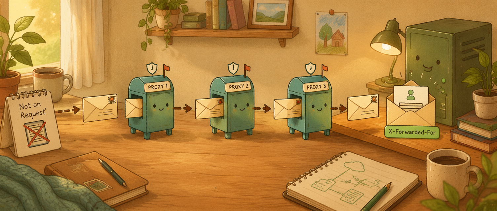

> 原文：[Getting the Client IP Address in ASP.NET Core](https://weblog.west-wind.com/posts/2026/May/13/Getting-the-Client-IP-Address-in-ASPNET-Core)
> 作者：Rick Strahl · May 13, 2026

---

每次需要在 ASP.NET Core 里拿客户端 IP，Rick Strahl 都坦言自己总是记不住正确的位置——本能上会去找 `Request`，但其实它藏在 `HttpContext.Connection` 里。这篇文章的价值正在于此：把"到处翻文档"变成"一次读完、直接抄用"。

## 客户端 IP 在哪？

答案比你想象的更绕弯：

```csharp
HttpContext?.Connection?.RemoteIpAddress
```

注意，**不在** `Request` 对象上。这是很多人（包括有多年 ASP.NET 经验的开发者）第一反应会走错的地方。

不过一旦知道位置，用法并不复杂。真正麻烦的是——**当你的应用部署在反向代理或负载均衡器后面时**，`RemoteIpAddress` 拿到的是代理服务器的 IP，而不是真实客户端的 IP。

---

## 扩展方法：一份代码搞定所有场景

Rick 将完整逻辑封装成 `HttpRequest` 的扩展方法，直接可以复制到项目里用：

### 主方法 `GetClientIpAddress`

```csharp
/// <summary>
/// Returns the client IPv4 Address for a request.
/// Checks proxy forwarding first, then the actual IP, and returns null if not found.
/// </summary>
/// <param name="request">The HttpRequest instance.</param>
/// <param name="checkForProxy">
/// Default (false): returns the raw connection's IP Address.
/// When true: checks X-Forwarded-For, Forwarded, X-Real-IP headers in that order
/// and returns the first valid IP address found.
/// </param>
/// <returns>IP Address or null</returns>
public static string GetClientIpAddress(this HttpRequest request, bool checkForProxy = false)
{
    if (request == null)
        return null;

    string ip = NormalizeIpAddress(request.HttpContext?.Connection?.RemoteIpAddress);
    if (!checkForProxy)
        return ip;

    string proxy = GetForwardedIpAddress(request.Headers["X-Forwarded-For"].FirstOrDefault());
    if (!string.IsNullOrEmpty(proxy))
        return proxy;

    proxy = GetForwardedIpAddress(request.Headers["Forwarded"].FirstOrDefault(), true);
    if (!string.IsNullOrEmpty(proxy))
        return proxy;

    proxy = GetForwardedIpAddress(request.Headers["X-Real-IP"].FirstOrDefault());
    return proxy ?? ip;
}
```

**关键设计决策**：

- `checkForProxy = false`（默认）：只返回连接层的直接 IP。如果你明确知道应用直接面向公网，就用默认值，**同时也能防止客户端伪造代理头来欺骗服务器**。
- `checkForProxy = true`：依次尝试三个转发头，取第一个有效的 IPv4 地址。

### 代理头解析 `GetForwardedIpAddress`

代理链中的 IP 格式并不统一：

- `X-Forwarded-For`：逗号分隔的 IP 列表，例如 `203.0.113.5, 198.51.100.1, 10.0.0.1`
- `Forwarded`（RFC 7239 标准格式）：`for=203.0.113.5;by=198.51.100.1`
- `X-Real-IP`：通常只有一个 IP

下面是完整的解析逻辑，能处理 IPv6 地址（如 `[::1]`）和带端口号的格式（如 `203.0.113.5:12345`）：

```csharp
private static string GetForwardedIpAddress(string headerValue, bool isForwardedHeader = false)
{
    if (string.IsNullOrWhiteSpace(headerValue))
        return null;

    foreach (var value in headerValue.Split(','))
    {
        string candidate = value?.Trim();
        if (string.IsNullOrWhiteSpace(candidate))
            continue;

        if (isForwardedHeader)
        {
            // RFC 7239: for="[v1.::1]", for=203.0.113.5
            candidate = candidate.Split(';')
                .Select(segment => segment?.Trim())
                .FirstOrDefault(segment => segment != null
                    && segment.StartsWith("for=", StringComparison.OrdinalIgnoreCase));

            if (string.IsNullOrWhiteSpace(candidate))
                continue;

            candidate = candidate.Substring(4).Trim(); // 移除 "for="
        }

        candidate = candidate.Trim('"');

        // IPv6 格式 [::1] → 取括号内内容
        if (candidate.StartsWith("[", StringComparison.Ordinal)
            && candidate.Contains("]", StringComparison.Ordinal))
            candidate = candidate.Substring(1, candidate.IndexOf(']') - 1);
        // ip:port 格式 → 只取 IP 部分
        else if (candidate.Count(ch => ch == ':') == 1)
        {
            var parts = candidate.Split(':');
            if (parts.Length == 2 && IPAddress.TryParse(parts[0], out _))
                candidate = parts[0];
        }

        if (string.Equals(candidate, "unknown", StringComparison.OrdinalIgnoreCase))
            continue;

        if (IPAddress.TryParse(candidate, out var address))
            return NormalizeIpAddress(address);
    }

    return null;
}
```

### IPv4/IPv6 归一化 `NormalizeIpAddress`

在双栈环境下，IPv4 地址经常被表示为 IPv6 映射形式（`::ffff:192.168.1.1`）。这个方法统一返回干净的 IPv4 字符串：

```csharp
private static string NormalizeIpAddress(IPAddress address)
{
    if (address == null)
        return null;

    if (address.IsIPv4MappedToIPv6)
        address = address.MapToIPv4();

    return address.ToString();
}
```

---

## 完整代码获取

以上三个方法已经收录在 Rick 的开源库 [Westwind.AspNetCore](https://github.com/RickStrahl/Westwind.AspNetCore/blob/f244102fcc3b9fbed5f0d736bd0bb9cd2cd57799/Westwind.AspNetCore/Extensions/HttpRequestExtensions.cs#L204) 中，作为 `HttpRequestExtensions` 类的一部分。这个库还包含很多其他常用的小型扩展，值得收藏。

---

## 替代方案：使用内置 ForwardedHeaders 中间件

*感谢评论区 @RichardD 的补充。*

如果你的应用始终部署在代理后面，并且几乎每个请求都需要正确的 IP 地址，可以注册 ASP.NET Core 内置的 **ForwardedHeaders 中间件**。它会在请求到达业务中间件之前，自动将转发头里的 IP 写回 `HttpContext.Connection.RemoteIpAddress`，让后续代码"感知不到代理的存在"。

配置示例（在 `Program.cs` 中）：

```csharp
builder.Services.Configure<ForwardedHeadersOptions>(options =>
{
    options.ForwardLimit = 2;                                  // 最多信任 2 层代理
    options.KnownProxies.Add(IPAddress.Parse("127.0.10.1")); // 可信代理 IP
    options.ForwardedForHeaderName = "X-Forwarded-For-My-Custom-Header-Name"; // 自定义头名称（可选）
});

// 必须放在中间件管道的最前面
// 确保后续中间件都能拿到真实 IP
app.UseForwardedHeaders();
```

> 详细文档：[Configure ASP.NET Core to work with proxy servers and load balancers](https://learn.microsoft.com/en-us/aspnet/core/host-and-deploy/proxy-load-balancer?view=aspnetcore-10.0)

**两种方案怎么选？**

| 场景 | 推荐方案 |
|------|---------|
| 偶尔需要 IP，只在少数接口使用 | `GetClientIpAddress` 扩展方法，按需调用 |
| 全局都需要真实 IP，始终在代理后运行 | `UseForwardedHeaders()` 中间件 |
| 直连公网，不经过代理 | `HttpContext.Connection.RemoteIpAddress`，无需任何封装 |

Rick 的建议：**如果你不确定是否在代理后面，默认不启用代理头检查**——这样可以避免客户端通过伪造 `X-Forwarded-For` 头来欺骗服务器。

---

## 小结

ASP.NET Core 获取客户端 IP 的三句话总结：

1. **IP 在 `HttpContext.Connection.RemoteIpAddress`**，不在 `Request` 上。
2. **有代理时**，需要从 `X-Forwarded-For` / `Forwarded` / `X-Real-IP` 转发头中提取真实 IP，并注意 IPv6 映射和带端口格式的处理。
3. **全局需求时**，用 `UseForwardedHeaders()` 中间件一次配置、处处透明；**局部需求时**，用扩展方法按需调取。

---

## 参考链接

- [Getting the Client IP Address in ASP.NET Core](https://weblog.west-wind.com/posts/2026/May/13/Getting-the-Client-IP-Address-in-ASPNET-Core) — Rick Strahl's Weblog
- [Westwind.AspNetCore on Github](https://github.com/RickStrahl/Westwind.AspNetCore)
- [Configure ASP.NET Core to work with proxy servers and load balancers](https://learn.microsoft.com/en-us/aspnet/core/host-and-deploy/proxy-load-balancer?view=aspnetcore-10.0)
