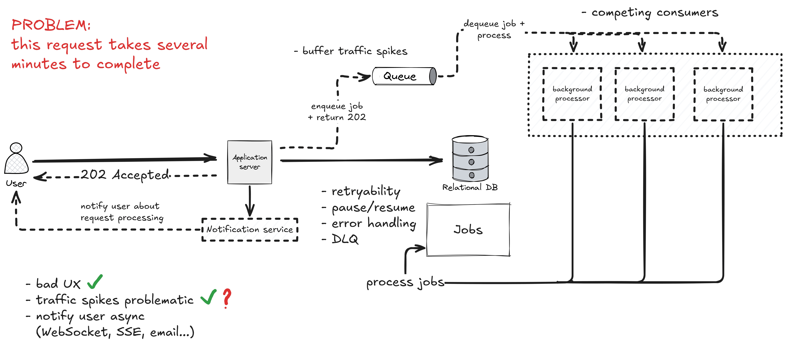
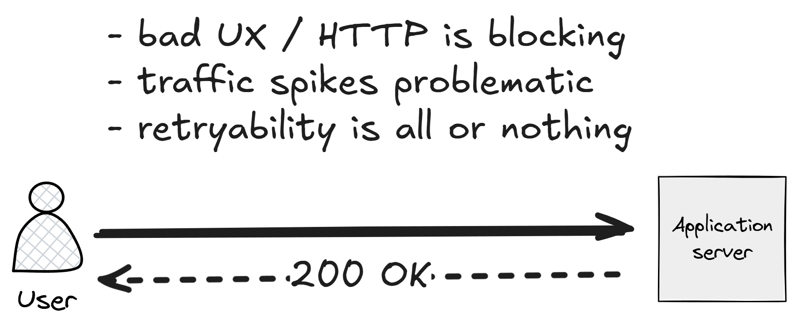
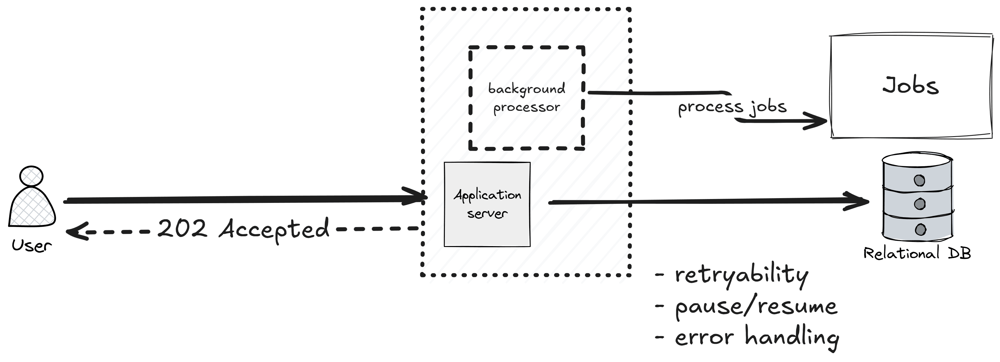
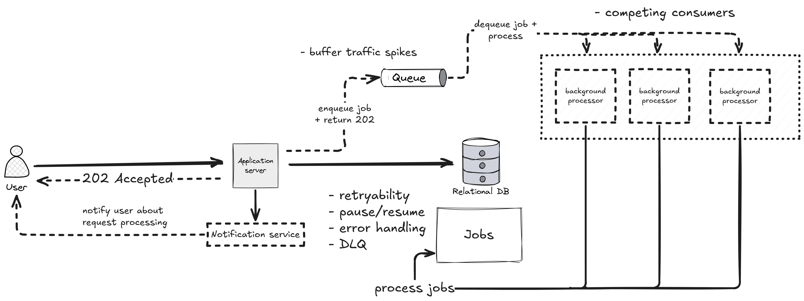

几乎每个系统迟早都会出现一个"慢端点"——批量导入、多年数据聚合报表、需要调用三个外部服务才能返回答案的工作流。这种请求天然就慢，但问题不仅仅是慢。

连接在等、线程在占、并发槽在耗。流量一上来，这一个端点就有可能把整个 API 拖垮。

Milan Jovanović 用一张演进图梳理了他处理这类问题的路径：从"请求直接阻塞"到"队列化竞争消费者"。根据实际规模，你可能在任意阶段停下来，但理解整条路有助于在对的时机做出对的决定。

## 第零步：默认的阻塞方式

用户发请求，服务器开始干活，活要干五分钟，连接就开着五分钟。

这没有"错"，只是在用可用性换正确性。用户体验差，影响范围大：每个慢请求占着的资源，就是其他请求用不上的资源。

原文里有一句值得反复看：**响应时间和工作时长，不必是同一件事。**

## 第一步：接受工作，但不立刻做

第一个改动：把"做工作"从请求里移走。

引入一张 `jobs` 表，API 端点只做三件事：

1. 校验请求
2. 往 `jobs` 表插一行，状态标为 `Pending`
3. 返回 `202 Accepted`，附带一个 job ID

实际执行工作的是运行在同一 API 进程内的[后台处理器](https://www.milanjovanovic.tech/blog/running-background-tasks-in-asp-net-core)，它持续捞取 `Pending` 状态的行并处理。客户端可以轮询 `GET /jobs/{id}`，也可以通过 [SignalR](https://www.milanjovanovic.tech/blog/adding-real-time-functionality-to-dotnet-applications-with-signalr)、[Server-Sent Events](https://www.milanjovanovic.tech/blog/server-sent-events-in-aspnetcore-and-dotnet-10) 或邮件接收完成通知。

这步的收益很实在：端点毫秒级返回，用户拿到一个可追踪的 job ID，流量峰值变成数据库里的一批行写入——写行很便宜。

但这里有一个上限，而且容易撞上：后台处理器和 API 跑在同一个进程里，它们争 CPU、内存和连接池。处理变重，API 的响应就会开始变慢。

## 第二步：把 Worker 从 API 里拆出来

解法是把后台处理器独立部署，在两者之间放一个队列。

API 把消息发到队列（也可以同时写一行 job 记录用于追踪），一组后台 Worker 从队列消费并执行实际工作——这就是[事件驱动架构里的竞争消费者模式](https://www.milanjovanovic.tech/blog/event-driven-architecture-in-dotnet-with-rabbitmq)。

跨过这条线之后，三件事变了：

- **队列吸收峰值**：API 以固定速率接收工作，Worker 按自己的节奏消化，互不干扰。
- **Worker 独立扩展**：后台任务吞吐量不再绑定 API 实例数量。
- **失败变成常态**：一个 Worker 崩溃，消息重回队列，用户不会收到 500。

可重试性、暂停/恢复、结构化错误处理、死信队列——这些能力基本上是队列基础设施附送的。

## 这样做要付出什么

Milan 没有回避代价：你现在要跑一个队列、一个 Worker 集群和一条通知链路。部署、监控、告警都变复杂了。`HTTP 响应有没有完成` 这个判断不再直接从 HTTP 状态码读到，客户端要主动问或者你要主动告诉它。每个任务都必须是[幂等的](https://www.milanjovanovic.tech/blog/the-idempotent-consumer-pattern-in-dotnet-and-why-you-need-it)——at-least-once 投递意味着 Worker 肯定会看到重复消息。

**如果只有一个慢端点、流量不大，进程内的"提交即返回 + 状态轮询"就够了。不要在不需要的时候引入队列。**

## 云服务替代方案

如果不想自己组装这套东西，有几个现成选项：

- **[AWS SQS](https://www.milanjovanovic.tech/blog/complete-guide-to-amazon-sqs-and-amazon-sns-with-masstransit) + Lambda** 或 **[Azure Service Bus](https://www.milanjovanovic.tech/blog/messaging-made-easy-with-azure-service-bus) + Azure Functions**：想让 Worker 弹性伸缩到零、不想管宿主时适合用。
- **Azure Durable Functions** 或 **AWS Step Functions**：工作流本身有多步骤、带定时器、重试和人工审批时，这类编排工具更合适。
- **[Temporal](https://temporal.io/)**：任务生命周期跨越小时甚至天级别，需要一等公民级别的持久执行、版本管理和跨次运行可见性时考虑。

代价是经典的那个：运维工作变少，厂商绑定变深，吞吐量增大后要仔细建模定价。

## 三条结论

1. **不要在请求内做慢活**：接受它，持久化它，返回 `202`。
2. **不要在 API 进程里跑 Worker**：加一个队列，让两侧独立扩展。
3. **告诉用户完成了**：轮询可用，推送更好。

这不是微服务的论战，而是把"接受工作"和"执行工作"分开——两者有截然不同的扩展曲线和失败模式。

如果你关注 AI 助手、开发工具和软件工程实践，可以关注 Aide Hub。这里会持续分享能落地的工具教程、架构思考和项目经验。

## 参考

- [How to Scale Long-Running API Requests - Milan Jovanović](https://www.milanjovanovic.tech/blog/how-to-scale-long-running-api-requests)
- [Building Async APIs in ASP.NET Core the Right Way](https://www.milanjovanovic.tech/blog/building-async-apis-in-aspnetcore-the-right-way)
- [Running Background Tasks in ASP.NET Core](https://www.milanjovanovic.tech/blog/running-background-tasks-in-asp-net-core)
- [Event-Driven Architecture in .NET with RabbitMQ](https://www.milanjovanovic.tech/blog/event-driven-architecture-in-dotnet-with-rabbitmq)
