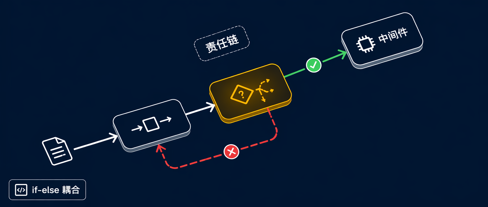

写过请求验证、权限检查或中间件拦截器的人，大概都处理过这样的代码：一串嵌套的 if-else，每一层对应一种检查条件。这种写法能跑，但每次增加一个检查项都要改同一个地方，条件之间互相知道彼此。

责任链模式要解决的就是这个问题：把每种检查条件分散到独立的处理器对象里，让请求沿着链依次流过，每个处理器决定是处理、放行还是拦截。发送方只和链头打交道，不知道最终是哪个节点处理了请求。

## 责任链是什么

责任链（Chain of Responsibility）是 GoF 行为型设计模式。它让请求沿着一条由处理器对象组成的链流动，每个处理器检查请求后，选择处理并停止、传给下一个，或者两件事都做。

一个直观的类比：客服工单系统。工单先到一线客服，一线能解决就关闭，不能就升级给专家，再不行升级给经理。提交工单的人不知道、也不关心谁最终处理了工单。链负责路由，每个节点负责自己的那一段。

原文作者点出了没有这个模式时的代价：发送方需要用条件逻辑决定调哪个处理器，导致紧耦合、违反开闭原则。责任链把这个判断分散给了链上的每个处理器，新增处理器只要插入链中就够了。

## 三种链变体

不是每条链都一样工作。理解三种变体能帮你选到合适的一种：

**传或处理（pass or handle）**：最经典的形式。每个处理器要么完整处理请求并停止链，要么原样传给下一个。适合异常处理、路由等场景——每个请求只应被一个处理器处理。

**处理并继续（handle and continue）**：每个处理器都处理请求，不管前一个做了什么。日志和审计管线用这种方式——每个处理器添加自己的内容，然后继续传递。

**处理并决定（handle and decide）**：最灵活的形式，每个处理器既可以处理请求，又可以决定是否继续链。这正是 ASP.NET Core 中间件的工作方式：每个中间件可以在调用 `next` 前后做事，也可以不调用 `next` 来短路整个管线。

## 三个核心组件

**Handler（处理器接口/基类）**：定义处理请求的契约，持有指向链中下一个处理器的引用。通常提供 `SetNext` 方法（或通过构造函数接受下一个处理器），并声明具体处理器要覆写的 `Handle` 方法。基类常包含默认的转发行为。

**Concrete Handlers（具体处理器）**：实现处理器接口，包含真正的处理逻辑。每个具体处理器决定自己能否处理请求——能处理就处理，不能（或处理后还想继续）就委托给下一个。每个处理器只知道自己的职责和下一个处理器，别的什么都不知道。

**Client（客户端）**：构建链并向链头发送请求。链建好之后，客户端只和链头交互，不关心谁处理了请求。这里依赖注入可以帮忙管理大型应用中的链组装。

## C# 实现：请求验证管线

用一个实际场景：API 请求要经过认证、授权、内容校验三道关卡。顺序很重要，每个关卡职责清晰独立。

### 抽象处理器基类

```csharp
public abstract class RequestHandler
{
    private RequestHandler? _nextHandler;

    public RequestHandler SetNext(RequestHandler handler)
    {
        _nextHandler = handler;
        return handler; // 返回 handler 本身，支持流式链接
    }

    public virtual bool Handle(Request request)
    {
        if (_nextHandler is not null)
        {
            return _nextHandler.Handle(request);
        }

        // 链尾——所有处理器都通过了
        return true;
    }
}

public sealed class Request
{
    public string? AuthToken { get; set; }
    public string? UserRole { get; set; }
    public string? Body { get; set; }
    public List<string> ValidationErrors { get; } = new();
}
```

`SetNext` 返回它接收到的处理器，从而支持流式链接。基类的 `Handle` 方法在有下一个处理器时转发，否则返回 `true`。

### 认证处理器

```csharp
using System;

public sealed class AuthenticationHandler : RequestHandler
{
    public override bool Handle(Request request)
    {
        if (string.IsNullOrEmpty(request.AuthToken))
        {
            Console.WriteLine("AuthenticationHandler: No auth token provided. Rejected.");
            return false;
        }

        if (request.AuthToken != "valid-token-123")
        {
            Console.WriteLine("AuthenticationHandler: Invalid auth token. Rejected.");
            return false;
        }

        Console.WriteLine("AuthenticationHandler: Token validated. Passing to next handler.");
        return base.Handle(request);
    }
}
```

Token 缺失或无效时，处理器拒绝请求，链就此停止。Token 有效时，调用 `base.Handle(request)` 转发给下一个处理器。

### 授权处理器

```csharp
using System;

public sealed class AuthorizationHandler : RequestHandler
{
    private readonly string _requiredRole;

    public AuthorizationHandler(string requiredRole)
    {
        _requiredRole = requiredRole;
    }

    public override bool Handle(Request request)
    {
        if (request.UserRole != _requiredRole)
        {
            Console.WriteLine(
                $"AuthorizationHandler: User lacks '{_requiredRole}' role. Rejected.");
            return false;
        }

        Console.WriteLine("AuthorizationHandler: Role verified. Passing to next handler.");
        return base.Handle(request);
    }
}
```

### 内容校验处理器

```csharp
using System;

public sealed class ValidationHandler : RequestHandler
{
    public override bool Handle(Request request)
    {
        if (string.IsNullOrWhiteSpace(request.Body))
        {
            Console.WriteLine("ValidationHandler: Request body is empty. Rejected.");
            return false;
        }

        if (request.Body.Length > 1000)
        {
            Console.WriteLine("ValidationHandler: Request body exceeds limit. Rejected.");
            return false;
        }

        Console.WriteLine("ValidationHandler: Body validated. Passing to next handler.");
        return base.Handle(request);
    }
}
```

三个处理器各自关注一个问题，对彼此一无所知。

### 组装链并运行

```csharp
using System;

var authentication = new AuthenticationHandler();
var authorization  = new AuthorizationHandler("admin");
var validation     = new ValidationHandler();

// 构建链
authentication
    .SetNext(authorization)
    .SetNext(validation);

// 合法请求 — 通过全部处理器
var validRequest = new Request
{
    AuthToken = "valid-token-123",
    UserRole  = "admin",
    Body      = "{ \"action\": \"update\" }"
};

Console.WriteLine("--- Processing valid request ---");
bool result = authentication.Handle(validRequest);
Console.WriteLine($"Result: {result}");

// 无效 Token — 在第一个处理器就被拦截
var badTokenRequest = new Request
{
    AuthToken = "expired-token",
    UserRole  = "admin",
    Body      = "{ \"action\": \"delete\" }"
};

Console.WriteLine("\n--- Processing bad token request ---");
result = authentication.Handle(badTokenRequest);
Console.WriteLine($"Result: {result}");
```

合法请求经过三个处理器；无效 Token 请求在第一关被拦截，后面两个处理器根本不会被调用——避免了不必要的处理。

## ASP.NET Core 中间件就是责任链

如果你用过 ASP.NET Core，你已经用过责任链模式了。中间件管线是这个模式的教科书级实现：每个中间件组件决定是否把请求传给下一个，或者直接短路。

`RequestDelegate` 就是"下一个处理器"的引用：

```csharp
using Microsoft.AspNetCore.Builder;
using Microsoft.AspNetCore.Http;

var builder = WebApplication.CreateBuilder(args);
var app = builder.Build();

// 日志中间件 — 处理并继续
app.Use(async (context, next) =>
{
    Console.WriteLine($"Request: {context.Request.Method} {context.Request.Path}");
    await next(context);
    Console.WriteLine($"Response: {context.Response.StatusCode}");
});

// 认证中间件 — 可以短路
app.Use(async (context, next) =>
{
    if (!context.Request.Headers.ContainsKey("Authorization"))
    {
        context.Response.StatusCode = 401;
        await context.Response.WriteAsync("Unauthorized");
        return; // 短路：不调用 next
    }

    await next(context);
});

// 终端中间件 — 链尾
app.Run(async context =>
{
    await context.Response.WriteAsync("Hello from the end of the chain!");
});

app.Run();
```

日志中间件是"处理并继续"变体——在调用 `next` 前后都做了事情。认证中间件是"处理并决定"变体——要么返回 401 短路，要么调用 `next` 继续。终端 `app.Run` 是不调用 `next` 的链尾。

中间件的注册顺序决定链的顺序，每个中间件都是独立的——增删改任意一个中间件，不需要修改其他任何组件。

## 结合依赖注入构建链

生产级应用里，你希望通过依赖注入构建链，而不是手动连线。先定义一个更友好的接口：

```csharp
public interface IRequestHandler
{
    IRequestHandler? NextHandler { get; set; }
    bool Handle(Request request);
}

public abstract class BaseRequestHandler : IRequestHandler
{
    public IRequestHandler? NextHandler { get; set; }

    public virtual bool Handle(Request request)
    {
        if (NextHandler is not null)
        {
            return NextHandler.Handle(request);
        }

        return true;
    }
}
```

然后注册处理器并用工厂方法构建链：

```csharp
using Microsoft.Extensions.DependencyInjection;

var services = new ServiceCollection();

// 注册各个处理器
services.AddTransient<AuthenticationHandler>();
services.AddTransient<AuthorizationHandler>(
    sp => new AuthorizationHandler("admin"));
services.AddTransient<ValidationHandler>();

// 注册链工厂
services.AddTransient<IRequestHandler>(sp =>
{
    var auth  = sp.GetRequiredService<AuthenticationHandler>();
    var authz = sp.GetRequiredService<AuthorizationHandler>();
    var val   = sp.GetRequiredService<ValidationHandler>();

    // 连接链
    auth.NextHandler  = authz;
    authz.NextHandler = val;

    return auth;
});

var provider = services.BuildServiceProvider();
var chain = provider.GetRequiredService<IRequestHandler>();

var request = new Request
{
    AuthToken = "valid-token-123",
    UserRole  = "admin",
    Body      = "{ \"data\": \"test\" }"
};

bool result = chain.Handle(request);
Console.WriteLine($"Chain result: {result}");
```

工厂 lambda 从容器里解析每个处理器，连接它们，返回链头。如果要改变链顺序或新增处理器，修改工厂就够了，不需要动任何处理器本身。

## 适合和不适合的场景

**适合使用的情况：**

- **请求验证管线**：认证、授权、限流、内容校验各自独立，需要顺序执行且支持提前退出
- **日志和审计链**：每个处理器处理请求后继续传递，每个节点记录不同维度的信息
- **事件路由系统**：事件传递给第一个能识别它的处理器，UI 框架的键盘事件冒泡就是这个逻辑

**不适合使用的情况：**

- **每个处理器都必须处理、且顺序无关**：用观察者模式（Observer），所有观察者同时收到通知
- **已知确切应该由哪个处理器处理**：用策略模式（Strategy），直接选择处理器，不必遍历整条链
- **需要给同一个接口分层叠加行为**：用装饰器模式（Decorator），装饰器通过包装组合行为，链通过转发组合

## 与相近模式的对比

**vs 命令模式**：命令模式把请求封装成对象以便存储、排队或撤销，责任链把请求路由给潜在的处理器。两者解决不同问题，但可以组合——命令对象可以流经一条责任链，由链上的处理器决定如何分派。

**vs 装饰器模式**：两者都是链式对象互相委托。装饰器包装对象以添加行为，同时保持相同接口，且每个装饰器都一定处理请求。责任链给每个处理器选择权——处理、跳过还是短路。

**vs 观察者模式**：观察者同时通知所有已注册的观察者。责任链串行传递请求，直到某个处理器处理它。全部监听者都应响应时用观察者，需要顺序处理且能短路时用责任链。

## 常见问题

**处理器可以修改请求再传递吗？** 可以。处理器可以检查、修改、丰富或转换请求后再传给下一个。这在中间件管线里很常见——上游中间件附加认证信息或 Correlation ID，下游中间件再用。

**没有任何处理器处理请求时怎么办？** 几个选项：在链尾加一个默认处理器捕获未处理的请求；让基类 `Handle` 在链耗尽时返回默认值；记录未处理请求以便监控。具体选哪种取决于业务上未处理请求是错误还是可接受的情况。

**链是线程安全的吗？** 模式本身不保证。如果多个线程同时往同一条链发请求，需要确保处理器不共享可变状态。无状态处理器（处理过程中不修改实例字段）天然线程安全；有状态的处理器要么每个请求新建链，要么用线程安全的数据结构。

---

如果你关注 AI 助手、开发工具和软件工程实践，可以关注 Aide Hub。这里会继续分享能落地的工具教程、技术观察和项目经验。

## 参考

- [原文：Chain of Responsibility Design Pattern in C#: Complete Guide with Examples](https://www.devleader.ca/2026/05/25/chain-of-responsibility-design-pattern-in-c-complete-guide-with-examples)
- [IServiceCollection in C#: Simplified Beginner's Guide for Dependency Injection](https://www.devleader.ca/2024/02/21/iservicecollection-in-c-simplified-beginners-guide-for-dependency-injection)
- [Observer Design Pattern in C#: Complete Guide with Examples](https://www.devleader.ca/2026/03/26/observer-design-pattern-in-c-complete-guide-with-examples)
- [Decorator Design Pattern in C#: Complete Guide with Examples](https://www.devleader.ca/2026/03/14/decorator-design-pattern-in-c-complete-guide-with-examples)
- [Strategy Design Pattern in C#: Complete Guide with Examples](https://www.devleader.ca/2026/03/02/strategy-design-pattern-in-c-complete-guide-with-examples)
- [Command Design Pattern in C#: Complete Guide with Examples](https://www.devleader.ca/2026/04/14/command-design-pattern-in-c-complete-guide-with-examples)
