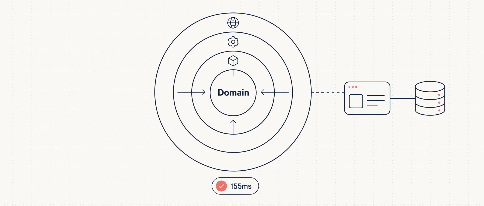

Clean Architecture 这个词说了十几年，核心就一条规则：依赖只朝内指向业务核心。Domain 层不知道数据库是什么，不知道 HTTP 是什么，所有外部细节（框架、UI、持久化）都在外圈，都依赖内圈的抽象。

这篇文章跟着 Mukesh Murugan 的教程，用 .NET 10 从空目录开始，一步步搭出一个电影管理 Web API：四个项目对应四层，编译器通过项目引用强制依赖方向，Domain 里放真正的业务规则，Application 通过接口访问 DbContext，Infrastructure 实现接口，API 只做组合和路由。全程不用 Repository 模式，不用 MediatR，不用 AutoMapper——能跑，能测，够用。

## Clean Architecture 是什么

Clean Architecture 由 Robert C. Martin 在 2012 年提出，和六边形架构、洋葱架构是一回事：把业务规则放在中心，框架和数据库是可替换的外部细节。

用电影管理举例：一部电影是什么、评分怎么计算、标题不能为空——这些规则不应该因为你从 SQL Server 换到 PostgreSQL、从 Controller 换到 Minimal API 就要改。

四层从内到外：

1. **Domain** — 实体、值对象、枚举和始终成立的业务规则。零依赖。
2. **Application** — 用例和编排。定义接口（比如 `IApplicationDbContext`）、DTO、服务。只依赖 Domain。
3. **Infrastructure** — 接口的具体实现。EF Core `DbContext`、实体配置、外部 API 客户端。依赖 Application。
4. **Presentation (API)** — 入口点。Minimal API 端点、中间件和组合根。依赖 Application 和 Infrastructure。

依赖方向：`Api → Infrastructure → Application → Domain`。每支箭头都朝 Domain 指。Domain 不指向任何东西。

| 层             | 拥有                   | 禁止                    | 依赖                        |
| -------------- | ---------------------- | ----------------------- | --------------------------- |
| Domain         | 实体、值对象、业务规则 | EF Core、HTTP、JSON、DI | 无                          |
| Application    | 用例、DTO、接口        | 具体 DB 代码、控制器    | Domain                      |
| Infrastructure | DbContext、配置、集成  | API 端点                | Application                 |
| API            | 端点、中间件、组合根   | 业务规则                | Application、Infrastructure |

在 .NET 里，编译器替你守住这条规则。Domain 项目没有引用 Infrastructure，你在 Domain 里写 `using MovieManagement.Infrastructure;` 根本编译不过。

## 什么时候该用

Clean Architecture 不是默认选项，是一个权衡。它的额外项目和间接层在以下场景下值得：

- 领域逻辑有实质复杂度——不是纯 CRUD
- 项目会维护好几年
- 多人协作，层边界减少合并冲突
- 外部技术预期会换——不同前端、不同数据库、不同消息队列
- 需要在没有数据库和 Web 服务器的情况下测试核心逻辑

原文作者给了一个判断标准：如果你说不出三条属于 Domain 层的业务规则，你暂时不需要 Domain 层。

**不该用的场景**：纯 CRUD 应用、原型、一个人的小项目、团队还没理解这个模式。错误理解的 Clean Architecture（贫血模型、逻辑散落在 Controller 里）比老实的单层结构更糟。

## 项目结构

四个核心层在 `src/` 下，两个 Aspire 编排项目在 `aspire/` 下：

```
clean-architecture-dotnet/
├── MovieManagement.slnx
├── Directory.Packages.props        # 集中管理 NuGet 版本
├── Directory.Build.props           # 共享 MSBuild 设置
├── .editorconfig                   # 共享代码风格
├── src/
│   ├── MovieManagement.Domain/         # 实体、规则。零依赖。
│   ├── MovieManagement.Application/    # 用例、DTO、接口。
│   ├── MovieManagement.Infrastructure/ # DbContext、EF 配置。
│   └── MovieManagement.Api/            # 端点、组合根。
├── aspire/
│   ├── MovieManagement.AppHost/        # 编排 API + PostgreSQL。
│   └── MovieManagement.ServiceDefaults/# 遥测、健康检查、弹性。
└── tests/
    └── MovieManagement.Domain.Tests/   # 领域层快速单元测试。
```

## 前置条件

- .NET 10 SDK（作者用的 `10.0.203`）
- Docker Desktop（Aspire 用容器跑 PostgreSQL）
- 编辑器：VS 2026、VS Code + C# Dev Kit 或 Rider

安装 Aspire 项目模板：

```bash
dotnet new install Aspire.ProjectTemplates
```

完整源码在 [GitHub 仓库](https://github.com/codewithmukesh/dotnet-webapi-zero-to-hero-course/tree/master/modules/08-architecture-best-practices/clean-architecture-dotnet)。

## 第一步：创建解决方案和项目

创建六个项目：三个内层 class library、一个 web 项目、两个 Aspire 项目。

```bash
mkdir clean-architecture-dotnet && cd clean-architecture-dotnet

dotnet new classlib -n MovieManagement.Domain -o src/MovieManagement.Domain
dotnet new classlib -n MovieManagement.Application -o src/MovieManagement.Application
dotnet new classlib -n MovieManagement.Infrastructure -o src/MovieManagement.Infrastructure
dotnet new web -n MovieManagement.Api -o src/MovieManagement.Api

dotnet new aspire-apphost -n MovieManagement.AppHost -o aspire/MovieManagement.AppHost
dotnet new aspire-servicedefaults -n MovieManagement.ServiceDefaults -o aspire/MovieManagement.ServiceDefaults
```

接下来是整个教程最关键的一步——**设置项目引用**，这些引用就是 Dependency Rule 的编译器级别保障：

```bash
dotnet add src/MovieManagement.Application reference src/MovieManagement.Domain
dotnet add src/MovieManagement.Infrastructure reference src/MovieManagement.Application
dotnet add src/MovieManagement.Api reference src/MovieManagement.Application src/MovieManagement.Infrastructure aspire/MovieManagement.ServiceDefaults
dotnet add aspire/MovieManagement.AppHost reference src/MovieManagement.Api
```

把这些引用念出来就能听到架构：Application 引用 Domain，Infrastructure 引用 Application，API 引用两者。Domain 不引用任何东西。

创建解决方案文件，用新的 `.slnx` 格式（纯 XML，diff 友好）：

```bash
dotnet new sln -n MovieManagement --format slnx
dotnet sln add src/MovieManagement.Domain src/MovieManagement.Application src/MovieManagement.Infrastructure src/MovieManagement.Api aspire/MovieManagement.AppHost aspire/MovieManagement.ServiceDefaults
```

## 第二步：Central Package Management

六个项目各自管 NuGet 版本，迟早出现三个不同版本的 EF Core。Central Package Management（CPM）把所有版本号集中到根目录的一个 `Directory.Packages.props` 文件里，每个项目只写包名、不写版本。

```xml
<Project>
  <PropertyGroup>
    <ManagePackageVersionsCentrally>true</ManagePackageVersionsCentrally>
    <CentralPackageTransitivePinningEnabled>true</CentralPackageTransitivePinningEnabled>
  </PropertyGroup>

  <ItemGroup Label="EF Core + PostgreSQL">
    <PackageVersion Include="Microsoft.EntityFrameworkCore" Version="10.0.8" />
    <PackageVersion Include="Microsoft.EntityFrameworkCore.Design" Version="10.0.8" />
    <PackageVersion Include="Npgsql.EntityFrameworkCore.PostgreSQL" Version="10.0.1" />
  </ItemGroup>

  <ItemGroup Label="API">
    <PackageVersion Include="Microsoft.AspNetCore.OpenApi" Version="10.0.8" />
    <PackageVersion Include="Scalar.AspNetCore" Version="2.14.14" />
  </ItemGroup>

  <ItemGroup Label="Aspire orchestration">
    <PackageVersion Include="Aspire.Hosting.PostgreSQL" Version="13.3.5" />
    <PackageVersion Include="Aspire.Npgsql.EntityFrameworkCore.PostgreSQL" Version="13.3.5" />
  </ItemGroup>
</Project>
```

这样项目文件里只写包名，没有版本号。全解决方案升级 EF Core 只改一行。

`CentralPackageTransitivePinningEnabled` 还会锁定传递依赖的版本，杀掉一整类"我这能跑你那不行"的版本漂移问题。

再加一个 `Directory.Build.props` 共享编译器设置：

```xml
<Project>
  <PropertyGroup>
    <TargetFramework>net10.0</TargetFramework>
    <Nullable>enable</Nullable>
    <ImplicitUsings>enable</ImplicitUsings>
    <LangVersion>latest</LangVersion>
    <EnforceCodeStyleInBuild>true</EnforceCodeStyleInBuild>
  </PropertyGroup>
</Project>
```

## 第三步：共享 .editorconfig

`var` 还是显式类型、`this.` 要不要加——与其在 PR 里吵，不如一个文件定死。在解决方案根目录放 `.editorconfig`：

```ini
root = true

[*.cs]
csharp_style_namespace_declarations = file_scoped:warning
dotnet_style_qualification_for_field = false:warning
dotnet_style_qualification_for_property = false:warning
csharp_style_prefer_primary_constructors = true:suggestion
csharp_prefer_braces = true:warning
dotnet_style_prefer_collection_expression = true:suggestion

dotnet_naming_rule.interfaces_start_with_i.severity = warning
dotnet_naming_rule.interfaces_start_with_i.symbols = interface_symbol
dotnet_naming_rule.interfaces_start_with_i.style = i_prefix_style
dotnet_naming_symbols.interface_symbol.applicable_kinds = interface
dotnet_naming_style.i_prefix_style.required_prefix = I
dotnet_naming_style.i_prefix_style.capitalization = pascal_case
```

配合 `EnforceCodeStyleInBuild`，风格违规会变成构建警告，永远到不了 Reviewer 眼前。

## 第四步：Domain 层

Domain 是起点，因为所有其他层都依赖它。规则很严：**不允许任何 NuGet 包，不引用任何其他项目**，只有纯 C#。

一个小基类，让每个实体都有强类型 ID。用 `Guid.CreateVersion7()`（.NET 9 引入的顺序 GUID，UUID v7），在 PostgreSQL 里的索引性能远好于 `Guid.NewGuid()` 的随机 GUID：

```csharp
namespace MovieManagement.Domain.Common;

public abstract class Entity
{
    public Guid Id { get; protected set; } = Guid.CreateVersion7();
}
```

一个领域异常类型。Domain 在规则被破坏时抛出它，API 层负责把它转成 400 而不是 500：

```csharp
namespace MovieManagement.Domain.Common;

public sealed class DomainException(string message) : Exception(message);
```

`Movie` 实体——这里是"轻量 DDD"发挥作用的地方。贫血模型只是一堆公开 setter 的数据袋，没有任何行为，这是 Clean Architecture 最常见的错误用法。相反，把状态设为 private，通过方法暴露意图。你不可能把一个 `Movie` 弄到无效状态：

```csharp
using MovieManagement.Domain.Common;

namespace MovieManagement.Domain.Movies;

public sealed class Movie : Entity
{
    private Movie() { }

    private Movie(string title, string director, DateOnly releaseDate,
        Genre genre, string synopsis)
    {
        Title = title;
        Director = director;
        ReleaseDate = releaseDate;
        Genre = genre;
        Synopsis = synopsis;
        CreatedAtUtc = DateTime.UtcNow;
    }

    public string Title { get; private set; } = default!;
    public string Director { get; private set; } = default!;
    public DateOnly ReleaseDate { get; private set; }
    public Genre Genre { get; private set; }
    public string Synopsis { get; private set; } = default!;
    public double? AverageRating { get; private set; }
    public int RatingCount { get; private set; }
    public DateTime CreatedAtUtc { get; private set; }

    public static Movie Create(string title, string director,
        DateOnly releaseDate, Genre genre, string synopsis)
    {
        if (string.IsNullOrWhiteSpace(title))
            throw new DomainException("A movie must have a title.");

        if (string.IsNullOrWhiteSpace(director))
            throw new DomainException("A movie must have a director.");

        return new Movie(title.Trim(), director.Trim(),
            releaseDate, genre, synopsis?.Trim() ?? string.Empty);
    }

    public void UpdateDetails(string title, string director,
        DateOnly releaseDate, Genre genre, string synopsis)
    {
        if (string.IsNullOrWhiteSpace(title))
            throw new DomainException("A movie must have a title.");

        Title = title.Trim();
        Director = director.Trim();
        ReleaseDate = releaseDate;
        Genre = genre;
        Synopsis = synopsis?.Trim() ?? string.Empty;
    }

    public void AddRating(int score)
    {
        if (score is < 1 or > 10)
            throw new DomainException("A rating must be between 1 and 10.");

        var runningTotal = (AverageRating ?? 0) * RatingCount + score;
        RatingCount++;
        AverageRating = Math.Round(runningTotal / RatingCount, 2);
    }
}
```

`Genre` 是一个简单枚举：

```csharp
namespace MovieManagement.Domain.Movies;

public enum Genre
{
    Action = 1,
    Comedy = 2,
    Drama = 3,
    SciFi = 4,
    Horror = 5,
    Documentary = 6
}
```

注意 `AddRating`：评分必须在 1 到 10 之间、平均分的计算——这些规则活在实体上。不是某个 service 去计算平均分然后赋值。`Movie` 保护自己的不变量。这是领域模型和"带了额外步骤的数据库行"的区别。

## 第五步：Application 层

Application 层放用例。它依赖 Domain 和 EF Core 抽象，但绝不引用 Infrastructure 项目。让这一切成为可能的——也是让 Repository 模式变成多余的——是一个接口。

### 为什么直接用 DbContext 而不是 Repository

在 EF Core 里，`DbContext` 本身就是 Unit of Work，`DbSet<T>` 本身就是 Repository。再包一层自定义 Repository 通常只增加间接层而不增加价值。微软在架构指南里写得很明白：["The Entity Framework DbContext class is based on the Unit of Work and Repository patterns and can be used directly from your code"](https://learn.microsoft.com/en-us/dotnet/architecture/microservices/microservice-ddd-cqrs-patterns/infrastructure-persistence-layer-implementation-entity-framework-core#using-a-custom-repository-versus-using-ef-dbcontext-directly)。

经典反对意见是"Application 层就依赖 Infrastructure 了"。并没有。在 Application 层定义一个接口，暴露需要的 `DbSet`，由 Infrastructure 的 `DbContext` 实现它：

```csharp
using Microsoft.EntityFrameworkCore;
using MovieManagement.Domain.Movies;

namespace MovieManagement.Application.Common;

public interface IApplicationDbContext
{
    DbSet<Movie> Movies { get; }
    Task<int> SaveChangesAsync(CancellationToken cancellationToken = default);
}
```

Application 层拿到了完整的 LINQ 和 EF Core 能力——`Include`、`AsNoTracking`、投影——同时只依赖一个它自己拥有的接口。比泛型 Repository 加 Unit of Work 少得多的代码。

DTO 用 record 定义，一行搞定：

```csharp
using MovieManagement.Domain.Movies;

namespace MovieManagement.Application.Movies;

public record CreateMovieRequest(string Title, string Director,
    DateOnly ReleaseDate, Genre Genre, string Synopsis);

public record UpdateMovieRequest(string Title, string Director,
    DateOnly ReleaseDate, Genre Genre, string Synopsis);

public record AddRatingRequest(int Score);

public record MovieResponse(Guid Id, string Title, string Director,
    DateOnly ReleaseDate, string Genre, string Synopsis,
    double? AverageRating, int RatingCount);
```

一个映射辅助方法：

```csharp
using MovieManagement.Domain.Movies;

namespace MovieManagement.Application.Movies;

internal static class MovieMappings
{
    public static MovieResponse ToResponse(this Movie movie) => new(
        movie.Id, movie.Title, movie.Director, movie.ReleaseDate,
        movie.Genre.ToString(), movie.Synopsis,
        movie.AverageRating, movie.RatingCount);
}
```

用例本身。`MovieService` 编排领域和数据库，通过主构造函数依赖 `IApplicationDbContext`——不需要 Repository，不需要 Unit of Work：

```csharp
using Microsoft.EntityFrameworkCore;
using MovieManagement.Application.Common;
using MovieManagement.Domain.Movies;

namespace MovieManagement.Application.Movies;

public sealed class MovieService(IApplicationDbContext context) : IMovieService
{
    public async Task<MovieResponse> CreateAsync(
        CreateMovieRequest request, CancellationToken cancellationToken)
    {
        var movie = Movie.Create(request.Title, request.Director,
            request.ReleaseDate, request.Genre, request.Synopsis);

        context.Movies.Add(movie);
        await context.SaveChangesAsync(cancellationToken);

        return movie.ToResponse();
    }

    public async Task<MovieResponse?> GetByIdAsync(
        Guid id, CancellationToken cancellationToken)
    {
        var movie = await context.Movies
            .AsNoTracking()
            .FirstOrDefaultAsync(m => m.Id == id, cancellationToken);

        return movie?.ToResponse();
    }

    public async Task<IReadOnlyList<MovieResponse>> GetAllAsync(
        CancellationToken cancellationToken)
    {
        var movies = await context.Movies
            .AsNoTracking()
            .OrderByDescending(m => m.ReleaseDate)
            .ToListAsync(cancellationToken);

        return movies.Select(m => m.ToResponse()).ToList();
    }

    public async Task<bool> UpdateAsync(
        Guid id, UpdateMovieRequest request, CancellationToken cancellationToken)
    {
        var movie = await context.Movies
            .FirstOrDefaultAsync(m => m.Id == id, cancellationToken);
        if (movie is null) return false;

        movie.UpdateDetails(request.Title, request.Director,
            request.ReleaseDate, request.Genre, request.Synopsis);
        await context.SaveChangesAsync(cancellationToken);
        return true;
    }

    public async Task<bool> AddRatingAsync(
        Guid id, AddRatingRequest request, CancellationToken cancellationToken)
    {
        var movie = await context.Movies
            .FirstOrDefaultAsync(m => m.Id == id, cancellationToken);
        if (movie is null) return false;

        movie.AddRating(request.Score);
        await context.SaveChangesAsync(cancellationToken);
        return true;
    }

    public async Task<bool> DeleteAsync(
        Guid id, CancellationToken cancellationToken)
    {
        var movie = await context.Movies
            .FirstOrDefaultAsync(m => m.Id == id, cancellationToken);
        if (movie is null) return false;

        context.Movies.Remove(movie);
        await context.SaveChangesAsync(cancellationToken);
        return true;
    }
}
```

DI 注册用扩展方法，每层暴露自己的 `AddXxx()`：

```csharp
using Microsoft.Extensions.DependencyInjection;
using MovieManagement.Application.Movies;

namespace MovieManagement.Application;

public static class DependencyInjection
{
    public static IServiceCollection AddApplication(
        this IServiceCollection services)
    {
        services.AddScoped<IMovieService, MovieService>();
        return services;
    }
}
```

## 第六步：Infrastructure 层

Infrastructure 层是抽象变成具体实现的地方。这里的核心是 EF Core `DbContext`，它实现了 Application 层定义的 `IApplicationDbContext`：

```csharp
using Microsoft.EntityFrameworkCore;
using MovieManagement.Application.Common;
using MovieManagement.Domain.Movies;

namespace MovieManagement.Infrastructure.Persistence;

public sealed class ApplicationDbContext(
    DbContextOptions<ApplicationDbContext> options)
    : DbContext(options), IApplicationDbContext
{
    public DbSet<Movie> Movies => Set<Movie>();

    protected override void OnModelCreating(ModelBuilder modelBuilder)
    {
        modelBuilder.ApplyConfigurationsFromAssembly(
            typeof(ApplicationDbContext).Assembly);
        base.OnModelCreating(modelBuilder);
    }
}
```

实体配置用单独的类，不要全堆在 `OnModelCreating` 里——项目规模大了会崩：

```csharp
using Microsoft.EntityFrameworkCore;
using Microsoft.EntityFrameworkCore.Metadata.Builders;
using MovieManagement.Domain.Movies;

namespace MovieManagement.Infrastructure.Persistence.Configurations;

public sealed class MovieConfiguration : IEntityTypeConfiguration<Movie>
{
    public void Configure(EntityTypeBuilder<Movie> builder)
    {
        builder.ToTable("movies");
        builder.HasKey(m => m.Id);

        builder.Property(m => m.Title).HasMaxLength(200).IsRequired();
        builder.Property(m => m.Director).HasMaxLength(150).IsRequired();
        builder.Property(m => m.Synopsis).HasMaxLength(2000);

        builder.Property(m => m.Genre)
            .HasConversion<string>().HasMaxLength(40);
    }
}
```

Infrastructure 的 DI 扩展——把接口映射到具体 `DbContext`：

```csharp
using Microsoft.Extensions.DependencyInjection;
using MovieManagement.Application.Common;
using MovieManagement.Infrastructure.Persistence;

namespace MovieManagement.Infrastructure;

public static class DependencyInjection
{
    public static IServiceCollection AddInfrastructure(
        this IServiceCollection services)
    {
        services.AddScoped<IApplicationDbContext>(
            sp => sp.GetRequiredService<ApplicationDbContext>());
        return services;
    }
}
```

`AddScoped<IApplicationDbContext>` 这一行是关键。`MovieService` 请求 `IApplicationDbContext` 时拿到的是真实的 `ApplicationDbContext`——但它完全不知道这一点，也没有对 Infrastructure 项目的引用。Dependency Rule 成立。

## 第七步：API 层

API 是组合根——唯一允许知道所有层、把它们连接起来的地方。用 Minimal API 按资源分组：

```csharp
using MovieManagement.Application.Movies;

namespace MovieManagement.Api.Endpoints;

public static class MovieEndpoints
{
    public static IEndpointRouteBuilder MapMovieEndpoints(
        this IEndpointRouteBuilder app)
    {
        var group = app.MapGroup("/movies").WithTags("Movies");

        group.MapPost("/", async (CreateMovieRequest request,
            IMovieService service, CancellationToken cancellationToken) =>
        {
            var movie = await service.CreateAsync(request, cancellationToken);
            return Results.Created($"/movies/{movie.Id}", movie);
        });

        group.MapGet("/", async (IMovieService service,
            CancellationToken cancellationToken) =>
            Results.Ok(await service.GetAllAsync(cancellationToken)));

        group.MapGet("/{id:guid}", async (Guid id,
            IMovieService service, CancellationToken cancellationToken) =>
        {
            var movie = await service.GetByIdAsync(id, cancellationToken);
            return movie is null ? Results.NotFound() : Results.Ok(movie);
        });

        group.MapPut("/{id:guid}", async (Guid id,
            UpdateMovieRequest request, IMovieService service,
            CancellationToken cancellationToken) =>
        {
            var updated = await service.UpdateAsync(
                id, request, cancellationToken);
            return updated ? Results.NoContent() : Results.NotFound();
        });

        group.MapPost("/{id:guid}/ratings", async (Guid id,
            AddRatingRequest request, IMovieService service,
            CancellationToken cancellationToken) =>
        {
            var rated = await service.AddRatingAsync(
                id, request, cancellationToken);
            return rated ? Results.NoContent() : Results.NotFound();
        });

        group.MapDelete("/{id:guid}", async (Guid id,
            IMovieService service, CancellationToken cancellationToken) =>
        {
            var deleted = await service.DeleteAsync(id, cancellationToken);
            return deleted ? Results.NoContent() : Results.NotFound();
        });

        return app;
    }
}
```

端点对 EF Core 和数据库一无所知。它们接收 DTO、调用 service、返回结果。每个端点只依赖 Application 层的 `IMovieService`。

### 领域异常处理

Domain 层里 `Movie.Create` 在标题为空时抛 `DomainException`。如果没人处理，API 返回 500——这不对，空标题是调用方的错，应该返回 400。

一个全局异常处理器把 `DomainException` 转成标准的 `ProblemDetails` 400 响应：

```csharp
using Microsoft.AspNetCore.Diagnostics;
using Microsoft.AspNetCore.Mvc;
using MovieManagement.Domain.Common;

namespace MovieManagement.Api.Infrastructure;

internal sealed class DomainExceptionHandler(
    IProblemDetailsService problemDetailsService) : IExceptionHandler
{
    public async ValueTask<bool> TryHandleAsync(
        HttpContext httpContext, Exception exception,
        CancellationToken cancellationToken)
    {
        if (exception is not DomainException) return false;

        httpContext.Response.StatusCode =
            StatusCodes.Status400BadRequest;

        return await problemDetailsService.TryWriteAsync(
            new ProblemDetailsContext
            {
                HttpContext = httpContext,
                Exception = exception,
                ProblemDetails = new ProblemDetails
                {
                    Status = StatusCodes.Status400BadRequest,
                    Title = "Invalid request",
                    Detail = exception.Message
                }
            });
    }
}
```

规则留在 Domain（它该在的地方），HTTP 响应留在 API（它该在的地方）。Domain 永远不需要知道 HTTP 状态码是什么。

### FluentValidation 输入验证

领域异常是兜底手段。如果想在请求到达 Domain 之前就报出所有字段错误，需要输入验证。每个请求 DTO 写一个 Validator：

```csharp
using FluentValidation;

namespace MovieManagement.Application.Movies;

internal sealed class CreateMovieRequestValidator
    : AbstractValidator<CreateMovieRequest>
{
    public CreateMovieRequestValidator()
    {
        RuleFor(x => x.Title).NotEmpty().MaximumLength(200);
        RuleFor(x => x.Director).NotEmpty().MaximumLength(100);
        RuleFor(x => x.ReleaseDate).NotEqual(default(DateOnly))
            .WithMessage("Release date is required.");
        RuleFor(x => x.Genre).IsInEnum()
            .WithMessage("Genre must be one of the supported values.");
        RuleFor(x => x.Synopsis).MaximumLength(2000);
    }
}
```

用一个 Endpoint Filter 在模型绑定之后、Handler 之前执行验证：

```csharp
using FluentValidation;

namespace MovieManagement.Api.Infrastructure;

internal sealed class ValidationFilter<T>(IValidator<T> validator)
    : IEndpointFilter where T : class
{
    public async ValueTask<object?> InvokeAsync(
        EndpointFilterInvocationContext context,
        EndpointFilterDelegate next)
    {
        var request = context.Arguments.OfType<T>().FirstOrDefault();
        if (request is null)
            return Results.Problem(
                "The request body was missing or could not be read.",
                statusCode: StatusCodes.Status400BadRequest);

        var result = await validator.ValidateAsync(
            request, context.HttpContext.RequestAborted);
        if (!result.IsValid)
            return Results.ValidationProblem(result.ToDictionary());

        return await next(context);
    }
}
```

挂到端点上：

```csharp
group.MapPost("/", /* ... */)
    .AddEndpointFilter<ValidationFilter<CreateMovieRequest>>();
group.MapPut("/{id:guid}", /* ... */)
    .AddEndpointFilter<ValidationFilter<UpdateMovieRequest>>();
group.MapPost("/{id:guid}/ratings", /* ... */)
    .AddEndpointFilter<ValidationFilter<AddRatingRequest>>();
```

这样无效请求会返回清晰的字段级 400 错误，而不是一个笼统的 500。

### Program.cs

```csharp
using MovieManagement.Api.Endpoints;
using MovieManagement.Api.Infrastructure;
using MovieManagement.Application;
using MovieManagement.Infrastructure;
using MovieManagement.Infrastructure.Persistence;
using Scalar.AspNetCore;

var builder = WebApplication.CreateBuilder(args);

builder.AddServiceDefaults();
builder.AddNpgsqlDbContext<ApplicationDbContext>("moviesdb");

builder.Services.AddApplication();
builder.Services.AddInfrastructure();
builder.Services.AddOpenApi();
builder.Services.AddProblemDetails();
builder.Services.AddExceptionHandler<DomainExceptionHandler>();

var app = builder.Build();

if (app.Environment.IsDevelopment())
{
    await app.Services.InitializeDatabaseAsync();
}

app.UseExceptionHandler();
app.MapDefaultEndpoints();

if (app.Environment.IsDevelopment())
{
    app.MapOpenApi();
    app.MapScalarApiReference();
}

app.MapMovieEndpoints();
app.Run();
```

每层贡献自己的注册方法，`Program.cs` 短而清楚。`AddNpgsqlDbContext` 来自 Aspire，一个调用完成了 DbContext 注册、Npgsql 配置、健康检查、连接弹性和遥测。

## 第八步：Aspire 编排

.NET Aspire 是本地开发的编排层。不需要手动跑 PostgreSQL 容器、复制连接字符串到 `appsettings.json`、祈祷端口对上——用代码描述拓扑，Aspire 替你搞定。

`AppHost` 项目声明运行什么：

```csharp
var builder = DistributedApplication.CreateBuilder(args);

var postgres = builder.AddPostgres("postgres")
    .WithDataVolume();

var moviesdb = postgres.AddDatabase("moviesdb");

builder.AddProject<Projects.MovieManagement_Api>("api")
    .WithReference(moviesdb)
    .WaitFor(moviesdb);

builder.Build().Run();
```

`WithReference(moviesdb)` 把 `"moviesdb"` 连接字符串注入 API，正好是 `AddNpgsqlDbContext<ApplicationDbContext>("moviesdb")` 读取的名字。`WaitFor` 保证 PostgreSQL 就绪之后 API 才连接，杀掉经典的启动竞态条件。

### 数据库迁移

生成 EF Core 迁移：

```bash
dotnet ef migrations add InitialCreate \
  --project src/MovieManagement.Infrastructure \
  --startup-project src/MovieManagement.Api \
  --output-dir Persistence/Migrations
```

### 启动时应用迁移和种子数据

在 Infrastructure 层写一个 `DatabaseInitializer`，启动时应用迁移并插入示例数据：

```csharp
using Microsoft.EntityFrameworkCore;
using Microsoft.Extensions.DependencyInjection;
using Microsoft.Extensions.Logging;
using MovieManagement.Domain.Movies;

namespace MovieManagement.Infrastructure.Persistence;

public static class DatabaseInitializer
{
    public static async Task InitializeDatabaseAsync(
        this IServiceProvider services,
        CancellationToken cancellationToken = default)
    {
        using var scope = services.CreateScope();
        var context = scope.ServiceProvider
            .GetRequiredService<ApplicationDbContext>();
        var logger = scope.ServiceProvider
            .GetRequiredService<ILogger<ApplicationDbContext>>();

        logger.LogInformation("Applying database migrations...");
        await context.Database.MigrateAsync(cancellationToken);
        logger.LogInformation("Database migrations applied.");

        await SeedAsync(context, logger, cancellationToken);
    }

    private static async Task SeedAsync(
        ApplicationDbContext context, ILogger logger,
        CancellationToken cancellationToken)
    {
        if (await context.Movies.AnyAsync(cancellationToken))
        {
            logger.LogInformation("Database already seeded, skipping.");
            return;
        }

        Movie[] movies =
        [
            Movie.Create("Inception", "Christopher Nolan",
                new DateOnly(2010, 7, 16), Genre.SciFi,
                "A thief who steals corporate secrets through dream-sharing technology."),
            Movie.Create("The Shawshank Redemption", "Frank Darabont",
                new DateOnly(1994, 10, 14), Genre.Drama,
                "Two imprisoned men bond over years, finding redemption through common decency."),
            Movie.Create("The Dark Knight", "Christopher Nolan",
                new DateOnly(2008, 7, 18), Genre.Action,
                "Batman faces the Joker while dismantling criminal organizations in Gotham."),
        ];

        context.Movies.AddRange(movies);
        await context.SaveChangesAsync(cancellationToken);
        logger.LogInformation("Seeded {Count} movies.", movies.Length);
    }
}
```

> ⚠️ **不要在生产环境这样做。** 启动时迁移在多实例部署时会竞态。生产迁移应该是部署流水线里的显式步骤。这里的启动调用纯粹是学习项目的便利，被 `IsDevelopment()` 包着。

## 运行

一条命令启动所有东西：

```bash
dotnet run --project aspire/MovieManagement.AppHost
```

Aspire 仪表盘会在浏览器里打开，你能看到 `postgres` 资源和 `api` 资源都进入 Running 状态，带实时日志、追踪和指标。

首次启动时，应用自动应用迁移并种子三部电影。打开 API 端点，追加 `/scalar/v1`，用 Scalar UI 试每个端点——列出电影（会看到三部种子数据）、创建、按 ID 查询、更新、删除。

原文作者在 .NET 10.0.203 + EF Core 10.0.8 + Npgsql 10.0.1 + Aspire 13.3.5 上跑通，零构建错误，10 个领域单测全部通过，EF Core 迁移正常生成。

## 测试 Domain 层

这是所有结构付出的回报。因为 Domain 层没有数据库和框架，你可以用普通对象测试最重要的代码。测试跑毫秒级，不需要 PostgreSQL，不需要启动 API。

加一个测试项目，只引用 Domain：

```bash
dotnet new xunit -n MovieManagement.Domain.Tests \
  -o tests/MovieManagement.Domain.Tests
dotnet add tests/MovieManagement.Domain.Tests reference \
  src/MovieManagement.Domain
dotnet sln add tests/MovieManagement.Domain.Tests
```

写测试——不需要 mock，不需要 setup，不需要数据库：

```csharp
using MovieManagement.Domain.Common;
using MovieManagement.Domain.Movies;

namespace MovieManagement.Domain.Tests;

public class MovieTests
{
    private static Movie CreateValidMovie() => Movie.Create(
        title: "Inception",
        director: "Christopher Nolan",
        releaseDate: new DateOnly(2010, 7, 16),
        genre: Genre.SciFi,
        synopsis: "A thief who steals secrets through dreams.");

    [Fact]
    public void Create_WithEmptyTitle_Throws()
    {
        var error = Assert.Throws<DomainException>(() =>
            Movie.Create("", "Some Director",
                new DateOnly(2020, 1, 1), Genre.Drama, "Plot."));

        Assert.Equal("A movie must have a title.", error.Message);
    }

    [Fact]
    public void AddRating_WithThreeScores_KeepsARunningAverage()
    {
        var movie = CreateValidMovie();

        movie.AddRating(10);
        movie.AddRating(8);
        movie.AddRating(6);

        Assert.Equal(8, movie.AverageRating);
        Assert.Equal(3, movie.RatingCount);
    }

    [Theory]
    [InlineData(0)]
    [InlineData(11)]
    [InlineData(-5)]
    public void AddRating_OutsideOneToTen_Throws(int badScore)
    {
        var movie = CreateValidMovie();

        Assert.Throws<DomainException>(() => movie.AddRating(badScore));
    }
}
```

运行：

```bash
dotnet test
```

作者的机器上全部 10 个测试 155ms 跑完：

```
Passed!  - Failed: 0, Passed: 10, Skipped: 0, Total: 10, Duration: 155 ms
```

这些测试检查真实的业务规则——电影必须有标题、评分必须在 1 到 10 之间、平均分计算正确——而且不需要启动任何东西。当规则活在 Domain 里而不是散落在 service 和 controller 里时，测试就是这样的体验。

## 保持无聊

原文作者建了 fullstackhero（一个开源 .NET Clean Architecture 模板），在很多项目上用过这个结构。他见得最多的错误是过度工程化内部：人们给一个四实体 CRUD 应用加 MediatR、泛型 Repository、Unit of Work、AutoMapper 和 Specification 模式，然后管它叫 Clean Architecture。这不是 clean，这是 expensive。

这篇教程里的版本故意保持朴素：普通 service 类而不是 MediatR handler，DbContext 通过接口而不是 Repository，手写映射方法而不是 AutoMapper。每个选择都去掉一个依赖和一层间接，同时保持架构完整。Dependency Rule 是唯一不可商量的东西，其他都是在真实问题出现时才加的工具。

如果后来需要把读写分开，可以引入 CQRS——因为层已经是干净的，这个改动只影响 Application 层。这就是前期结构的全部回报：改动保持局部。

## 常见问题排查

1. **`Projects.MovieManagement_Api` 不存在** — 这个类型由 Aspire SDK 从 AppHost 对 API 的项目引用生成。确保 AppHost 引用了 Api 项目并重新构建。
2. **EF 迁移报 "Unable to create a DbContext"** — 因为 Aspire 在运行时才注册 DbContext，EF 工具在设计时无法构建它。在 Infrastructure 项目里加一个 `IDesignTimeDbContextFactory<ApplicationDbContext>`。
3. **启动时 "connection refused"** — PostgreSQL 还没就绪。在 AppHost 里给 API 资源加 `.WaitFor(moviesdb)`。
4. **CPM 报错 NU1008** — 开了 CPM 之后，`PackageReference` 不能带 `Version` 属性。把版本移到 `Directory.Packages.props` 里。
5. **Application 项目想引用 Infrastructure** — 停下来。你需要的是在 Application 里定义接口、让 Infrastructure 实现。这个冲动正是 Dependency Rule 在发挥作用。

如果你关注 AI 助手、开发工具和软件工程实践，可以关注 Aide Hub。这里会继续分享能落地的工具教程、技术观察和项目经验。

## 参考

- [Implementing Clean Architecture in .NET 10 - Step-by-Step Guide (codewithmukesh)](https://codewithmukesh.com/blog/clean-architecture-dotnet/)
- [GitHub 完整源码](https://github.com/codewithmukesh/dotnet-webapi-zero-to-hero-course/tree/master/modules/08-architecture-best-practices/clean-architecture-dotnet)
- [Microsoft: Common Web Application Architectures](https://learn.microsoft.com/en-us/dotnet/architecture/modern-web-apps-azure/common-web-application-architectures)
- [Microsoft: Using DbContext directly vs. custom repository](https://learn.microsoft.com/en-us/dotnet/architecture/microservices/microservice-ddd-cqrs-patterns/infrastructure-persistence-layer-implementation-entity-framework-core#using-a-custom-repository-versus-using-ef-dbcontext-directly)
- [.NET Aspire 文档](https://learn.microsoft.com/en-us/dotnet/aspire/)
