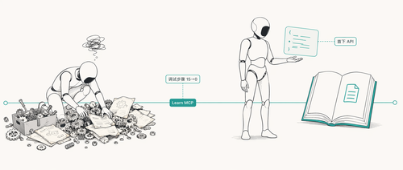

模型再强，也不知道上个月才换的 API 长什么样。Pieter de Bruin 在 Microsoft 开发者博客上记录了一个很容易复现的现象：让代理写一个部署 Azure AI Foundry 的脚本，没接文档的代理会一头扎进一套**一年前才是正确答案**的方法里，调依赖、改路径、绕来绕去；接上 Microsoft Learn 文档之后，同一个模型直接走到当下正确的 API 上。

这篇博客的价值不是“又一个 MCP 介绍”，而是把“代理为什么经常写出能编译却跑不通的代码”这件事拆得很具体，并且给出了一个**不用安装、不用授权**就能接上的远端 MCP 服务。下面把原文里的关键事实和接入步骤梳理一遍，方便你直接抄作业。

## 代理写过期代码的真正原因

代理本身的代码生成能力没问题，问题在于它的训练数据有截止时间，而技术在持续演进。结果是：

- 它写出的代码看起来很合理
- 它引用的 API 可能上个月刚被弃用
- 它选择的命令行扩展可能已经不是官方推荐路径

你当然可以靠提示工程绕过去：加约束、固定版本、跑一遍测试再让它修。这条路能走通，但等于你在替代理做它本来应该自己做的核查。

Learn MCP Server 的思路是把这件事甩回给代理：**让代理在动笔前先去 Microsoft Learn 上查一遍当下的文档**。

## 同一个 prompt 的两种命运

原文做了一组很直观的对照实验，prompt 都是同一句：

> create a CLI script to deploy Azure AI Foundry

### 没有 Learn MCP 的版本

代理选了 `az ml` 扩展，准备用 `az ml workspace create --kind hub` 来创建 Foundry 资源。这个写法**一年前是对的**——当时 Foundry 还在用 hub-and-project 模型，挂在 ML workspace API 下面。

然后扩展加载失败，触发了 `rpds-py` 的 Python 依赖冲突。代理开始排错：

- 重装 pip 包
- 验证 Python import 路径
- 比对系统 Python 和 CLI Python 的版本差异
- 翻 `.so` 文件

15+ 次工具调用之后，扩展终于加载起来，脚本也跑通了——但它打的是已经过时的 hub-and-project API。

### 接上 Learn MCP 之后

同一个 prompt、同一个模型，多了一个 Learn MCP Server 连接。

代理的第一步动作变成了**向 Microsoft Learn 查询当前的 Foundry 部署指引**。它拿到了 quickstart 文档，于是改用 `az cognitiveservices`——这是 Foundry 资源现在使用的 API 面。整套流程跑下来：

- 不用装扩展
- 没有依赖冲突
- 脚本创建了 AIServices 资源、创建了 project、部署了一个带版本和 SKU 的模型
- 顺手加了交互提示、幂等检查和连接信息输出
- 第一次跑就成

差别不在模型能力，而在**代理动手前是否能看到当下的官方文档**。

### 一张表对比

| 维度               | 不接 Learn MCP                        | 接上 Learn MCP                     |
| ------------------ | ------------------------------------- | ---------------------------------- |
| Prompt             | 同一句                                | 同一句                             |
| 代理首步动作       | Web search                            | Microsoft Docs Search              |
| 选用的 API         | `az ml`（对 Foundry 已弃用）          | `az cognitiveservices`（当下版本） |
| 被卡在哪           | `rpds-py` Python 依赖冲突             | 没卡                               |
| 出代码前的调试步骤 | 15+ 次工具调用                        | 0 次                               |
| 是否包含模型部署   | 否                                    | 是（gpt-4.1-mini，带版本和 SKU）   |
| 结果               | 一段对着旧 hub-and-project API 的脚本 | 一段端到端能跑的部署脚本           |

## Learn MCP Server 到底是什么

一句话：**它是一个远端 MCP 服务，让任何兼容 MCP 的代理都能直接搜 Microsoft Learn 上的文档、代码示例和指导**。

关键属性都比较克制：

- **协议**：标准 Model Context Protocol（MCP），所以兼容 GitHub Copilot CLI、VS Code、Visual Studio、Claude Code 等任何 MCP 客户端
- **位置**：远端服务，端点是 `https://learn.microsoft.com/api/mcp`，MCP 客户端能直接识别
- **部署成本**：不用安装、不用自托管
- **授权**：不需要认证
- **可扩展用法**：可以接到你在 Foundry 或 Copilot Studio 里搭的自定义代理上

它解决的是“代理推理时手上没有当下文档”这一个具体问题。当任务里涉及微软技术——部署一个 Azure 服务、迁移一个 .NET 应用、写一个 Bicep 模板——代理可以把 Learn 上的最新指导和你的代码库放在一起推理，少走一些“看起来对、实际过期”的弯路。

## 接入步骤

这一节是教程部分，命令直接照抄即可。

### 前置条件

- 一个支持 MCP 的客户端：GitHub Copilot CLI、VS Code、Visual Studio、Claude Code 等
- 能访问 `https://learn.microsoft.com/api/mcp`（公共网络可达即可，不需要登录）

### GitHub Copilot CLI

在 Copilot CLI 会话中执行：

```text
/plugin install microsoftdocs/mcp
/restart
```

`/plugin install` 会把 `microsoftdocs/mcp` 这个插件挂上去，`/restart` 重启 CLI 让插件加载生效。重启后，下一轮对话里代理就能调用 Microsoft Docs Search 类的工具。

验证方式很简单：让它做一个**最近发生过变化**的任务——比如换了名字的服务、改过签名的命令、新弃用的参数——看它的第一步是不是去查文档。

### VS Code

打开 VS Code 的扩展面板，搜索：

```text
@agentPlugins microsoft-docs
```

选择安装即可。它会作为一个 MCP 插件挂载到 Copilot 的代理模式下。

### 适合用来验收的 prompt

原文给出了一条很实用的判断方法：故意挑一件**最近才变的事**让代理做。比如：

- 让它生成一个部署某个 Azure 资源的脚本，但要求只用当下 GA 的 API 面
- 让它解释某个最近改名的服务的当前结构
- 让它使用某个最近弃用的标志，看它会不会主动指出已经被替代

如果第一次响应里它就去查 Learn 文档，并且选到了当下的 API，说明接入到位。

## 这件事提醒了什么

代理写代码看上去是“模型问题”，但很多时候只是一个**信息时效性**问题。模型不知道某个服务两个月前换了 SKU 命名，也不知道某个扩展上个月被官方下线，于是它会自然地拿训练时的那套写法当成默认答案。

Learn MCP Server 的做法很朴素：

- 不强迫你在 prompt 里写一堆“请使用最新 API”的告诫
- 不要求你在代理跑完之后再 diff 一遍文档
- 只是把当下的文档作为一个工具，挂在代理可调用的工具集合里

这套思路并不是 Microsoft 独有的。任何足够稳定的官方文档源 + MCP 通道，都可以做类似的事。值得留意的是，**有没有让代理在动笔前查当下文档**，会越来越变成代理工作流好用与否的一个隐性分界线。

## 上手建议

- 先在你已经在用的 MCP 客户端里把 Learn MCP Server 挂上
- 找一个**最近变过**的微软相关任务，对比接入前后第一步的差别
- 如果你在 Foundry 或 Copilot Studio 里自己搭代理，也可以把它作为一个工具直接接进去
- 更多配置和最新动态在 [Learn MCP Server 仓库](https://github.com/MicrosoftDocs/mcp) 里跟进

如果你关注 AI 助手、开发工具和软件工程实践，可以关注 Aide Hub。这里会继续分享能落地的工具教程、技术观察和项目经验。

## 参考

- 原文：[Improve your agentic developer tools by grounding in Microsoft Learn](https://devblogs.microsoft.com/blog/improve-your-agentic-developer-tools-by-grounding-in-microsoft-learn)
- [Learn MCP Server 官方介绍](https://learn.microsoft.com/training/support/mcp)
- [Learn MCP Server 仓库](https://github.com/MicrosoftDocs/mcp)
