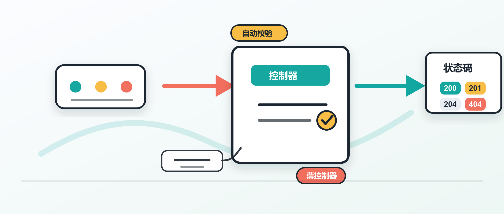

在 ASP.NET Core Web API 里，controller 是最常见的 HTTP 入口。它接收请求，调用业务代码，再把结果翻译成 HTTP 响应。这个角色看起来简单，写坏之后会很快变成一堆条件判断、数据转换和状态码分支。

Dev Leader 这篇文章把 controller 的基本功重新梳理了一遍：什么时候用 `ControllerBase`，`[ApiController]` 自动做了什么，action 应该返回什么类型，模型绑定从哪里取数据，以及为什么要让 controller 保持很薄。这里结合 Microsoft Learn 的官方说明，整理成一份可直接用在项目里的检查清单。

## 先选基类

ASP.NET Core 里常见两个 controller 基类：`ControllerBase` 和 `Controller`。

`ControllerBase` 提供 Web API 需要的基础能力，例如访问 `HttpContext`、`Request`、`Response`、`ModelState`，以及 `Ok()`、`NotFound()`、`BadRequest()`、`CreatedAtAction()` 这类响应辅助方法。

`Controller` 继承自 `ControllerBase`，还加入 Razor 视图相关能力，例如 `View()`、`ViewData`、`ViewBag` 和 `TempData`。如果项目只返回 JSON，通常选择 `ControllerBase`。

一个常见起点如下：

```csharp
using Microsoft.AspNetCore.Mvc;

[ApiController]
[Route("api/[controller]")]
public class CustomersController : ControllerBase
{
    [HttpGet]
    public IActionResult GetAll()
    {
        return Ok(new[] { new { Id = 1, Name = "Acme Corp" } });
    }

    [HttpGet("{id:int}")]
    public IActionResult GetById(int id)
    {
        return Ok(new { Id = id, Name = "Acme Corp" });
    }

    [HttpPost]
    public IActionResult Create([FromBody] CreateCustomerRequest request)
    {
        var newId = 42;
        return CreatedAtAction(
            nameof(GetById),
            new { id = newId },
            new { Id = newId });
    }
}

public record CreateCustomerRequest(string Name, string Email);
```

这里有三个基础选择：

- `[ApiController]` 打开 Web API 常用行为。
- `[Route("api/[controller]")]` 给 controller 设置基础路径。
- `ControllerBase` 提供 HTTP 响应辅助方法。

`[controller]` 会用 controller 类名去掉 `Controller` 后缀后的部分替换。`CustomersController` 对应的路径就是 `/api/customers`。

## ApiController 做了什么

`[ApiController]` 不是一个简单标记。它会改变 controller 的几个默认行为。

模型验证会自动执行。如果请求体绑定到模型后不满足数据注解，action 方法体还没运行，框架就会返回 `400 Bad Request`，响应体使用 `ProblemDetails` 格式。很多旧代码里常见的这一段可以省掉：

```csharp
if (!ModelState.IsValid)
{
    return BadRequest(ModelState);
}
```

绑定来源也会自动推断。复杂类型通常从请求体读取，路由模板里的简单类型从 route value 读取，其余简单类型多从 query string 读取。比如 `GET /api/orders/42?includeLines=true` 里，`id` 可以从路由取，`includeLines` 可以从查询字符串取。

错误响应会更一致。ASP.NET Core 现在默认使用 RFC 9457 形式的 `ProblemDetails` 来表达很多错误，客户端可以稳定读取 `type`、`title`、`status`、`detail` 和 `instance` 等字段。

在新项目里，可以把 `[ApiController]` 放在每个 controller 上，也可以在程序集级别启用，让所有 API controller 使用一致行为。

## Action 怎么写

Action method 是处理请求的公开方法。它需要是 `public`，不能是 `static`，也不能标记 `[NonAction]`。有数据库、远程 HTTP 调用或文件 I/O 时，优先写成异步方法。

常见返回类型有这些：

- `IActionResult`：适合返回结果种类多，成功类型不固定的场景。
- `ActionResult<T>`：适合成功响应有明确模型类型的场景。
- `Task<IActionResult>`：异步版本。
- `Task<ActionResult<T>>`：异步且成功类型明确。

在有明确成功类型时，优先使用 `ActionResult<T>`。它能让 OpenAPI 工具更容易推断响应模型，也让阅读代码的人直接看到成功响应的数据形状。

```csharp
[ApiController]
[Route("api/[controller]")]
public class InvoicesController : ControllerBase
{
    private readonly IInvoiceService _invoiceService;
    private readonly ILogger<InvoicesController> _logger;

    public InvoicesController(
        IInvoiceService invoiceService,
        ILogger<InvoicesController> logger)
    {
        _invoiceService = invoiceService;
        _logger = logger;
    }

    [HttpGet]
    public async Task<ActionResult<IReadOnlyList<InvoiceSummary>>> GetAll(
        CancellationToken cancellationToken)
    {
        var invoices = await _invoiceService.GetAllAsync(cancellationToken);
        return Ok(invoices);
    }

    [HttpGet("{id:guid}")]
    public async Task<ActionResult<InvoiceDetail>> GetById(
        Guid id,
        CancellationToken cancellationToken)
    {
        var invoice = await _invoiceService.GetByIdAsync(id, cancellationToken);

        if (invoice is null)
        {
            return NotFound();
        }

        return Ok(invoice);
    }

    [HttpPost]
    public async Task<ActionResult<InvoiceDetail>> Create(
        [FromBody] CreateInvoiceRequest request,
        CancellationToken cancellationToken)
    {
        var created = await _invoiceService.CreateAsync(
            request,
            cancellationToken);

        return CreatedAtAction(
            nameof(GetById),
            new { id = created.Id },
            created);
    }

    [HttpDelete("{id:guid}")]
    public async Task<IActionResult> Delete(
        Guid id,
        CancellationToken cancellationToken)
    {
        await _invoiceService.DeleteAsync(id, cancellationToken);
        return NoContent();
    }
}
```

这段代码的关键在于 action 只做三件事：接参数，调用 service，返回状态码。`CancellationToken` 也一路传下去。客户端断开连接后，框架会触发这个 token，数据库查询或外部 HTTP 调用就有机会及时停止。

## 状态码要准确

Controller 层的一个核心职责是把业务结果映射成合适的 HTTP 响应。常见对应关系可以这样记：

- `Ok(value)`：返回 `200`，通常用于成功的 `GET`。
- `CreatedAtAction(...)`：返回 `201`，通常用于创建资源，并带上 `Location`。
- `NoContent()`：返回 `204`，常见于成功删除或无需返回内容的更新。
- `BadRequest(...)`：返回 `400`，表示请求本身不合法。
- `NotFound()`：返回 `404`，表示资源不存在。
- `Conflict(...)`：返回 `409`，表示资源状态冲突，例如邮箱已注册。

业务规则错误也建议使用 `ProblemDetails`，这样它和自动模型验证的错误形状一致。

```csharp
[HttpPost]
public async Task<IActionResult> Register([FromBody] RegisterRequest request)
{
    if (await EmailExistsAsync(request.Email))
    {
        return Conflict(new ProblemDetails
        {
            Title = "Email already registered",
            Detail = "The email address is already associated with an account.",
            Status = StatusCodes.Status409Conflict
        });
    }

    var member = await CreateMemberAsync(request);
    return CreatedAtAction(nameof(GetById), new { id = member.Id }, member);
}
```

客户端消费 API 时，最怕同一种错误在不同接口里返回不同 JSON 形状。`ProblemDetails` 能减少这种额外适配。

## 模型绑定来源

模型绑定负责把 HTTP 请求里的数据填到 action 参数里。ASP.NET Core 常见绑定来源有这些：

- `[FromRoute]`：从路由参数读取。
- `[FromQuery]`：从查询字符串读取。
- `[FromBody]`：从请求体读取，JSON 默认由 `System.Text.Json` 反序列化。
- `[FromHeader]`：从请求头读取。
- `[FromForm]`：从表单读取，常见于文件上传。

有 `[ApiController]` 时，很多来源可以推断出来。遇到参数名和来源字段不一致、需要读取请求头、或者希望代码意图更清楚时，显式写出来源更稳。

```csharp
[ApiController]
[Route("api/exports")]
public class ExportsController : ControllerBase
{
    [HttpGet("{format}")]
    public IActionResult Download(
        [FromRoute] string format,
        [FromQuery] DateTimeOffset from,
        [FromQuery] DateTimeOffset to,
        [FromQuery] string? timezone = "UTC",
        [FromHeader(Name = "X-Correlation-Id")]
        string? correlationId = null)
    {
        return Ok(new
        {
            Format = format,
            From = from,
            To = to,
            Timezone = timezone,
            CorrelationId = correlationId
        });
    }
}
```

如果项目需要调整 JSON 行为，可以在 `AddControllers()` 后调用 `AddJsonOptions(...)`。只有在确实需要某些 `Newtonsoft.Json` 特性时，再引入对应扩展。

## 依赖注入

Controller 通过构造函数接收依赖。ASP.NET Core 会在每次请求激活 controller 时，从内置依赖注入容器中解析构造函数参数。

```csharp
[ApiController]
[Route("api/[controller]")]
public class NotificationsController : ControllerBase
{
    private readonly INotificationService _notificationService;
    private readonly IUserRepository _userRepository;
    private readonly ILogger<NotificationsController> _logger;

    public NotificationsController(
        INotificationService notificationService,
        IUserRepository userRepository,
        ILogger<NotificationsController> logger)
    {
        _notificationService = notificationService;
        _userRepository = userRepository;
        _logger = logger;
    }

    [HttpPost("send")]
    public async Task<IActionResult> Send(
        [FromBody] SendNotificationRequest request,
        CancellationToken cancellationToken)
    {
        var user = await _userRepository.GetByIdAsync(
            request.UserId,
            cancellationToken);

        if (user is null)
        {
            return NotFound(new ProblemDetails
            {
                Title = "User not found",
                Detail = $"No user with ID {request.UserId} exists.",
                Status = StatusCodes.Status404NotFound
            });
        }

        _logger.LogInformation(
            "Sending {Channel} notification to user {UserId}",
            request.Channel,
            request.UserId);

        await _notificationService.SendAsync(user, request, cancellationToken);
        return Accepted();
    }
}

public record SendNotificationRequest(
    Guid UserId,
    string Channel,
    string Message);
```

`ILogger<T>` 来自框架内置日志系统，通常不用手动注册。自己的服务和仓储要在 `Program.cs` 里注册，例如：

```csharp
builder.Services.AddScoped<INotificationService, NotificationService>();
builder.Services.AddScoped<IUserRepository, UserRepository>();
```

## 让控制器变薄

原文反复强调一个实践：controller 不应该承载业务逻辑。它的职责是协调请求、业务服务和响应。

当 action 里开始出现大段循环、复杂条件分支、数据聚合或跨系统调用编排时，可以考虑把逻辑移到 service、command handler、query handler 或 facade 里。controller 只留下输入输出边界。

薄 controller 有几个直接好处：

- 代码更容易读，请求入口一眼能看完。
- 测试更简单，通常 mock 一两个服务，再断言状态码和响应形状。
- 业务规则可以脱离 HTTP 层复用。
- 以后改路由、鉴权或响应格式时，不容易碰到业务代码。

如果项目采用 Mediator 模式，controller 可以只发送 command 或 query。若一个接口背后要协调多个仓储、缓存和外部服务，也可以用 facade 给 controller 提供一个更窄的入口。

## 过滤器和 Areas

Filter 适合处理只作用于部分 controller 或 action 的横切逻辑。比如：

- 写操作审计日志。
- 针对部分端点做响应缓存。
- 自定义授权检查。
- 把特定异常映射成状态码。

常见接口包括 `IActionFilter`、`IAsyncActionFilter`、`IResultFilter`、`IExceptionFilter` 和 `IResourceFilter`。它们可以通过 attribute、`[ServiceFilter(typeof(MyFilter))]` 或全局配置接入。

当 API 规模变大，`Controllers/` 目录里堆满几十上百个 controller 时，可以用 Areas 分组。比如后台接口和前台接口都操作产品资源，可以分别放到 `admin` 和 `store` 区域：

```csharp
[Area("admin")]
[Route("api/[area]/[controller]")]
public class ProductsController : ControllerBase
{
}
```

这种方式适合多模块或多租户系统。不同区域可以拥有自己的路径、授权策略和服务注册边界。

## .NET 10 变化

原文提到几个 .NET 10 相关变化，和 controller 项目关系比较近。

`Microsoft.AspNetCore.OpenApi` 在 .NET 9 开始提供内置 OpenAPI 支持，.NET 10 继续扩展。很多项目可以减少对第三方 OpenAPI 包的依赖，但复杂文档需求仍然要按项目情况判断。

泛型版 `[ProducesResponseType<T>]` 能替代过去的 `[ProducesResponseType(typeof(MyType), 200)]` 写法。它对重构更友好，类型改名或移动时更容易被工具检查到。

Endpoint metadata 也更丰富。controller action 可以带上更多元数据，后续 middleware 或 endpoint filter 可以读取这些信息，用来做缓存、限流、功能开关等处理。

Native AOT 支持也在改善。源生成器覆盖更多需要反射的场景，减少手动补 `[JsonSerializable]` 的负担。高频日志可以配合 `[LoggerMessage]` 做编译期日志方法生成，减少装箱和字符串模板开销。

## 实用检查清单

写一个新的 ASP.NET Core controller 前，可以快速过一遍：

- Web API 优先从 `ControllerBase` 开始。
- 给 API controller 启用 `[ApiController]`。
- 路由用 attribute routing，让入口在代码旁边可见。
- 成功类型明确时，action 返回 `ActionResult<T>`。
- 创建资源用 `CreatedAtAction`，删除成功用 `NoContent`。
- 业务错误也尽量使用 `ProblemDetails`。
- 需要读取 header 或字段名不直观时，显式写 `[FromHeader]`、`[FromQuery]` 或 `[FromRoute]`。
- I/O 操作用异步，并把 `CancellationToken` 传到服务层。
- 构造函数注入服务，不在 controller 里 new 业务对象。
- action 里只协调请求、服务和响应，复杂逻辑移到服务或 handler。

ASP.NET Core controller 的写法并不神秘。把 HTTP 边界处理清楚，把业务逻辑放到合适位置，再让响应格式保持一致，大多数 Web API 端点就会更容易维护。

如果你关注 AI 助手、开发工具和软件工程实践，可以关注 Aide Hub。这里会继续分享实用的工具教程、技术观察和项目经验。

## 参考

- [ASP.NET Core Controllers: A Practical Guide to Building REST Endpoints](https://www.devleader.ca/2026/06/01/aspnet-core-controllers-a-practical-guide-to-building-rest-endpoints)
- [Microsoft Learn: Create web APIs with ASP.NET Core](https://learn.microsoft.com/en-us/aspnet/core/web-api/?view=aspnetcore-10.0)
- [Microsoft Learn: Controller actions in ASP.NET Core](https://learn.microsoft.com/en-us/aspnet/core/mvc/controllers/actions?view=aspnetcore-10.0)
- [Microsoft Learn: Model binding in ASP.NET Core](https://learn.microsoft.com/en-us/aspnet/core/mvc/models/model-binding?view=aspnetcore-10.0)
