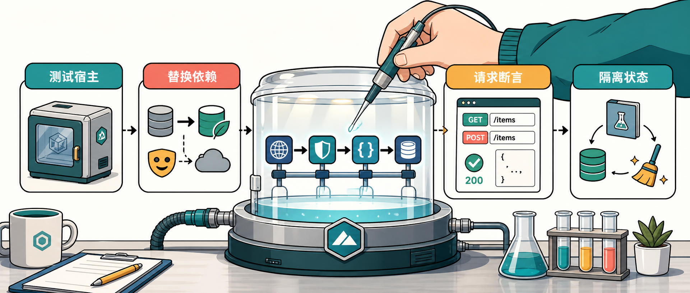

写 Web API 测试时，最容易卡在一个问题上：只测 Controller 方法太浅，真起一个服务又太重。`WebApplicationFactory` 的价值就在中间这层，它能在测试进程里启动真实 ASP.NET Core 应用，让请求走过路由、模型绑定、过滤器、中间件、序列化和依赖注入，但不需要打开真实网络端口。

Dev Leader 这篇文章围绕 .NET 10 的 ASP.NET Core Web API 测试展开，主线很明确：用 `WebApplicationFactory` 搭测试宿主，用 `HttpClient` 发真实 HTTP 请求，再把生产数据库、认证和外部服务换成测试版本。这样写出来的测试，比直接 new 一个 Controller 更接近用户真实调用，也比完整端到端环境更快、更可控。

## 先搭测试宿主

最小形态其实很短。测试项目引用 `Microsoft.AspNetCore.Mvc.Testing`，然后让测试类实现 `IClassFixture<WebApplicationFactory<Program>>`：

```csharp
using Microsoft.AspNetCore.Mvc.Testing;
using System.Net;
using Xunit;

public class ProductsEndpointTests
    : IClassFixture<WebApplicationFactory<Program>>
{
    private readonly HttpClient _client;

    public ProductsEndpointTests(WebApplicationFactory<Program> factory)
    {
        _client = factory.CreateClient();
    }

    [Fact]
    public async Task GetProducts_ReturnsOk()
    {
        var response = await _client.GetAsync("/api/products");

        Assert.Equal(HttpStatusCode.OK, response.StatusCode);
    }
}
```

这里的关键不是 `GetAsync`，而是 `factory.CreateClient()`。这个 `HttpClient` 会把请求送进内存中的 ASP.NET Core 测试服务器，请求仍然经过应用的真实管线。也就是说，路由写错、过滤器没注册、JSON 序列化配置有问题，这类单元测试绕过去的错误，有机会在集成测试里暴露出来。

如果你的 `Program` 类型在最小 API 项目里不可见，原文提醒了一个常见处理方式：在应用项目里补一个公开的 partial 类型。

```csharp
public partial class Program { }
```

## 替换生产依赖

真实项目不会只测一个空端点。端点背后通常有数据库、邮件服务、消息队列、第三方 API。集成测试要覆盖应用行为，但不应该真的打到生产资源，所以需要自定义 `WebApplicationFactory`。

常见写法是继承 `WebApplicationFactory<Program>`，在 `ConfigureWebHost` 里重写服务注册：

```csharp
using Microsoft.AspNetCore.Hosting;
using Microsoft.AspNetCore.Mvc.Testing;
using Microsoft.EntityFrameworkCore;
using Microsoft.Extensions.DependencyInjection;

public class CustomWebApplicationFactory
    : WebApplicationFactory<Program>
{
    protected override void ConfigureWebHost(IWebHostBuilder builder)
    {
        builder.ConfigureServices(services =>
        {
            var descriptor = services.SingleOrDefault(
                d => d.ServiceType == typeof(DbContextOptions<AppDbContext>));

            if (descriptor != null)
            {
                services.Remove(descriptor);
            }

            services.AddDbContext<AppDbContext>(options =>
            {
                options.UseSqlite("DataSource=:memory:");
            });

            services.AddSingleton<IEmailService, FakeEmailService>();

            var sp = services.BuildServiceProvider();
            using var scope = sp.CreateScope();
            var db = scope.ServiceProvider.GetRequiredService<AppDbContext>();
            db.Database.EnsureCreated();
        });
    }
}
```

这段代码有几个实用锚点：

- 移除生产环境的 `DbContextOptions<AppDbContext>` 注册。
- 用 SQLite in-memory 替换数据库。
- 用 `FakeEmailService` 这类测试替身替换外部服务。
- 调用 `EnsureCreated()` 让测试数据库具备可用 schema。

原文也提到，EF Core 的 InMemory provider 更简单，但它不执行关系型数据库约束；SQLite in-memory 更接近真实关系型数据库，会检查外键、事务和唯一约束等行为。只测 HTTP 行为时，EF InMemory 可能够用；如果业务依赖关系型语义，SQLite in-memory 更稳。

## 发送真实请求

测试宿主搭好以后，测试就应该围绕 API 合同写，而不是围绕实现细节写。一个产品端点通常至少覆盖空列表、创建成功、校验失败这些路径：

```csharp
using System.Net;
using System.Net.Http.Json;
using Xunit;

public class ProductsIntegrationTests
    : IClassFixture<CustomWebApplicationFactory>
{
    private readonly HttpClient _client;

    public ProductsIntegrationTests(CustomWebApplicationFactory factory)
    {
        _client = factory.CreateClient();
    }

    [Fact]
    public async Task GetProducts_WhenEmpty_ReturnsEmptyList()
    {
        var response = await _client.GetAsync("/api/products");
        var products =
            await response.Content.ReadFromJsonAsync<List<ProductDto>>();

        Assert.Equal(HttpStatusCode.OK, response.StatusCode);
        Assert.NotNull(products);
        Assert.Empty(products);
    }

    [Fact]
    public async Task CreateProduct_WithValidData_ReturnsCreated()
    {
        var request = new CreateProductRequest
        {
            Name = "Widget Pro",
            Price = 49.99m,
            StockQuantity = 100
        };

        var response = await _client.PostAsJsonAsync(
            "/api/products",
            request
        );
        var created =
            await response.Content.ReadFromJsonAsync<ProductDto>();

        Assert.Equal(HttpStatusCode.Created, response.StatusCode);
        Assert.NotNull(created);
        Assert.Equal("Widget Pro", created.Name);
        Assert.True(created.Id > 0);
    }
}
```

这里有一个小原则很重要：集成测试要像 API 行为文档。测试名用 `MethodUnderTest_Condition_Expected` 这类清楚的格式，失败时不用打开测试体也能知道是哪条行为坏了。一个叫 `Test1` 的失败测试，只会把排查成本推给后来的人。

## 处理认证端点

带 `[Authorize]` 的端点怎么测，要看你到底想验证什么。

大多数业务集成测试并不需要重新证明 JWT 库能正常工作。它们更关心“已认证且有这些 claims 的用户访问这个端点时，业务行为是否正确”。这种场景可以注册一个测试认证处理器，让它总是返回固定用户。

```csharp
using Microsoft.AspNetCore.Authentication;
using Microsoft.AspNetCore.Mvc.Testing;
using Microsoft.Extensions.Options;
using System.Security.Claims;
using System.Text.Encodings.Web;

public class TestAuthHandler
    : AuthenticationHandler<AuthenticationSchemeOptions>
{
    public TestAuthHandler(
        IOptionsMonitor<AuthenticationSchemeOptions> options,
        ILoggerFactory logger,
        UrlEncoder encoder)
        : base(options, logger, encoder) { }

    protected override Task<AuthenticateResult> HandleAuthenticateAsync()
    {
        var claims = new[]
        {
            new Claim(ClaimTypes.Name, "TestUser"),
            new Claim(ClaimTypes.NameIdentifier, "test-user-id"),
            new Claim(ClaimTypes.Role, "Admin")
        };

        var identity = new ClaimsIdentity(claims, "TestScheme");
        var principal = new ClaimsPrincipal(identity);
        var ticket = new AuthenticationTicket(principal, "TestScheme");

        return Task.FromResult(AuthenticateResult.Success(ticket));
    }
}
```

然后在自定义 factory 里注册这个 scheme。后续通过该 factory 创建的 client，就会带着固定身份进入授权管线。

只有当你明确要验证 JWT 配置本身，比如过期 token 是否被拒绝、签名密钥是否正确，才值得走真实 token 生成和验证。否则，伪造认证能让测试聚焦在应用逻辑上，速度也更快。

## 隔离测试数据

很多集成测试最后不是输给启动速度，而是输给“脏数据”。一个测试创建了产品，另一个测试突然多查出一条记录；本地没问题，CI 并行跑就炸。

原文推荐用 `IAsyncLifetime` 做异步初始化和清理，把种子数据放在离测试最近的地方：

```csharp
public class ProductsWithDataTests
    : IClassFixture<CustomWebApplicationFactory>, IAsyncLifetime
{
    private readonly CustomWebApplicationFactory _factory;
    private readonly HttpClient _client;

    public ProductsWithDataTests(CustomWebApplicationFactory factory)
    {
        _factory = factory;
        _client = factory.CreateClient();
    }

    public async Task InitializeAsync()
    {
        using var scope = _factory.Services.CreateScope();
        var db = scope.ServiceProvider.GetRequiredService<AppDbContext>();

        db.Products.AddRange(
            new Product { Name = "Alpha Widget", Price = 10.00m },
            new Product { Name = "Beta Widget", Price = 20.00m },
            new Product { Name = "Gamma Widget", Price = 30.00m }
        );

        await db.SaveChangesAsync();
    }

    public async Task DisposeAsync()
    {
        using var scope = _factory.Services.CreateScope();
        var db = scope.ServiceProvider.GetRequiredService<AppDbContext>();

        db.Products.RemoveRange(db.Products);
        await db.SaveChangesAsync();
    }
}
```

`InitializeAsync` 相当于异步版 setup，`DisposeAsync` 相当于异步版 teardown。更进一步，如果同一个测试类里的不同测试需要完全不同的数据集，可以给每个测试分配独立数据库名，例如用 `Guid.NewGuid()` 生成数据库名，避免并行测试互相污染。

有一条边界也要记住：适合放在 factory 里的，是不会被测试修改的参考数据；会被测试增删改的数据，最好由测试类自己准备和清理。

## 组织 xUnit 夹具

`IClassFixture<T>` 和 `ICollectionFixture<T>` 的差别，核心是共享范围。

`IClassFixture<T>` 在一个测试类里共享同一个 `T` 实例。对于 `WebApplicationFactory` 这种启动有成本的对象，它能避免每个测试方法都重启宿主。

`ICollectionFixture<T>` 可以跨多个测试类共享同一个实例。它适合测试服务器启动很贵、多个类又共用同一套环境的情况。但共享越大，状态隔离越难，测试并行度也可能受影响。原文的态度比较务实：先保持测试独立，再考虑共享带来的速度收益。

## 单元测试仍然要留着

集成测试验证的是 HTTP 边界和管线行为，不应该吞掉所有测试职责。

业务分支复杂的地方，单元测试仍然更合适。Controller 可以直接 new 出来测返回的 `IActionResult`；如果项目用了 mediator pattern，Controller 测“是否发送了正确 command/query”，handler 测业务规则。这样集成测试不用覆盖每个业务排列组合，只需要覆盖 API 合同的关键路径。

Middleware 和 filter 则更适合在它们实际工作的边界上测。自定义 middleware 可以用 `Microsoft.AspNetCore.TestHost` 的 `TestServer` 搭一个最小管线；action filter 通常通过挂载了该 filter 的端点做集成测试更自然，因为这能顺便验证注册和激活路径。

## 实践建议

如果你准备给 ASP.NET Core Web API 补一套集成测试，可以从这几个动作开始：

- 给测试项目加 `Microsoft.AspNetCore.Mvc.Testing`。
- 用 `WebApplicationFactory<Program>` 跑通一个最小 GET 请求。
- 建一个自定义 factory，替换数据库和外部服务。
- 对每个重要端点覆盖 happy path、一个校验失败、一个鉴权或授权场景。
- 用 `IAsyncLifetime` 或独立数据库名确保测试数据可清理、可重复。

不需要追求用集成测试覆盖 100% 代码。它更像 API 合同的活文档：状态码对不对、响应形状对不对、授权策略是否生效、常见失败路径是否稳定。更深的业务分支，继续交给单元测试。

如果你关注 AI 助手、开发工具和软件工程实践，可以关注 Aide Hub。这里会继续分享能落地的工具教程、技术观察和项目经验。

## 参考

- [Testing ASP.NET Core Web API: WebApplicationFactory and Integration Tests](https://www.devleader.ca/2026/06/08/testing-aspnet-core-web-api-webapplicationfactory-and-integration-tests)
