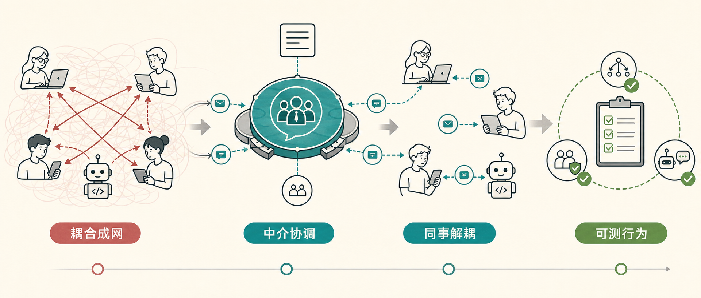

当几个对象开始互相调用时，代码一开始看起来还行。A 通知 B，B 再通知 C，C 反过来影响 A。等对象数量多一点，关系就会变成一张网：谁依赖谁、谁应该通知谁、谁可以跳过谁，全都散落在各个类里。

中介者模式解决的就是这类“对象之间通信规则失控”的问题。它引入一个中介者对象，把对象之间的直接通信收束到一个协调点。对象只知道中介者，不需要知道其他对象是谁。

Dev Leader 这篇文章用一个聊天系统示例演示了 C# 中介者模式的完整实现：`IChatMediator` 负责发送和注册，`ChatRoom` 负责路由，`StandardUser` 和 `BotUser` 作为同事对象通过中介者通信。这个例子不复杂，但能把模式里的几个关键点讲清楚。

## 适用场景

中介者模式不是为了让所有调用都“多绕一层”。它适合这些情况：

- 多个对象之间有复杂的双向或多向通信。
- 每加一个对象，就要改很多已有对象。
- 通信规则分散在各处，排查行为要跳好几个类。
- 你希望把“谁通知谁”的规则集中起来测试。

聊天系统、表单控件联动、UI 组件协调、游戏对象事件、工作流内部状态协调，都可能适合这个模式。

如果只是一个对象向多个订阅者广播事件，观察者模式可能更自然。如果只是想给外部调用者提供一个简化入口，外观模式更贴切。中介者模式强调的是同一组对象内部的多方协作。

## 定义中介者接口

示例从一个 `IChatMediator` 开始。它只做两件事：注册同事对象，发送消息。

```csharp
public interface IChatMediator
{
    void SendMessage(
        string message,
        IChatColleague sender);

    void RegisterColleague(IChatColleague colleague);
}
```

这个接口越小越好。它应该描述协调行为，而不是把业务规则都塞进去。原文后面专门提醒过一个坑：如果中介者类膨胀成几百行，开始承载业务判断、数据转换和校验规则，它就会变成“上帝中介者”。

## 抽象同事对象

同事对象也需要一个接口，方便中介者统一发送通知：

```csharp
public interface IChatColleague
{
    string Name { get; }

    void ReceiveMessage(
        string message,
        string senderName);
}
```

然后用一个抽象基类保存中介者引用，并提供 `Send` 方法：

```csharp
public abstract class ChatColleagueBase : IChatColleague
{
    protected IChatMediator Mediator { get; }

    public string Name { get; }

    protected ChatColleagueBase(
        IChatMediator mediator,
        string name)
    {
        Mediator = mediator
            ?? throw new ArgumentNullException(nameof(mediator));
        Name = name
            ?? throw new ArgumentNullException(nameof(name));
    }

    public void Send(string message)
    {
        Mediator.SendMessage(message, this);
    }

    public abstract void ReceiveMessage(
        string message,
        string senderName);
}
```

这里有个设计味道值得保留：同事对象通过 `Send` 把消息交给中介者，而不是拿着其他同事对象引用挨个调用。以后新增一个同事类型，只要实现 `ReceiveMessage`，不需要去改已有同事类。

## 实现 ChatRoom

具体中介者 `ChatRoom` 持有已注册同事对象列表，并负责转发消息：

```csharp
public class ChatRoom : IChatMediator
{
    private readonly List<IChatColleague> _colleagues;

    public ChatRoom()
    {
        _colleagues = new List<IChatColleague>();
    }

    public void RegisterColleague(IChatColleague colleague)
    {
        if (colleague == null)
        {
            throw new ArgumentNullException(nameof(colleague));
        }

        if (!_colleagues.Contains(colleague))
        {
            _colleagues.Add(colleague);
        }
    }

    public void SendMessage(
        string message,
        IChatColleague sender)
    {
        foreach (var colleague in _colleagues.ToArray())
        {
            if (colleague != sender)
            {
                colleague.ReceiveMessage(message, sender.Name);
            }
        }
    }
}
```

这段代码里有三个小细节很实用：

- `RegisterColleague` 防重复注册，避免同一个对象收到两次消息。
- `SendMessage` 遍历 `_colleagues.ToArray()`，先做快照，避免通知过程中集合被修改导致 `InvalidOperationException`。
- `colleague != sender` 避免把消息回发给发送者，这也是聊天室语义里比较自然的规则。

如果以后要加消息过滤、优先级、日志、审计、静音规则，修改点都集中在 `ChatRoom`。这就是中介者模式的核心收益：通信规则集中，同事对象保持简单。

## 写两个同事类

普通用户只记录和显示消息：

```csharp
public class StandardUser : ChatColleagueBase
{
    private readonly List<string> _messageLog;

    public IReadOnlyList<string> MessageLog => _messageLog;

    public StandardUser(
        IChatMediator mediator,
        string name)
        : base(mediator, name)
    {
        _messageLog = new List<string>();
    }

    public override void ReceiveMessage(
        string message,
        string senderName)
    {
        var formatted =
            $"[{Name}] received from {senderName}: {message}";

        _messageLog.Add(formatted);
        Console.WriteLine(formatted);
    }
}
```

机器人用户收到特定关键词后，会通过中介者自动回复：

```csharp
public class BotUser : ChatColleagueBase
{
    private readonly Dictionary<string, string> _autoResponses;
    private readonly List<string> _messageLog;

    public IReadOnlyList<string> MessageLog => _messageLog;

    public BotUser(
        IChatMediator mediator,
        string name,
        Dictionary<string, string> autoResponses)
        : base(mediator, name)
    {
        _autoResponses = autoResponses
            ?? throw new ArgumentNullException(nameof(autoResponses));
        _messageLog = new List<string>();
    }

    public override void ReceiveMessage(
        string message,
        string senderName)
    {
        var formatted =
            $"[{Name}] received from {senderName}: {message}";

        _messageLog.Add(formatted);

        foreach (var kvp in _autoResponses)
        {
            if (message.Contains(
                kvp.Key,
                StringComparison.OrdinalIgnoreCase))
            {
                Send(kvp.Value);
                break;
            }
        }
    }
}
```

`BotUser` 这里很能体现模式的边界：它可以有自己的行为，比如关键词匹配和自动回复；但它不直接知道 Alice、Bob 或其他用户。回复还是调用继承来的 `Send`，消息继续走中介者。

## 串起来运行

把中介者和同事对象创建出来，注册后就可以发消息：

```csharp
var chatRoom = new ChatRoom();

var alice = new StandardUser(chatRoom, "Alice");
var bob = new StandardUser(chatRoom, "Bob");

var autoResponses = new Dictionary<string, string>
{
    { "help", "I can assist you! Type a command." },
    { "hello", "Hi there! Welcome to the chat." }
};

var helpBot = new BotUser(
    chatRoom,
    "HelpBot",
    autoResponses);

chatRoom.RegisterColleague(alice);
chatRoom.RegisterColleague(bob);
chatRoom.RegisterColleague(helpBot);

alice.Send("hello everyone!");
bob.Send("Can someone help me?");
alice.Send("How is the project going?");
```

运行后你会看到，Alice 的 `hello` 会被 Bob 和 HelpBot 收到，HelpBot 识别到关键词后再发出自动回复。Bob 的 `help` 也是同样流程。所有消息都经过 `ChatRoom`，同事对象之间没有直接引用。

## 接入依赖注入

生产代码里通常会把中介者注册进 DI 容器。原文给出的思路是把中介者注册成 singleton，让所有同事对象共享同一个协调实例：

```csharp
using Microsoft.Extensions.DependencyInjection;

var services = new ServiceCollection();

services.AddSingleton<IChatMediator, ChatRoom>();

services.AddTransient<StandardUser>(sp =>
{
    var mediator =
        sp.GetRequiredService<IChatMediator>();
    var user = new StandardUser(mediator, "DI-User");

    mediator.RegisterColleague(user);
    return user;
});

var provider = services.BuildServiceProvider();

var user = provider.GetRequiredService<StandardUser>();
user.Send("Hello from DI!");
```

这个写法能跑，但实际项目里要留意生命周期。中介者如果是 singleton，而同事对象是 transient，注册后中介者会长期持有同事对象引用。对于聊天室、UI session 或工作流这类有明确生命周期的场景，可能需要按 room、scope 或 session 管理中介者实例，避免对象泄漏。

## 写单元测试

这个模式比较好测，因为中介者和同事对象之间有清楚的接口。先测路由：消息应该发给除发送者以外的所有对象。

```csharp
using Xunit;

public class ChatRoomTests
{
    [Fact]
    public void SendMessage_DeliversToAll_ExceptSender()
    {
        var chatRoom = new ChatRoom();
        var alice = new StandardUser(chatRoom, "Alice");
        var bob = new StandardUser(chatRoom, "Bob");
        var charlie = new StandardUser(chatRoom, "Charlie");

        chatRoom.RegisterColleague(alice);
        chatRoom.RegisterColleague(bob);
        chatRoom.RegisterColleague(charlie);

        alice.Send("Test message");

        Assert.Empty(alice.MessageLog);
        Assert.Single(bob.MessageLog);
        Assert.Single(charlie.MessageLog);
        Assert.Contains("Alice", bob.MessageLog[0]);
        Assert.Contains("Test message", charlie.MessageLog[0]);
    }

    [Fact]
    public void RegisterColleague_PreventsDuplicates()
    {
        var chatRoom = new ChatRoom();
        var alice = new StandardUser(chatRoom, "Alice");
        var bob = new StandardUser(chatRoom, "Bob");

        chatRoom.RegisterColleague(alice);
        chatRoom.RegisterColleague(alice);
        chatRoom.RegisterColleague(bob);

        alice.Send("Duplicate test");

        Assert.Single(bob.MessageLog);
    }
}
```

再测机器人行为：含关键词时自动回复，不含关键词时不回复。

```csharp
public class BotUserTests
{
    [Fact]
    public void ReceiveMessage_WithKeyword_SendsAutoResponse()
    {
        var chatRoom = new ChatRoom();
        var alice = new StandardUser(chatRoom, "Alice");
        var bot = new BotUser(
            chatRoom,
            "TestBot",
            new Dictionary<string, string>
            {
                { "help", "Here to help!" }
            });

        chatRoom.RegisterColleague(alice);
        chatRoom.RegisterColleague(bot);

        alice.Send("I need help please");

        Assert.Single(alice.MessageLog);
        Assert.Contains("Here to help!", alice.MessageLog[0]);
    }
}
```

原文这里的一个好习惯是给同事对象暴露 `MessageLog`，让测试可以直接断言收到的消息。这样很多场景不用 mock 框架也能测清楚。

如果只想测中介者本身，可以写一个很轻的 stub colleague，实现 `IChatColleague` 并把收到的消息存到列表里。这样测试不会和 `StandardUser`、`BotUser` 的内部行为绑在一起。

## 常见坑

中介者模式最常见的坑不是“写不出来”，而是写着写着走偏。

**中介者过胖。** 中介者应该负责协调通信，不应该吞掉同事对象自己的领域逻辑。比如机器人该不该回复，是 `BotUser` 的行为；谁能收到消息、是否跳过发送者，是 `ChatRoom` 的协调规则。

**循环消息。** `BotUser` 这类对象会在收到消息后继续发消息。如果自动回复关键词互相触发，就可能出现无限循环。可以用处理标记、递归深度限制，或者从规则设计上避免自动回复互相命中。

**依赖具体中介者。** 同事对象应该依赖 `IChatMediator`，不要依赖 `ChatRoom`。否则以后想替换中介者实现、写测试替身，都会被具体类型卡住。

**忽略线程安全。** 示例里的 `List<T>` 适合讲模式，但多线程同时发送或注册时不安全。并发场景要用 `ConcurrentBag<T>`、锁，或者更明确的并发模型。`ToArray()` 能避免通知过程中集合被修改，但不能保护并发写入。

**忘记注册同事对象。** 一个对象拿到了中介者，但没调用 `RegisterColleague`，就可能“能发消息但收不到消息”。项目里可以考虑把注册过程封装到工厂、生命周期管理器或基类构造流程里。

## 和 MediatR 的关系

很多 .NET 开发者听到 mediator，会马上想到 MediatR。两者相关，但不是同一件事。

中介者模式是设计模式，描述一种“对象通过协调者通信”的思想。MediatR 是一个 .NET 库，它用 `IRequest<T>`、`IRequestHandler<TRequest, TResponse>` 等接口实现了请求/响应式的进程内消息分发，还带 pipeline 行为。

如果你做的是应用层 command/query 分发，MediatR 很合适。如果你面对的是一组对象之间的协作关系，比如聊天室成员、UI 控件、工作流节点，自己实现一个更贴近领域的中介者可能更直观。

这篇示例的意义也在这里：理解底层模式以后，再用 MediatR 或其他库时，你会更清楚自己是在解耦什么、集中什么、以及不该把什么塞进中介者。

## 落地建议

中介者模式适合从小处落地。先找一组关系已经开始变乱的对象，不要一上来把全系统都改成消息分发。

可以按这个顺序做：

1. 抽出一个小的 mediator 接口，只保留协调所需方法。
2. 让参与者依赖接口，而不是互相持有具体对象。
3. 把路由、过滤、注册这类通信规则放进中介者。
4. 把领域行为继续留在同事对象里。
5. 用单元测试覆盖路由、重复注册、异常和循环消息边界。

一个好的中介者实现，读起来应该像“交通规则集中在一个路口调度器里”。如果它读起来像“所有业务都搬进了一个大类”，那就需要停下来拆职责了。

如果你关注 AI 助手、开发工具和软件工程实践，可以关注 Aide Hub。这里会继续分享能落地的工具教程、技术观察和项目经验。

## 参考

- [How to Implement Mediator Pattern in C#: Step-by-Step Guide](https://www.devleader.ca/2026/06/08/how-to-implement-mediator-pattern-in-c-stepbystep-guide)
