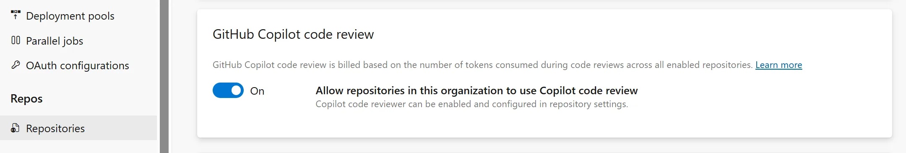
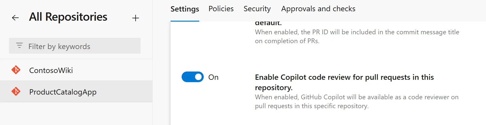
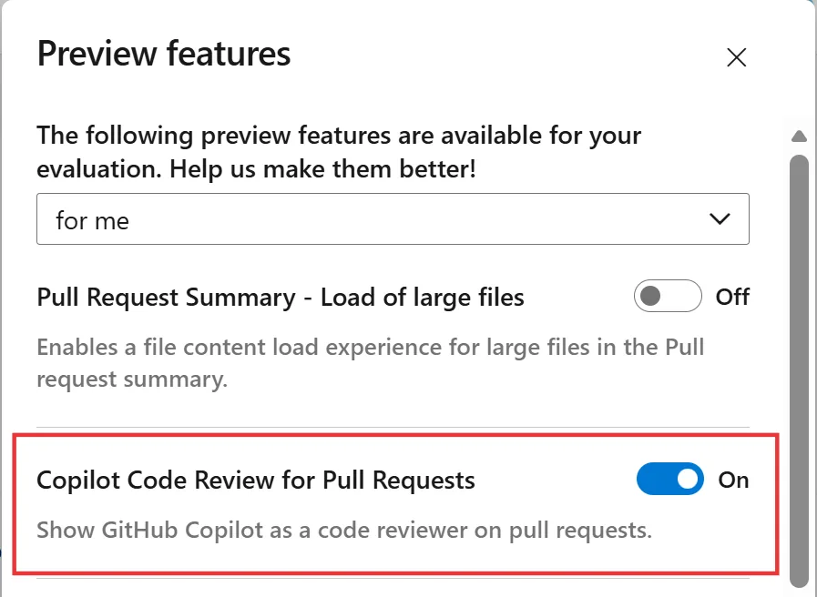
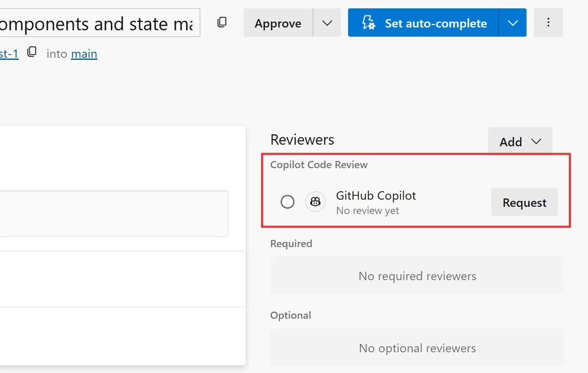
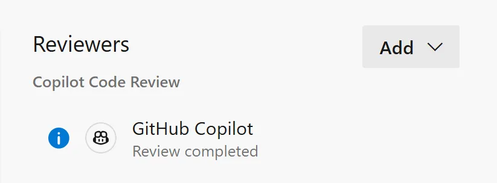
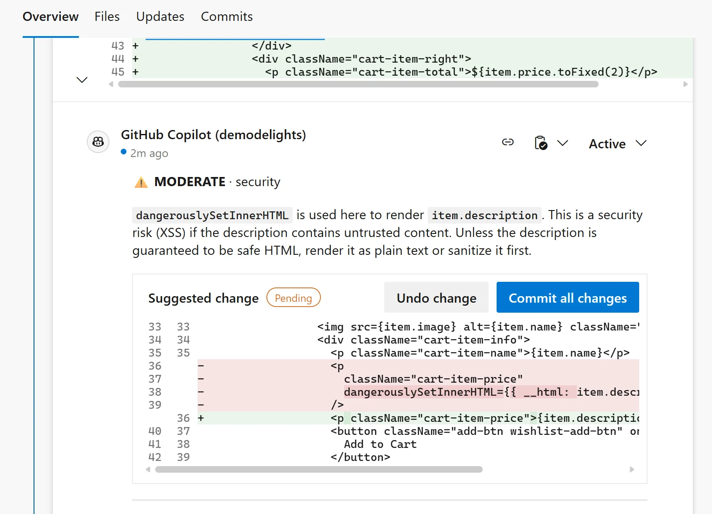
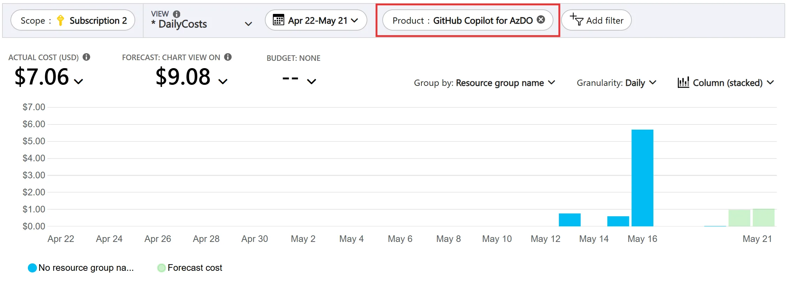

还在 Azure Repos 上做日常开发的团队，现在可以关注一个新的预览能力：Microsoft 正在把 GitHub Copilot code reviews 带进 Azure Repos 的 pull request。它不是替代人工评审，而是在 PR 里额外请求一次 Copilot 检查，让它对潜在问题给出评论和修改建议。

这篇适合两类读者：一类是还没准备迁移到 GitHub、但已经在 Azure DevOps 上管理代码的团队；另一类是想试用 AI 代码评审，但更关心权限、启用范围、并发限制和费用的人。原文的重点不只是“功能来了”，还包括它目前仍处在有限公开预览阶段，需要申请、启用和观察成本。

## 为什么是现在

Microsoft 在原文开头先交代了背景：过去几年，他们一直鼓励客户从 Azure Repos 迁移到 GitHub，以便使用 GitHub 正在交付的 AI 和 agentic development 体验。

但迁移不总是简单动作。大型组织会遇到规模、定制、合规、工具链和行业约束。有些团队已经在计划迁移，有些团队短期内仍然会继续依赖 Azure Repos 做日常开发。

这次预览版针对的就是后一类场景：代码仓库还在 Azure Repos，团队暂时不迁移，但希望在 pull request 里试用 Copilot 代码评审。

## 先申请预览

当前功能不是默认开放。Microsoft 采用申请制开放 technical preview，感兴趣的客户可以提交申请，之后由 Microsoft 为组织启用该功能。

原文给出的理由也很现实：他们需要逐步放量，观察 telemetry 和 usage metrics，并在广泛开放前收集反馈。换句话说，这更像受控预览，不适合当成已经稳定可用的生产级能力来规划全团队上线。

如果团队想参与，可以从原文里的 preview signup 链接申请。申请通过后，才进入真正的配置步骤。

## 三层开关

启用路径分三层：组织、仓库、用户。少开一层，最终都可能看不到可用入口。

### 组织级

组织管理员需要先在 Azure DevOps 的组织级别打开 Copilot code review。路径是：

`Organization Settings` > `Repositories`

这一步的意义是允许该组织使用这个能力。它不是自动让所有仓库都启用，而是给后续仓库级配置放行。

### 仓库级

组织级开关打开后，仓库管理员可以给具体仓库启用 Copilot Code Review。路径是：

`Project` > `Repositories` > `Manage Repositories`，再选择目标仓库。

这个设计比较适合试点。团队可以先选一两个活跃但风险可控的仓库，而不是把整个组织一次性打开。

### 用户级

还需要在用户侧打开预览功能。用户可以自己进入 `Preview Features` 面板，开启 `Copilot Code Review for Pull Requests`；组织管理员也可以为所有用户启用。

如果你在 PR 里找不到入口，优先检查这三层：组织是否启用、仓库是否启用、当前用户是否打开预览功能。

## 发起评审

配置完成后，使用方式很直接。开发者正常提交代码变更并创建 pull request。当 PR 准备好进入评审时，在 `Reviewers` 区域里找到 `Copilot Code Review`，点击旁边的 `Request`。

评审完成时间取决于仓库大小和 PR 变更量。完成后，评审状态会变成 `Review completed`。

如果 Copilot 发现潜在问题，它会直接在评审里添加评论和建议。你可以接受建议，也可以回到 IDE 自己修改后重新提交。创建新 commit 后，可以选择再跑一次 Copilot code review。

从团队流程看，它更适合作为人工评审前的一道辅助检查：先让 Copilot 扫一遍明显问题，再让人类 reviewer 把精力放在需求理解、架构取舍、边界条件和业务风险上。

## 预览限制

预览阶段有一组明确限制，原文也说明这些限制未来可能调整。

| 项目                                | 限制                                             |
| ----------------------------------- | ------------------------------------------------ |
| Repository size                     | 10 GB                                            |
| Pull request changed files          | 100 files                                        |
| Pull request status                 | 必须是 Active                                    |
| Pull request merge status           | 必须没有 merge conflicts，状态为 Merge Succeeded |
| Duplicate review on same PR version | 每个 merge commit 只能完成 1 次评审              |
| Concurrent reviews per pull request | 1                                                |
| Concurrent reviews per organization | 5                                                |
| Concurrent reviews per user         | 2                                                |

这些限制会影响真实使用方式。比如一个大范围重构 PR 改了超过 100 个文件，就不适合指望预览版完成评审。再比如组织级并发只有 5 个，团队如果集中在发布前大量提交 PR，可能需要排队或控制使用节奏。

## 费用怎么走

每次完成的代码评审都会消耗 token，包括发给模型的 input tokens、模型生成的 output tokens，以及复用已有上下文的 cached tokens。

为了简化计费，这些 token 会换算成 GitHub AI credit。原文给出的换算是：`1 credit = $0.01 USD`。费用会计入 Azure DevOps 组织所关联的 Azure subscription，并在 Azure Cost Management 里作为单独 meter 出现。

单次评审成本会随 PR 大小、变更行数等因素变化。更稳妥的做法是先给一两个仓库启用，观察日常使用量和每日费用，再决定是否扩大范围。

## 适合怎么试

这类能力最怕两种误用：一种是把它当成“自动通过 PR”的机器，另一种是打开后没人管费用和边界。

比较稳的试点方式是选一个活跃仓库，限定一组开发者，约定在以下场景使用：

- 中小型 PR，变更文件数远低于 100。
- 没有 merge conflicts，PR 状态已经稳定。
- 希望在人工 reviewer 介入前先做一轮常规检查。
- 团队愿意记录 Copilot 评论里哪些有用、哪些误报、哪些需要补充人工规范。

同时要把费用观察加进试点计划。每天去 `Subscription` > `Resources` > `Cost Management` > `Cost analysis` 看实际消耗，再按仓库、团队或时间段复盘。

## 现在的判断

对还在 Azure Repos 上的团队来说，这次预览的价值很明确：不用先完成 GitHub 迁移，也能在现有 PR 流程里试用 Copilot 代码评审。

它的边界也同样明确：当前是有限公开预览，需要申请；启用链路有组织、仓库、用户三层；PR 大小、并发、merge 状态都有约束；每次完成评审都会产生可计费的 GitHub AI credits。

如果你的团队已经在 Azure DevOps 上有成熟 PR 流程，可以把它当作一个小范围实验。先验证建议质量和费用曲线，再讨论是否纳入常规 code review 流程。这样比一上来全组织铺开更稳，也更容易知道它到底省了哪些评审时间。

如果你关注 AI 助手、开发工具和软件工程实践，可以关注 Aide Hub。这里会继续分享能落地的工具教程、技术观察和项目经验。

## 参考

- [Copilot Code Reviews for Azure Repos](https://devblogs.microsoft.com/devops/copilot-code-reviews-for-azure-repos/)
- [Technical Preview signup](https://nam.dcv.ms/VeDNq3VRhX)
