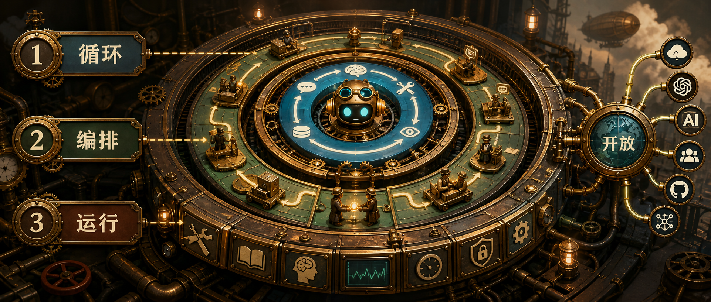
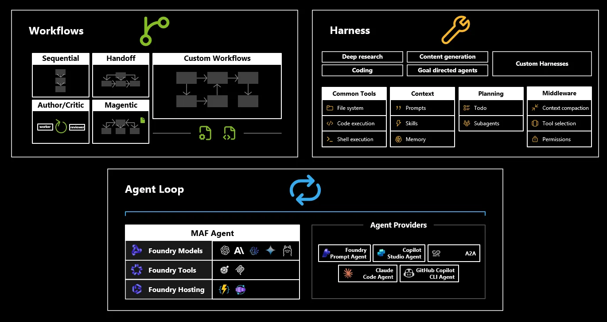

Microsoft Agent Framework 这篇文章讲的不是某个单点功能，而是一个更底层的设计问题：当 AI 应用从聊天框走向真实产品，SDK 应该怎么分层，才能同时支持简单 assistant、复杂 multi-agent 系统和企业流程？

原文把答案拆成三个核心概念：`Agent loops`、`Workflows` 和 `Harnesses`。这三个词看起来抽象，但对应的是非常具体的工程边界：谁负责执行循环，谁负责流程结构，谁负责运行时能力和控制。



## 从聊天到 agent

第一波 AI 应用主要证明了模型能理解意图、生成内容，并通过 completion、RAG、tool calling 完成一些增强体验。下一波问题更难：怎样让模型在真实产品和企业系统里可靠、可观察、可治理地行动。

这就是 Microsoft Agent Framework 要解决的范围。它不是只封装一次模型调用，而是提供构建 agentic applications 的基础块：model、tool、context、memory、planning、orchestration，以及和 Microsoft、开源、第三方生态集成的能力。

原文有一句很关键：这些层一起给开发者一条从 prompt 走向 production-ready agent 的路径。也就是说，MAF 试图把“模型能回答”升级成“系统能运行”。

## Agent Loop

Agent loop 是最内层的执行模式。它描述的是 agent 每一轮怎么工作：

1. 接收输入。
2. 基于上下文推理。
3. 决定下一步。
4. 可选地调用工具。
5. 观察工具结果。
6. 更新上下文或状态。
7. 继续循环，直到能回答或完成任务。

原文用一段伪代码表达这个结构：

```text
while true:
  response = send_to_llm(context, available_tools)
  if response.contains_tool_calls:
    execute each tool
    append results to context
    continue
  if response.is_done:
    break
```

这个循环看起来简单，但工程上并不轻。你要管理 message、tool schema、执行结果、错误、流式输出、权限、状态和日志。MAF 的价值之一，就是把这个循环显式化，让团队不必每个项目都重新搭一遍。

更重要的是，显式 loop 也是施加控制的地方。比如限制哪些工具可以被调用、某些动作前要求审批、上下文过长时 compact、每一步都记录日志。只要 loop 是框架里的清晰结构，这些策略就能一致地落地。

## Provider Agnostic

原文强调 MAF 是 provider-agnostic。它不希望 agentic application 被单一模型、工具供应商或托管环境锁死。

这意味着开发者可以组合不同来源的模型、工具和 hosted agents。文章里提到的例子包括 Microsoft Foundry，也包括 OpenAI、Anthropic 这样的第三方 provider；同时还能和 Copilot Studio、GitHub Copilot 这类外部 hosted agents 交互，或通过 A2A 这样的开放协议连接。

这点对企业很实际。生产系统生命周期通常比某个模型 API 更长，架构如果把 provider 绑死，后续替换、扩展、合规和成本优化都会变困难。

## Workflows

Agent loop 给了灵活性，但企业场景常常需要可预测步骤、显式控制流和可复用业务逻辑。这就是 Workflow 的位置。

原文举了几个场景：

- 客服流程：分类问题、查询账户、起草回复、检查政策合规、必要时升级。
- 软件工程助手：检查 issue、复现 bug、写 patch、跑测试、创建 pull request。
- 研究 agent：收集来源、比较证据、生成摘要、请求审核。

这些不只是“聊天”，而是有步骤、有交接、有验证点的流程。MAF 里的 workflow 可以描述任务如何从一步流向下一步，什么时候 agent 需要协作，哪里需要人工输入，结果如何被验证。

原文列出的常见模式包括：

- Sequential flows：每一步依赖上一步输出。
- Handoffs：一个 agent 或组件把工作交给另一个。
- Author/critic loops：一个 agent 产出，另一个审阅或改进。
- Magentic-style orchestration：协调 agent 规划并监督工具或 subagents。
- Custom workflows：开发者定义领域特定控制流。

这里的关键不是“workflow 越复杂越好”，而是能选择合适的自治程度。有些任务适合高度自治的 loop，有些任务必须设计检查点、人审和固定路径。

## Harnesses

如果 agent loop 是引擎，workflow 是流程结构，harness 就是围绕 agent 的运行时能力集合。

原文把 harness 描述为一组让 agent 在真实世界里有用的能力：工具、上下文、记忆、planning、middleware、permissions，以及其他 runtime services。它可以提供文件系统、代码执行、shell 执行、system prompt、memory、subagents、context compaction、permission checks、human approval gates、logging、tracing 等。

这层很容易被低估。一个强模型如果配了弱工具、差上下文和没有控制的执行环境，仍然会产出糟糕结果。好的 harness 给 agent 提供正确的信息、能力和边界。

从工程角度看，harness 是 agent 从 demo 走向产品时最关键的差异之一。它负责回答这些问题：

- agent 能访问什么工具？
- 能看到什么上下文和记忆？
- 哪些操作需要权限或人工确认？
- 出错后如何恢复？
- 每一步怎么记录、追踪和审计？
- 长任务如何保持状态和可观察性？

这些问题不解决，agent 很难进入企业系统。

## 分层的意义

MAF 的设计重点，是让开发者按任务选择架构，而不是把所有 agent 都塞进同一种模式。

原文有一句判断很实在：不是每个 agent 都需要复杂 workflow，也不是每个 workflow 都需要高度自治的 agent。

这句话背后是一个工程取舍：

- 简单 assistant 可能只需要清晰的 agent loop 和少量工具。
- 企业审批流程可能更需要 workflow、检查点和人工介入。
- 长时间运行的 multi-agent 系统需要 harness 提供记忆、权限、日志和 tracing。
- 跨 provider 的系统需要 provider-agnostic composition，避免被单一平台锁死。

这也是为什么 MAF 把 loop、workflow、harness 分开。分层之后，开发者可以在同一个模型里支持简单应用和复杂系统，而不是为每种场景各造一套框架。

## 怎么判断要用哪层

如果你正在评估 agent 架构，可以用几个问题判断重点在哪：

| 问题                                                        | 更关注的层                    |
| ----------------------------------------------------------- | ----------------------------- |
| Agent 是否需要反复推理、调用工具、观察结果？                | Agent loop                    |
| 任务是否有固定步骤、审批点、交接或验证？                    | Workflow                      |
| Agent 是否需要文件、代码执行、memory、权限、日志、tracing？ | Harness                       |
| 是否要跨模型、跨 hosted agent 或跨 provider？               | Provider-agnostic composition |

这个判断比“要不要上 agent framework”更具体。框架的价值不是替你决定所有架构，而是让你在合适的层上表达控制。

## 我的理解

Microsoft Agent Framework 的这套分层设计，真正想解决的是生产化落差。

很多 agent demo 看起来流畅，是因为任务短、工具少、错误成本低。但企业应用里，agent 需要接触真实系统、执行长流程、留下审计记录、接受人工控制，并且可能跨多个模型和服务协作。这个时候，单纯的 prompt + tool calling 不够。

MAF 把问题拆成三层后，架构讨论会更清楚：

- loop 让 agentic execution 有统一执行骨架。
- workflow 让业务过程可设计、可验证、可复用。
- harness 让 agent 有工具、上下文、记忆、权限和可观测性。

如果你的 agent 还停在简单问答，可能不需要全套 workflow。但如果你要把 agent 放进真实产品或企业流程里，这种分层会很快变得有用。

如果你关注 AI 助手、开发工具和软件工程实践，可以关注 Aide Hub。这里会继续分享能落地的工具教程、技术观察和项目经验。

## 参考

- [ICYMI: Inside the Microsoft Agent Framework: How we designed a layered SDK](https://devblogs.microsoft.com/agent-framework/icymi-inside-the-microsoft-agent-framework-how-we-designed-a-layered-sdk/)
- [Inside the Microsoft Agent Framework: How we designed a layered SDK](https://commandline.microsoft.com/agent-framework-layered-sdk-loops-workflows-harnesses/)
- [Microsoft Agent Framework GitHub repository](https://github.com/microsoft/agent-framework)
- [Microsoft Agent Framework documentation](https://learn.microsoft.com/en-us/agent-framework/)
