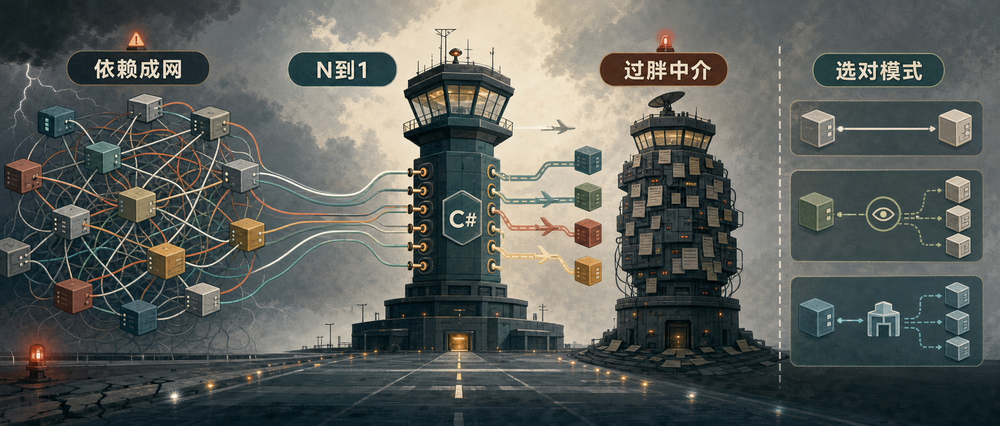

Mediator 模式最容易被误用的地方，是把它当成“所有调用都应该多一层”的通用答案。它真正解决的问题更窄：一组对象互相引用、互相通知、互相改变状态，通信规则开始散落在多个类里。

Dev Leader 这篇文章不是重复讲“怎么写一个 mediator”，而是给出判断框架：什么时候 C# 代码里的对象关系已经值得收束，什么时候直接调用、Observer、Facade 或 Command 会更简单。它的核心建议很朴素：先看交互形状，再决定要不要引入中介者。

## 它到底做什么

Mediator 模式引入一个中心对象，封装一组对象之间的交互方式。参与对象不再直接知道彼此，而是只知道 mediator。mediator 知道参与者，并负责协调它们之间的通信。

原文用了空中交通管制塔的比喻：飞机不直接互相协商跑道和降落顺序，而是和塔台通信，由塔台协调。放到代码里也是同一件事：组件保持简单，协调复杂度集中到一个明确位置。

经典结构通常有三类角色：

- mediator interface：定义参与对象如何通知或请求协调。
- concrete mediator：保存参与对象引用，实现协调规则。
- colleague objects：参与交互的组件，只依赖 mediator 抽象，不依赖其他同事对象。

这也是一种控制反转：对象不再把“我该调用谁”写死在自己内部，而是把交互路由交给一个协调者。

## 需要它的信号

一个项目是否需要 Mediator，不取决于你是否喜欢设计模式，而取决于依赖关系是否已经开始伤害修改、复用和测试。

**多对多依赖。** 这是最典型的信号。比如一个表单有十个控件，每个控件的变化都会影响其他几个控件。直接引用会让依赖数量快速膨胀；新增一个控件时，已有控件也要跟着改。Mediator 可以把 N 对 N 的互相引用收束成 N 对 1：所有控件只通知协调者。

**改一个类要改一串类。** 如果修改一个组件行为时，总要顺手改三四个引用它的类，说明对象之间太紧了。Mediator 把这种变化限制在协调逻辑里，而不是让变化沿着引用链扩散。

**组件难以复用。** 原文举了 `DatePicker` 的例子：如果它必须知道 `StartDateValidator`、`EndDateField` 和 `SubmitButton` 才能工作，它就不是一个可复用控件，而是被焊死在某个表单里。让它只依赖 mediator 后，同一个控件可以被不同表单用不同协调规则组合起来。

**交互规则散落。** 当“X 变化后要发生什么”分散在五个类里，理解系统行为就需要来回跳文件。Mediator 的价值是把交互规则集中到一个地方，让你能直接读到一组对象如何协作。

## 适合的场景

聊天室是最自然的例子。用户加入、离开、发送消息，实际都可以通过聊天室协调。没有 mediator 时，每个用户可能都要维护其他用户列表；有了聊天室 mediator，参与者管理和消息路由就归聊天室负责。

复杂 UI 表单也很适合。国家下拉框变化后，州/省字段要更新，物流选项要刷新，税费区域要重算；勾选“同账单地址”后，配送地址字段要复制并禁用。让每个控件直接操作其他控件，表单很快会变成一团依赖。让控件只通知 mediator，联动规则就能集中管理。

多步骤工作流也可以考虑。订单处理可能涉及库存检查、支付、运费计算和通知。各步骤不一定适合互相直接引用；mediator 可以根据上一步结果决定下一步走向。不过这里要和 Chain of Responsibility 区分开：责任链更像请求被一站站传下去，mediator 是主动协调多个参与者。

事件聚合器也常带有 mediator 味道。多个发布者和多个订阅者不应该互相知道时，可以让组件把事件发布到 aggregator，再由 aggregator 分发给感兴趣的订阅方。这在插件系统、模块化应用和动态加载组件里很常见。

## 不该用的时候

Mediator 不是越早用越好。它引入的是间接通信，如果原本的通信关系很简单，新增的一层只会降低可读性。

**一对一关系。** 如果 A 只调用 B，一个接口或直接引用通常更清楚。Mediator 解决的是多对多通信复杂度，不是所有依赖都要消灭。

**只有两三个组件。** 原文给了一个很实用的计算角度：两个组件只有一条直接依赖，五个互联组件可能有十条，十个互联组件可能有四十五条。组件数量小时，依赖节省不一定抵得过中介层带来的跳转成本。

**直接通信清晰且稳定。** 如果组件通过稳定接口通信，规则也不复杂，保持直接调用更容易跟踪。想简化外部调用时，Facade 可能比 Mediator 更贴切。

**中介者会变成 God Object。** 这是最大风险。一个 mediator 如果开始引用二十个组件、堆满五十个 `if` 分支，它没有降低复杂度，只是把复杂度从边缘搬到了中心。遇到这种情况，应该拆成多个更小的 mediator，或者重新判断模式是否适合。

## 表单重构例子

原文用一个表单控件联动例子说明重构前后的差异。重构前，`CountryDropdown` 直接持有多个其他控件：

```csharp
public sealed class CountryDropdown
{
    private readonly StateDropdown _stateDropdown;
    private readonly ShippingOptionsPanel _shippingPanel;
    private readonly TaxCalculator _taxCalculator;

    public CountryDropdown(
        StateDropdown stateDropdown,
        ShippingOptionsPanel shippingPanel,
        TaxCalculator taxCalculator)
    {
        _stateDropdown = stateDropdown;
        _shippingPanel = shippingPanel;
        _taxCalculator = taxCalculator;
    }

    public string SelectedCountry { get; private set; } = "";

    public void SelectCountry(string country)
    {
        SelectedCountry = country;

        _stateDropdown.LoadStatesFor(country);
        _shippingPanel.UpdateOptionsFor(country);
        _taxCalculator.SetRegion(country);
    }
}
```

这个写法短期看很直接，长期问题也明显：新增 `CurrencyDisplay` 时，要修改 `CountryDropdown` 的构造函数和处理逻辑；想把 `CountryDropdown` 拿到另一个表单复用，也会被这些具体依赖卡住。

重构后，控件只通知 mediator：

```csharp
public interface IFormMediator
{
    void Notify(object sender, string eventName);
}

public abstract class FormControl
{
    protected IFormMediator Mediator { get; }

    protected FormControl(IFormMediator mediator)
    {
        Mediator = mediator;
    }
}

public sealed class CountryDropdown : FormControl
{
    public CountryDropdown(IFormMediator mediator)
        : base(mediator) { }

    public string SelectedCountry { get; private set; } = "";

    public void SelectCountry(string country)
    {
        SelectedCountry = country;
        Mediator.Notify(this, "CountryChanged");
    }
}
```

协调规则放进具体 mediator：

```csharp
public sealed class CheckoutFormMediator : IFormMediator
{
    public CountryDropdown Country { get; set; } = null!;
    public StateDropdown State { get; set; } = null!;
    public ShippingOptionsPanel Shipping { get; set; } = null!;
    public TaxCalculator Tax { get; set; } = null!;

    public void Notify(object sender, string eventName)
    {
        if (sender is CountryDropdown country
            && eventName == "CountryChanged")
        {
            State.LoadStatesFor(country.SelectedCountry);
            Shipping.UpdateOptionsFor(country.SelectedCountry);
            Tax.SetRegion(country.SelectedCountry);
        }

        if (sender is StateDropdown state
            && eventName == "StateChanged")
        {
            Shipping.UpdateOptionsFor(state.SelectedState);
            Tax.SetSubRegion(state.SelectedState);
        }
    }
}
```

这时新增一个控件，不再需要让已有控件直接认识它。修改点主要落在 mediator 里。代价是通信流变得间接了，所以 mediator 的命名、日志和测试就更重要。

## 聊天室例子

聊天室例子更能体现动态参与者。用户只知道 `IChatMediator`，发送消息时把消息交给聊天室：

```csharp
public interface IChatMediator
{
    void Register(ChatUser user);

    void SendMessage(
        string message,
        ChatUser sender);

    void SendDirectMessage(
        string message,
        ChatUser sender,
        string recipientName);
}

public sealed class ChatUser
{
    private readonly IChatMediator _mediator;

    public ChatUser(
        string name,
        IChatMediator mediator)
    {
        Name = name;
        _mediator = mediator;
    }

    public string Name { get; }

    public void Send(string message)
    {
        _mediator.SendMessage(message, this);
    }

    public void SendTo(string message, string recipient)
    {
        _mediator.SendDirectMessage(message, this, recipient);
    }

    public void Receive(string message, string from)
    {
        Console.WriteLine($"{Name} receives from {from}: {message}");
    }
}
```

具体聊天室维护参与者列表并决定消息投递：

```csharp
public sealed class ChatRoom : IChatMediator
{
    private readonly List<ChatUser> _users = new();

    public void Register(ChatUser user)
    {
        if (!_users.Contains(user))
        {
            _users.Add(user);
        }
    }

    public void SendMessage(
        string message,
        ChatUser sender)
    {
        foreach (var user in _users)
        {
            if (user != sender)
            {
                user.Receive(message, sender.Name);
            }
        }
    }

    public void SendDirectMessage(
        string message,
        ChatUser sender,
        string recipientName)
    {
        var recipient = _users.FirstOrDefault(
            u => u.Name == recipientName);

        if (recipient is not null)
        {
            recipient.Receive(message, sender.Name);
        }
    }
}
```

这里的收益不是“代码行数变少”，而是职责变清楚：用户负责表达“我要发消息”，聊天室负责“消息发给谁”。加入和移除用户时，不需要同步修改每个用户的联系人列表。

## 一张判断清单

可以按下面几个问题做判断。回答“是”的越多，Mediator 越可能值得引入。

- 是否有超过三个组件互相影响？
- 交互规则是否复杂，或者经常变化？
- 组件是否需要在不同上下文复用？
- 是否希望分别测试组件行为和协调规则？
- 是否有更简单的模式能解决问题？
- mediator 是否能保持聚焦，而不是吞掉整个业务流程？

最后两个问题很关键。Mediator 是结构性承诺，不是免费抽象。如果 Observer、Command、Facade 或简单事件就够用，先用更简单的方案。

## 和替代模式怎么选

Mediator 和 Observer 都能减少直接耦合，但形状不同。Observer 是一对多通知：一个 subject 状态变化，多个 observer 收到通知。Mediator 是多对多协调：多个参与者通过中心对象按规则交互。需要通知时用 Observer，需要协作规则时考虑 Mediator。

Facade 也会集中访问入口，但目的不同。Facade 面向外部调用者，提供一个更简单的子系统入口；Mediator 面向内部参与者，协调同级对象之间的通信。前者是“从外部简化访问”，后者是“从内部解耦协作”。

Command 把请求封装成对象，但不规定请求如何路由。MediatR 这类库经常把 Command/Query 和 Mediator 思想结合起来：调用方发送 request，mediator 把 request 交给 handler。

直接引用也不是坏味道。简单稳定的一对一调用，直接写出来通常最清楚。只有当引用关系开始像网一样扩散时，Mediator 才更有价值。

## 和 MediatR 的关系

很多 .NET 开发者会把 mediator 直接等同于 MediatR。它们相关，但不是同一件事。

Mediator 是设计模式，描述“通过中心协调者解耦对象交互”的思想。MediatR 是一个 .NET 库，提供进程内消息分发，常见形式是 request/response 和 notification。它适合应用层 command/query 分发，也常配合 pipeline behaviors 做日志、验证、性能监控等横切处理。

如果你解决的是 ASP.NET Core 应用层的 handler 路由，MediatR 很顺手。如果你解决的是 UI 控件、聊天室成员、工作流节点这类一组对象之间的协作关系，一个领域内自定义 mediator 可能更直观。

## 实践建议

先从直接引用开始。它简单、可读、容易调试。当你发现新增一个组件要改五个已有类，或者交互规则散落到多个类里，才是考虑 Mediator 的时机。

引入以后也要守住边界：mediator 负责协调，不负责承载所有业务规则；参与对象保持简单，但不要把它们自己的领域行为全部抽空；大型协调关系要拆成多个小 mediator，而不是堆成一个中心大类。

一个好用的判断方式是看代码阅读路径：如果 mediator 让你更快理解一组对象怎么协作，它就有价值；如果它只是让你多跳一层、还看不清真实处理者在哪里，那就该回到更简单的设计。

如果你关注 AI 助手、开发工具和软件工程实践，可以关注 Aide Hub。这里会继续分享能落地的工具教程、技术观察和项目经验。

## 参考

- [When to Use Mediator Pattern in C#: Decision Guide with Examples](https://www.devleader.ca/2026/06/10/when-to-use-mediator-pattern-in-c-decision-guide-with-examples)
- [Observer Design Pattern in C#: Complete Guide with Examples](https://www.devleader.ca/2026/03/26/observer-design-pattern-in-c-complete-guide-with-examples)
- [Facade Design Pattern in C#: Complete Guide with Examples](https://www.devleader.ca/2026/04/26/facade-design-pattern-in-c-complete-guide-with-examples)
- [Command Design Pattern in C#: Complete Guide with Examples](https://www.devleader.ca/2026/04/14/command-design-pattern-in-c-complete-guide-with-examples)
