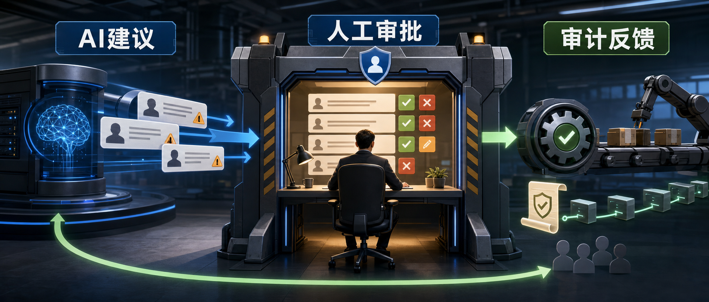

企业 AI 系统不该只问一个问题：“能不能自动执行？”更重要的是：哪些动作必须先经过人类确认，系统怎样记录谁批准了什么，以及人类反馈如何反过来改进 AI 行为。

C# Corner 这篇文章用 ASP.NET Core 讲 Human-in-the-Loop（HITL）AI 的基本架构。它的核心思路很明确：AI 负责生成建议，人类负责审批关键决策，系统负责把审批、执行、审计和反馈串成可治理的流程。

## 适合什么场景

HITL 不是给所有 AI 输出都加人工审核。它主要适合高影响、高风险、需要可追责的业务动作。

原文列了几类典型场景：

- 金融交易和贷款审批。
- 客户沟通和客服回复。
- 合规决策和法律审批。
- 安全告警和处置动作。
- 医疗建议和诊断辅助。
- 企业自动化里的关键操作。

这些场景里，AI 可以提高效率，但最终动作通常不能完全交给模型。原因也很现实：模型可能 hallucinate、误解请求、给出错误建议、产生偏见，或者在 agent 场景里误用工具。

## 工作流怎么变

全自动流程通常像这样：

```text
AI Decision
  -> Execution
```

HITL 会把它改成：

```text
AI Recommendation
  -> Human Review
  -> Approval
  -> Execution
```

多出来的不是“形式审批”，而是一个风险控制层。AI 的输出先变成 recommendation，进入 review queue。审核人可以批准、拒绝或要求修改。只有通过审批的请求，才进入真正的 business action。

在 ASP.NET Core 里，这个模式可以拆成几个组件：

- AI processing layer：调用 LLM、RAG 或 agent，生成建议。
- Approval workflow：保存待审核请求，维护状态流转。
- Review dashboard：让审核人查看建议和上下文。
- Notification system：提醒相关人员及时处理。
- Audit logging：记录审批人、时间、建议内容和结果。
- Business service：只处理已经被授权执行的动作。

## 审批模型

原文从一个很小的 `ApprovalRequest` 开始：

```csharp
public class ApprovalRequest
{
    public int Id { get; set; }

    public string Recommendation { get; set; }
        = string.Empty;

    public string Status { get; set; }
        = "Pending";
}
```

这个模型能表达“AI 生成了一条建议，当前正在等待审核”。真实项目里可以继续补字段：

- `Input`：用户原始请求或业务上下文。
- `RiskLevel`：风险级别，用来决定审批链。
- `ReviewerId`：当前审核人。
- `DecisionReason`：批准或拒绝原因。
- `CreatedAt` / `ReviewedAt`：时间戳。
- `CorrelationId`：串联 AI 调用、审批和业务执行日志。

`Status` 也不要长期用自由字符串。更稳妥的做法是枚举或受约束的状态机，比如 `Pending`、`Approved`、`Rejected`、`ChangesRequested`、`Executed`、`Expired`。

## 生成 AI 建议

示例里的 recommendation service 很简单：

```csharp
public class RecommendationService
{
    public async Task<string> GenerateRecommendationAsync(
        string input)
    {
        return await Task.FromResult("Approve Refund");
    }
}
```

生产系统里，这里通常会调用 LLM、RAG 服务或 AI agent。关键点是：这个服务只返回建议，不直接执行敏感动作。

生成建议后，把它保存为待审核请求：

```csharp
var recommendation =
    await recommendationService.GenerateRecommendationAsync(input);

var request = new ApprovalRequest
{
    Recommendation = recommendation,
    Status = "Pending"
};

db.ApprovalRequests.Add(request);
await db.SaveChangesAsync();
```

这一步是 HITL 的边界线。AI 输出进入数据库和审批队列，而不是绕过系统直接触发支付、发邮件、封号、改权限或调用外部 API。

## 审核界面

审核人需要一个集中位置查看 AI 建议。原文给出的 dashboard 信息很简单：

```text
Request ID: 101

Recommendation:
Approve Refund

Status:
Pending
```

实际界面至少应该让审核人看到四类信息：

- AI 建议：建议做什么。
- 输入上下文：用户请求、订单、客户、告警、检索文档等。
- 风险和依据：为什么 AI 给出这个建议，置信度或规则命中情况。
- 可执行操作：批准、拒绝、要求修改、转交他人。

审核界面不要只显示模型结论。没有上下文的人类审批，很容易变成橡皮图章。

## 审批端点

ASP.NET Core API 可以提供审批端点。原文的示例是：

```csharp
[HttpPost]
public IActionResult Approve(int requestId)
{
    return Ok("Approved");
}
```

真实实现要多做几件事：

```csharp
[HttpPost("{requestId:int}/approve")]
[Authorize(Roles = "TeamLead,Manager,Administrator")]
public async Task<IActionResult> Approve(
    int requestId,
    ApprovalDecisionDto decision)
{
    var request = await db.ApprovalRequests
        .SingleOrDefaultAsync(x => x.Id == requestId);

    if (request is null)
    {
        return NotFound();
    }

    if (request.Status != "Pending")
    {
        return Conflict("Request is no longer pending.");
    }

    request.Status = "Approved";
    request.ReviewedAt = DateTimeOffset.UtcNow;
    request.DecisionReason = decision.Reason;

    await db.SaveChangesAsync();

    return Ok();
}
```

这里有几个边界要守住：

- 只有有权限的角色能审批。
- 只能审批还处于 `Pending` 的请求。
- 审批原因和时间要保存。
- 最好用事务把状态更新、审计日志和后续消息发布包起来。

## 多级审批

有些决策不应该由一个人直接放行。原文给了一个多级流程：

```text
AI Recommendation
  -> Team Lead Approval
  -> Manager Approval
  -> Execution
```

可以按风险级别决定审批链：

- 低风险：Team Lead 审批。
- 高风险：Manager 审批。
- 合规敏感：Compliance Officer 或 Administrator 审批。

不要把审批链设计得过长。HITL 的目标是降低风险，不是制造流程堵点。高风险动作需要更多约束，低风险动作可以简化甚至抽样审核。

## 通知和超时

审批请求如果没人知道，就会卡在队列里。原文提到可以用 Email、Teams、Slack 或 dashboard alerts 通知审核人。

设计通知时要考虑：

- 谁应该收到通知。
- 多久未处理需要升级。
- 是否允许批量审批。
- 审批请求是否会过期。
- 通知里能否安全展示业务上下文。

对于关键业务，建议加超时策略。比如 24 小时未审核就升级给 manager，或者请求过期后自动标记为 `Expired`，避免旧建议在上下文变化后被误执行。

## 审计日志

每个审批动作都应该被记录。原文列出的关键信息包括 reviewer identity、timestamp、recommendation 和 approval outcome。

最小日志可以像这样：

```csharp
_logger.LogInformation(
    "Request {Id} approved by {User}",
    requestId,
    reviewer);
```

但合规场景通常还需要结构化审计表：

- `ApprovalRequestId`
- `Action`
- `ActorUserId`
- `ActorRole`
- `BeforeStatus`
- `AfterStatus`
- `Reason`
- `Timestamp`
- `CorrelationId`

日志不是只为排错。它还要回答“谁基于什么信息批准了这次动作”。这对金融、医疗、安全和数据隐私场景尤其重要。

## RBAC 和权限边界

原文给了一个角色示例：

| Role          | Permissions                |
| ------------- | -------------------------- |
| Support Agent | View Requests              |
| Team Lead     | Approve Low-Risk Requests  |
| Manager       | Approve High-Risk Requests |
| Administrator | Full Control               |

在 ASP.NET Core 中可以用 `Authorize`、policy-based authorization 或自定义 requirement 实现。不要只靠前端按钮隐藏审批操作；后端端点必须重新检查权限。

审批权限也要和业务对象绑定。比如某个 manager 只能审批自己部门的请求，安全分析师只能处理自己队列里的告警。HITL 系统如果权限边界不清，反而会把 AI 风险转成人为越权风险。

## RAG 和 Agent 场景

RAG 应用也适合 HITL，尤其是客户可见回复。典型流程是：

```text
Retrieved Documents
  -> Generated Response
  -> Human Review
  -> Customer Response
```

这可以避免检索错文档、生成不合规措辞，或把内部信息发给客户。

Agent 场景风险更高。原文的流程是：

```text
Agent Decision
  -> Human Validation
  -> Tool Execution
```

如果 agent 能调用退款、发邮件、改权限、删除资源、封禁账号这类工具，就应该把敏感 tool 放在审批门后面。AI 可以准备 action proposal，但真正调用工具前需要人工授权。

## 反馈闭环

HITL 不只是审批，也是在收集高质量反馈。原文给了一个简单例子：

```text
AI Recommendation:
Approve

Human Decision:
Reject
```

这种差异很有价值。它可以用来：

- 改进 prompt。
- 调整 agent 行为规则。
- 优化风险分类。
- 发现训练或知识库缺口。
- 评估模型在不同业务场景的表现。

建议把人工决策、拒绝原因、修改建议和最终执行结果都结构化保存。后续无论是做 prompt 迭代、离线评估，还是训练分类器，都能用得上。

## 常见误区

原文提到的几个坑都很实际：

- 自动批准所有 AI 建议。
- 跳过审计日志。
- 审批链过度复杂。
- 忽略审核人的反馈。
- 没有清晰 ownership。
- 通知延迟。

可以再补一个工程层面的坑：把审批做成一个同步阻塞接口。审批天然可能持续几分钟、几小时甚至几天，应该用持久化状态、队列、后台任务或工作流引擎处理，而不是让 HTTP 请求一直挂着。

## 落地建议

可以从一个小的高风险动作开始，比如退款审批、客服回复发送、权限变更或安全处置。

先把流程拆清楚：

1. AI 生成建议，不直接执行动作。
2. 保存 `ApprovalRequest`，状态为 `Pending`。
3. 通知有权限的审核人。
4. 审核人在 dashboard 中批准、拒绝或要求修改。
5. 只有 `Approved` 请求能进入 business service。
6. 所有动作写入审计日志。
7. 人类决策回流到评估和改进流程。

这个架构的价值不是降低自动化能力，而是让自动化有边界。AI 负责提高处理速度，人类负责关键判断，ASP.NET Core 负责把权限、状态、审计和执行路径管住。

如果你关注 AI 助手、开发工具和软件工程实践，可以关注 Aide Hub。这里会继续分享能落地的工具教程、技术观察和项目经验。

## 参考

- [Designing Human-in-the-Loop AI Systems with ASP.NET Core](https://www.c-sharpcorner.com/article/designing-human-in-the-loop-ai-systems-with-asp-net-core/)
