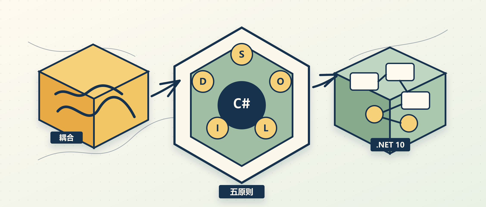

SOLID 常被讲成五个缩写：SRP、OCP、LSP、ISP、DIP。问题是，很多团队背得出来，却还是会写出一个类管认证、发邮件、写数据库，或者一个接口越长越胖，最后谁也不敢改。

Dev Leader 这篇文章的价值在于，它没有把 SOLID 当作抽象口号，而是把每个原则对应到 C# 代码里常见的失败模式。读完可以得到一个更实用的判断：什么时候该拆类、什么时候该加抽象、什么时候继承关系本身就错了。

## 先看目标

原文的核心判断很直接：软件刚开始通常还算干净，但需求、截止日期和临时修复会不断把职责揉在一起。到后来，一个 bug fix 可能牵出两个新问题，测试也越来越难写。

SOLID 的作用不是让代码显得“高级”，而是控制这种腐化：

- 一处变化只影响一个明确位置。
- 新能力尽量通过新增类型扩展，而不是反复打开旧代码。
- 子类型替换父类型时不破坏调用方预期。
- 客户端只依赖自己真正用到的接口。
- 业务逻辑依赖抽象，而不是直接依赖数据库、邮件服务、文件系统这类低层实现。

这也是为什么原文反复强调：五个原则是一套系统，不是一张可以随便打勾的清单。

## SRP：先拆职责

Single Responsibility Principle 常被翻译成“单一职责原则”。关键不在于一个类只能有一个方法，而在于它只有一个“变化原因”。

原文举的坏味道很典型：一个 `UserManager` 同时做三件事：

- 校验用户名和密码。
- 发送欢迎邮件。
- 把用户写入数据库。

这三个方向背后可能分别来自安全策略、运营模板和数据结构。任何一方变化，都会迫使同一个类跟着改。更麻烦的是，测试也会被拖进来：你想测认证逻辑，却可能要处理 SMTP 或数据库依赖。

更稳的拆法通常是把它拆成几个角色：

```csharp
public sealed class AuthenticationService
{
    public bool Authenticate(string username, string password)
    {
        // 只处理认证策略
        return true;
    }
}

public sealed class EmailService
{
    public Task SendWelcomeEmailAsync(string email)
    {
        // 只处理邮件发送
        return Task.CompletedTask;
    }
}

public sealed class UserRepository
{
    public Task SaveAsync(User user)
    {
        // 只处理持久化
        return Task.CompletedTask;
    }
}
```

拆完以后，类的数量会变多，但每个类的边界更清楚。SRP 不是为了追求“小类癖”，而是让变化有地方安放。

## OCP：少改旧代码

Open/Closed Principle 的意思是：系统应该对扩展开放，对修改关闭。它解决的是另一类常见问题：每来一个需求，都要修改已经测试过的旧方法。

原文用报表导出做例子。一个 `ReportExporter` 里写满 `if` / `else`：

```csharp
public byte[] Export(Report report, string format)
{
    if (format == "PDF") return GeneratePdf(report);
    if (format == "CSV") return GenerateCsv(report);
    if (format == "Excel") return GenerateExcel(report);

    throw new NotSupportedException();
}
```

当新增 XML、JSON 或其他格式时，这个方法会被一次次打开。看起来只是加一个分支，实际风险是新逻辑和旧逻辑被绑在同一个变更点里。

更符合 OCP 的结构是把格式变成独立实现：

```csharp
public interface IReportExporter
{
    string Format { get; }
    byte[] Export(Report report);
}

public sealed class PdfReportExporter : IReportExporter
{
    public string Format => "PDF";

    public byte[] Export(Report report) => Array.Empty<byte>();
}
```

调用方可以通过注册表、字典或 DI 容器选择对应实现。新增格式时，主要动作是增加一个类，而不是改动一个不断膨胀的中心方法。

## LSP：继承要守约

Liskov Substitution Principle 最容易被误解。它不是说“子类能继承父类就行”，而是说子类放到父类位置时，程序行为不能被破坏。

原文用了经典的矩形和正方形例子。`Square` 继承 `Rectangle` 看起来符合数学直觉，但代码里的 `Rectangle` 允许独立设置宽和高；`Square` 为了保持宽高一致，会在设置宽度时同步高度。调用方如果按矩形的契约去操作，结果就会出错。

这个问题不是靠多写注释解决的。更好的设计通常是承认两者行为不同：

```csharp
public interface IShape
{
    int Area();
}

public sealed record Rectangle(int Width, int Height) : IShape
{
    public int Area() => Width * Height;
}

public sealed record Square(int Size) : IShape
{
    public int Area() => Size * Size;
}
```

LSP 给 C# 开发者的提醒是：继承表达的是可替换的行为契约，不是“概念上像不像”。如果子类需要不断削弱父类能力、抛出意外异常、偷偷改变前后置条件，继承关系多半已经不合适。

## ISP：接口别太胖

Interface Segregation Principle 处理的是“接口过大”的问题。

原文的例子是一个 `IWorker` 接口同时要求 `Work`、`TakeBreak`、`SubmitTimesheet`、`ManageTeam`、`WriteCode`、`HandleSupport`。结果是承包商、经理、开发、支持人员都被迫实现自己不需要的方法。

这类接口会带来两个后果：

- 实现类被迫写空方法或抛 `NotSupportedException`。
- 接口每加一个方法，所有实现类都被波及。

更合适的方式是按角色拆接口：

```csharp
public interface IEmployee
{
    void Work();
}

public interface IDeveloper
{
    void WriteCode();
}

public interface IManager
{
    void ManageTeam();
}
```

调用方需要什么，就依赖什么。这个原则在大型系统里很实用，因为胖接口会悄悄扩大模块之间的依赖面，最后让一个小变更变成全局改动。

## DIP：依赖抽象

Dependency Inversion Principle 是现代 .NET 开发里最容易直接落地的一个原则。它说高层业务逻辑不应该直接依赖低层细节，两者都应该依赖抽象。

坏味道通常长这样：业务服务在类内部直接 new 数据库仓储、SMTP 发送器或 HTTP 客户端。这样写一开始很快，但单元测试会立刻变难，替换基础设施也会变成重构。

更稳的写法是构造函数注入抽象：

```csharp
public interface IOrderRepository
{
    Task SaveAsync(Order order);
}

public interface IEmailSender
{
    Task SendConfirmationAsync(string email, Order order);
}

public sealed class OrderService(
    IOrderRepository repository,
    IEmailSender emailSender)
{
    public async Task PlaceOrderAsync(Order order)
    {
        await repository.SaveAsync(order);
        await emailSender.SendConfirmationAsync(order.CustomerEmail, order);
    }
}
```

这段代码真正保护的是业务层。未来从 SQL Server 换到别的存储，或从 SMTP 换到其他邮件服务，`OrderService` 不应该跟着变。

## 它们会互相放大

原文有个很重要的提醒：SOLID 不是五个孤立技巧。

从 SRP 开始，类变小了，接口自然更容易变窄，这会帮助 ISP。接口窄了，业务代码更容易依赖抽象，这会帮助 DIP。职责清楚以后，新增行为更容易通过新增类型完成，这会帮助 OCP。继承关系不再承担过多职责时，LSP 也更容易守住。

反过来也是一样。一个 god class 往往会同时破坏多个原则：它难以 mock，接口容易变胖，新增需求只能继续改它，继承或组合关系也会越来越混乱。

所以实践 SOLID 时，不必机械地逐条检查。更有效的问题是：这次修改为什么会牵动这么多地方？测试为什么这么难写？一个接口为什么要求调用方认识这么多无关方法？这些问题通常会把你带回某一个原则。

## .NET 10 的帮助

原文把 SOLID 放到现代 .NET 语境里看，这一点值得保留。

.NET 10 没有改变 SOLID 的定义，但 C# 和 ASP.NET Core 已经让很多做法更自然：

- `record` 适合表达清晰的数据载体，减少把业务行为塞进数据对象的冲动。
- `Microsoft.Extensions.DependencyInjection` 让 DIP 成为默认写法。
- `ILogger<T>` 是框架级的 DIP 示例：业务类依赖日志抽象，不关心日志最终写到哪里。
- `IMiddleware`、`IActionFilter`、`IHostedService` 这类扩展点体现了 OCP：通过新增实现扩展框架，而不是修改框架。
- 默认接口方法和静态抽象成员这类语言能力，可以在一些场景下降低演进接口和泛型算法的成本。

这些工具不会自动让代码变好。它们只是降低了正确设计的摩擦。真正的判断仍然来自代码边界本身。

## 什么时候别过度用

SOLID 是指导原则，不是强制律法。

原文 FAQ 里提到一个实际边界：某些性能热点路径里，抽象层、虚调用和间接访问可能有成本。更合理的顺序是先写出可维护设计，再用 benchmark 找到真实瓶颈。只有测量证明设计层抽象确实带来问题时，再考虑有意识地打破原则。

小工具类也不需要为了“符合 SRP”拆成一堆 collaborator。比如格式化时间戳的小函数，没有必要过度设计。SOLID 最该用在复杂、频繁变化、有业务风险的代码上。

## 团队怎么执行

自动化工具可以帮忙发现依赖环、复杂度和耦合指标，但 SOLID 最终主要靠代码评审落地。

评审时不要只说“这里违反原则”。更有用的方式是把问题接到具体后果：

- 这个类为什么有三个变化原因？
- 新增一种导出格式为什么要改旧方法？
- 这个子类能不能真的替换父类？
- 调用方为什么要依赖自己不用的方法？
- 这个服务为什么不能注入 mock 来测试？

当团队能把原则和真实 bug、测试困难、改动风险联系起来，SOLID 才会从概念变成习惯。

## 参考

- [SOLID Principles C# Guide: Complete Reference for .NET 10](https://www.devleader.ca/2026/06/10/solid-principles-c-guide-complete-reference-for-net-10)
