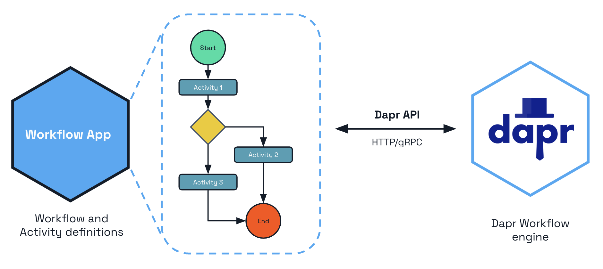
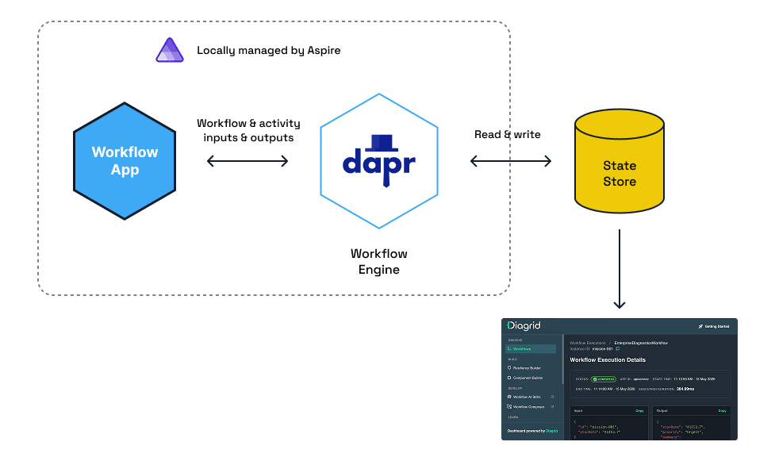
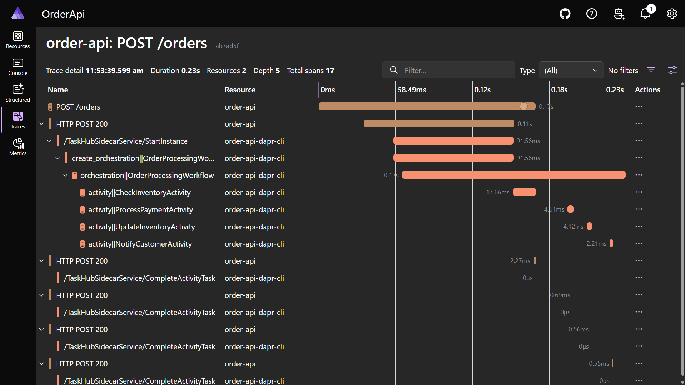
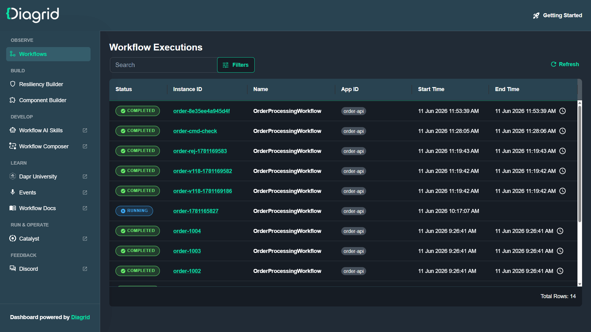

大多数真实的业务流程不会在一个请求里结束。

用户下单之后，要检查库存、扣款、锁定商品、通知客户。每一步都可能失败、超时，需要重试。更麻烦的是，整个流程必须能在进程重启后继续——不能丢了进度，也不能重复扣款。

常见做法是用一组消息队列、一张状态表，再加大量防御代码来跟踪流程位置。能跑，但业务逻辑散落在各种 handler 和数据库行里，没人能从头到尾读出完整流程。

[Dapr](https://www.milanjovanovic.tech/blog/introduction-to-dapr-for-dotnet-developers)（已从 CNCF 毕业的开源项目）有一个专门解决这个问题的构建块：**Workflow**。流程用普通 C# 代码写，Dapr 负责让它变得"持久"。即使宿主机在中途崩溃，工作流也能从断点捡起来继续。

这篇文章会带你构建一个 Dapr Workflow，用 [.NET Aspire](https://www.milanjovanovic.tech/blog/dotnet-aspire-a-game-changer-for-cloud-native-development) 跑起来，再用 [Diagrid Dev Dashboard](https://docs.diagrid.io/develop/local-development/dev-dashboard/?utm_source=milanjovanovic&utm_medium=referral&utm_campaign=workflows) 检查工作流状态。想动手实操的话，还有一条免费的 [Dapr University 学习路径](https://www.diagrid.io/dapr-university/dapr-workflows-dotnet-aspire?utm_source=milanjovanovic&utm_medium=referral&utm_campaign=workflows)可以跟着做。

## Dapr Workflow 到底是什么

理解 Dapr Workflow，关键是分开两个角色：

- **Workflow**：编排整个流程，决定"先做什么、再做什么、遇到分支怎么办"
- **Activity**：执行具体工作——查数据库、调 API、发邮件

这是**编排（orchestration）**而不是**编舞（choreography）**：流程驱动集中在一个地方，而不是让各服务互相响应对方的事件。

Workflow 和 Activity 的定义在你的应用代码里，但执行它们的 **workflow engine** 跑在 Dapr sidecar 中：



核心机制是**持久化执行（durable execution）**。Dapr 把每一步执行历史全部记录到状态存储里，工作流可以随时从历史回放。进程重启、滚动部署、横向扩缩都不会丢失进度——一个工作流可以跑几秒，也可以跑几个月。

这里有一条铁律：**workflow 代码必须确定性执行**。不能在 workflow 里用 `DateTime.Now`、随机数、文件 I/O——所有非确定性操作都必须放在 **Activity** 中。连日志都得注意：workflow 内部必须用 `context.CreateReplaySafeLogger<T>()`，否则每次回放都会重复输出日志行。

底层是基于 Dapr Actor 实现的，所以状态存储必须支持 actor。这是配置时最容易踩的坑，后面会看到。

## 构建 Workflow

最快的起步方式是 [Aspire CLI](https://aspire.dev/) 的 starter 模板：

```bash
aspire new aspire-starter -n OrderProcessing
```

这样会生成 app host、API service 和 `ServiceDefaults` 项目（负责 OpenTelemetry 和健康检查）。如果你用 Claude Code，[Dapr Skills](https://github.com/diagrid-labs/dapr-skills) 插件可以直接从提示词脚手架出完整的 workflow 项目，还能检查确定性错误。本文的完整代码也在作者的 [GitHub](https://github.com/m-jovanovic/dapr-workflows-with-aspire) 上。

API 项目需要引入 `Dapr.Workflow` 包：

```xml
<PackageReference Include="Dapr.Workflow" Version="1.18.1" />
```

Workflow 继承 `Workflow<TInput, TOutput>`，代码从上往下读，就像普通方法一样——但每一步都被持久化记录下来：

```csharp
using Dapr.Workflow;

namespace OrderApi.Workflows;

internal sealed class OrderProcessingWorkflow
    : Workflow<OrderPayload, OrderResult>
{
    public override async Task<OrderResult> RunAsync(
        WorkflowContext context,
        OrderPayload order)
    {
        // 1. 检查库存
        var inventory = await context.CallActivityAsync<InventoryResult>(
            nameof(CheckInventoryActivity),
            order);

        if (!inventory.InStock)
        {
            return new OrderResult(order.OrderId, "Rejected: out of stock");
        }

        // 2. 收款
        await context.CallActivityAsync(
            nameof(ProcessPaymentActivity),
            new PaymentRequest(order.OrderId, order.TotalAmount));

        // 3. 锁定库存
        await context.CallActivityAsync(
            nameof(UpdateInventoryActivity),
            order);

        // 4. 通知客户
        await context.CallActivityAsync(
            nameof(NotifyCustomerActivity),
            order.CustomerId);

        return new OrderResult(order.OrderId, "Completed");
    }
}
```

`CallActivityAsync` 不是直接调用 activity。它把任务交给 workflow engine 调度，engine 记录 activity 完成后返回的结果。如果进程在付款步骤之后挂了，Dapr 回放 workflow，把已完成步骤的结果喂回来，然后从库存更新继续。客户不会被重复扣款。

这是**任务链（task chaining）**模式。Dapr Workflow 还支持扇出/扇入、外部事件、定时器、子工作流——全部用普通 C# 写（扇出只需要 `Select` 加 `Task.WhenAll`）。

一个生产环境要注意的点：执行历史跟代码结构绑定。如果在有飞行中实例的时候改 workflow 代码，回放会断掉。这个问题通过 [workflow 版本管理](https://www.diagrid.io/blog/how-to-version-net-workflows?utm_source=milanjovanovic&utm_medium=referral&utm_campaign=workflows)解决，本文只涉及第一版。

Activity 是实际干活的地方，也是唯一允许非确定性操作的地方。它继承 `WorkflowActivity<TInput, TOutput>`，支持构造函数注入：

```csharp
using Dapr.Workflow;

namespace OrderApi.Activities;

internal sealed class CheckInventoryActivity(
    IInventoryService inventory)
    : WorkflowActivity<OrderPayload, InventoryResult>
{
    public override async Task<InventoryResult> RunAsync(
        WorkflowActivityContext context,
        OrderPayload order)
    {
        bool inStock = await inventory.HasStockAsync(
            order.ProductId, order.Quantity);

        return new InventoryResult(inStock);
    }
}
```

其他几个 activity 结构一样：扣款、减库存、发确认邮件。每一步独立隔离，Dapr 可以重试单个失败的 activity，而不需要重跑整个 workflow。因为所有输入输出都会被序列化到状态存储，所以简单 JSON-friendly 的 record 类型是最合适的数据载体。

## 通过 HTTP 启动工作流

在 API 项目的 `Program.cs` 里注册 workflow 和它的 activities：

```csharp
builder.Services.AddDaprWorkflow(options =>
{
    options.RegisterWorkflow<OrderProcessingWorkflow>();
    options.RegisterActivity<CheckInventoryActivity>();
    options.RegisterActivity<ProcessPaymentActivity>();
    options.RegisterActivity<UpdateInventoryActivity>();
    options.RegisterActivity<NotifyCustomerActivity>();
});
```

这同时会注册一个 `DaprWorkflowClient`，用来启动和查询工作流实例：

```csharp
app.MapPost("/orders", async (
    OrderPayload order,
    DaprWorkflowClient workflowClient) =>
{
    string instanceId = await workflowClient.ScheduleNewWorkflowAsync(
        name: nameof(OrderProcessingWorkflow),
        instanceId: order.OrderId,
        input: order);

    return Results.Accepted($"/orders/{instanceId}", new { instanceId });
});

app.MapGet("/orders/{instanceId}", async (
    string instanceId,
    DaprWorkflowClient workflowClient) =>
{
    WorkflowState? state = await workflowClient.GetWorkflowStateAsync(instanceId);

    if (state is null || !state.Exists)
    {
        return Results.NotFound();
    }

    return Results.Ok(new
    {
        RuntimeStatus = state.RuntimeStatus.ToString(),
        Output = state.ReadOutputAs<OrderResult>()
    });
});
```

`ScheduleNewWorkflowAsync` 立即返回，workflow 在后台执行。这和"扩展长时间运行的 API 请求"是同一个思路：返回 `202 Accepted`，让客户端轮询状态。两个 SDK 小坑值得注意：`GetWorkflowStateAsync` 遇到未接触过的实例会返回 `null`；`RuntimeStatus` 是枚举，序列化时不调用 `ToString()` 只会输出裸数字。

## 用 Aspire 运行一切

这里才是 Aspire 真正发光的地方。Dapr Workflow 需要 sidecar 和 state store 跟应用一起跑，而 Aspire 从同一个入口编排这一切。



App host 需要两个包。Dapr 集成现在在 [Aspire Community Toolkit](https://learn.microsoft.com/en-us/dotnet/aspire/community-toolkit/overview) 中，原先的 `Aspire.Hosting.Dapr` 包已经废弃：

```xml
<PackageReference Include="CommunityToolkit.Aspire.Hosting.Dapr" Version="13.0.0" />
<PackageReference Include="Aspire.Hosting.Valkey" Version="13.4.3" />
```

然后是 app host 的配置：

```csharp
using CommunityToolkit.Aspire.Hosting.Dapr;

var builder = DistributedApplication.CreateBuilder(args);

builder.AddDapr();

// 固定密码。Aspire 默认每次运行生成随机密码，
// 但 Dapr 组件文件需要知道这个密码。
var statePassword = builder.AddParameter(
    "statestore-password", "state-store-123", secret: true);

// Valkey（Redis 分支）作为 workflow 的状态存储
var statestore = builder
    .AddValkey("statestore", 16379, statePassword)
    .WithDataVolume();

builder.AddProject<Projects.OrderApi>("order-api")
    .WithDaprSidecar(new DaprSidecarOptions
    {
        ResourcesPaths = ["./Resources"]
    })
    .WaitFor(statestore);

builder.Build().Run();
```

`WithDaprSidecar` 在 `order-api` 旁边启动 Dapr sidecar，`ResourcesPaths` 指向 Dapr 组件文件（相对路径以 app host 目录为准）。

Workflow 只需要一个组件——state store。在 app host 的 `Resources` 文件夹下创建 `statestore.yaml`：

```yaml
apiVersion: dapr.io/v1alpha1
kind: Component
metadata:
  name: workflowstore
spec:
  type: state.redis
  version: v1
  metadata:
    - name: redisHost
      value: "localhost:16379"
    - name: redisPassword
      value: "state-store-123"
    - name: actorStateStore
      value: "true"
```

**`actorStateStore: "true"` 这一行是最容易忘的**。Dapr Workflow 底层跑在 actor 上，没有这一行 workflow 根本不会执行。注意应用代码完全不碰这些配置：把 Valkey 换成 Postgres，只需要改这个 YAML 文件，不用动 C# 代码。

安装 [Dapr CLI](https://docs.dapr.io/getting-started/install-dapr-cli/) 并执行一次 `dapr init`（sidecar 的二进制文件来源于此），然后一条命令启动一切：

```bash
aspire run
```

Aspire 会启动 Valkey、Dapr sidecar 和 API，日志、链路追踪、健康检查全在一个 dashboard 里。从 dashboard 拿到 API 端口，提交一个订单：

```bash
curl -X POST http://localhost:5555/orders \
  -H "Content-Type: application/json" \
  -d '{"orderId":"order-001","customerId":"cust-42","productId":"pro-plan","quantity":2,"totalAmount":49.99}'
```

轮询状态端点就能看到 workflow 按顺序跑完所有 activity（如果第一次返回 `500`，给 sidecar 几秒钟连接到 placement service 就好）：

```bash
curl http://localhost:5555/orders/order-001
```

```json
{
  "runtimeStatus": "Completed",
  "output": {
    "orderId": "order-001",
    "status": "Completed"
  }
}
```

每个 activity 都会在分布式追踪中作为独立 span 出现：



## 本地检查工作流状态

Aspire dashboard 能看到请求流，但看不到 **workflow 的内部状态**：当前在哪个步骤、每个 activity 返回了什么、完整的执行历史。这就是 [Diagrid Dev Dashboard](https://docs.diagrid.io/develop/local-development/dev-dashboard/?utm_source=milanjovanovic&utm_medium=referral&utm_campaign=workflows) 的作用——一个免费、纯本地的工具，读取你的 workflow state store（兼容 Redis、Postgres、SQLite），可视化每一个实例。它来自 Diagrid，这家公司由 Dapr OSS 项目创始人创办，也提供企业级 Dapr 支持。

既然是"一条命令启动一切"，把它也加到 app host 里：

```csharp
builder.AddContainer("diagrid-dashboard", "ghcr.io/diagridio/diagrid-dashboard:latest")
    .WithBindMount("./Resources", "/app/components")
    .WithEnvironment("COMPONENT_FILE", "/app/components/dashboard-store.yaml")
    .WithEnvironment("APP_ID", "diagrid-dashboard")
    .WithHttpEndpoint(targetPort: 8080)
    .WaitFor(statestore);
```

为什么需要第二个组件文件？网络问题。Sidecar 作为宿主机进程运行，`localhost:16379` 对它有效。Dashboard 跑在容器里，`localhost` 指容器自身，所以它的 `dashboard-store.yaml` 通过 `host.docker.internal` 访问宿主机（Linux 上没有 Docker Desktop 的话，用 bridge gateway IP 替代）：

```yaml
apiVersion: dapr.io/v1alpha1
kind: Component
metadata:
  name: dashboardstore
spec:
  type: state.redis
  version: v1
  metadata:
    - name: redisHost
      value: "host.docker.internal:16379"
    - name: redisPassword
      value: "state-store-123"
    - name: actorStateStore
      value: "true"
scopes:
  - diagrid-dashboard
```

`scopes` 字段防止 API 的 sidecar 也捡到这个组件，因为两个文件都在同一个 `Resources` 文件夹下。

再次运行 `aspire run`，从 Aspire 资源视图打开 dashboard 的端点。每个 workflow 实例都列出来了，包括状态、app ID 和运行时长。

点进一个实例，能看到 workflow 收到的确切输入和产生的输出。再往下是完整的执行历史——你的 workflow 到底做了什么，一目了然。展开 `TaskScheduled` 事件可以看 activity 的输入，展开 `TaskCompleted` 事件可以看它的输入和输出。

能直接看到 workflow 的真实状态而不只是从日志里猜，是让本地 workflow 开发变得可控的关键。另外还有一个 `Diagrid.Aspire.Hosting.Dashboard` NuGet 包把这段容器配置封装成一句 `AddDiagridDashboard` 调用。



## 注意事项

几个在实际使用中容易踩的坑：

- **`actorStateStore: "true"` 不能忘**。Dapr Workflow 依赖 actor，没有这个配置项 workflow 不会执行。
- **`statestore.yaml` 密码要固定**。Aspire 默认每次运行给 state store 生成随机密码，但 YAML 组件文件里需要硬编码密码，所以通过 `AddParameter` 固定下来。
- **Dashboard 的网络连通性**。Sidecar 用 `localhost` 访问 state store 没问题，但 dashboard 跑在容器里，需要 `host.docker.internal`。
- **Workflow 代码必须确定**。`DateTime.Now`、随机数、未重放的日志，一律放到 activity 里。日志要用 `context.CreateReplaySafeLogger<T>()`。
- **空中实例与代码版本**。修改在运行中的 workflow 代码会破坏回放。生产环境需要 workflow 版本管理策略。
- **`RuntimeStatus` 序列化**。它是枚举，不用 `ToString()` 的话 API 返回的是裸数字。
- **`GetWorkflowStateAsync` 返回 null**。对于从未见过的实例 ID，SDK 返回 `null` 而不是一个"不存在"的状态对象。

## 总结

Dapr Workflow 为长时间运行的流程提供了持久化执行能力，同时不往代码里塞沉重的编排引擎：

- 流程就是**普通 C# 代码**，从上往下读
- Dapr 负责**容错**，从 state store 回放执行历史，崩溃不丢进度
- 编排层**保持确定性**，副作用全都放在 activity 里
- **Aspire** 一条命令启动 sidecar、state store、dashboard
- **Diagrid Dev Dashboard** 让你看清每个实例到底在干什么

完整源码在作者的 [GitHub](https://github.com/m-jovanovic/dapr-workflows-with-aspire) 上，包含 Aspire 集成测试。如果想深入，免费的 [Dapr University 课程](https://www.diagrid.io/dapr-university/dapr-workflows-dotnet-aspire?utm_source=milanjovanovic&utm_medium=referral&utm_campaign=workflows)有完整的扇出/扇入工作流实操，在托管沙箱里直接上手，不用装任何东西。

## 参考

- [Building Dapr Workflows in .NET With Aspire - Milan Jovanović](https://www.milanjovanovic.tech/blog/building-dapr-workflows-in-dotnet-with-aspire)
- [Dapr - Workflows overview](https://docs.dapr.io/developing-applications/building-blocks/workflow/workflow-overview/)
- [Introduction to Dapr for .NET Developers](https://www.milanjovanovic.tech/blog/introduction-to-dapr-for-dotnet-developers)
- [.NET Aspire: A Game Changer for Cloud-Native Development](https://www.milanjovanovic.tech/blog/dotnet-aspire-a-game-changer-for-cloud-native-development)
- [Dapr University - Build Dapr Workflows in .NET with Aspire](https://www.diagrid.io/dapr-university/dapr-workflows-dotnet-aspire?utm_source=milanjovanovic&utm_medium=referral&utm_campaign=workflows)
- [Diagrid Dev Dashboard](https://docs.diagrid.io/develop/local-development/dev-dashboard/?utm_source=milanjovanovic&utm_medium=referral&utm_campaign=workflows)
- [Dapr Skills for Claude Code](https://github.com/diagrid-labs/dapr-skills)
- [Working Sample on GitHub](https://github.com/m-jovanovic/dapr-workflows-with-aspire)
- [Workflow Versioning in .NET](https://www.diagrid.io/blog/how-to-version-net-workflows?utm_source=milanjovanovic&utm_medium=referral&utm_campaign=workflows)
- [Aspire Community Toolkit](https://learn.microsoft.com/en-us/dotnet/aspire/community-toolkit/overview)
