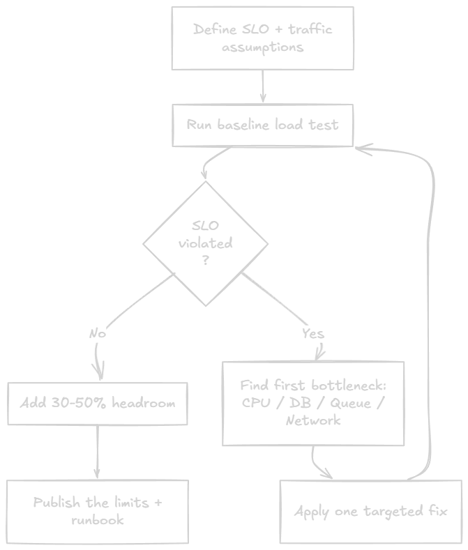

很多团队讨论 API 能否扛住峰值流量时，常见答案是“应该可以”。机器换大了，CPU 还有余量，内存也没顶满，于是大家带着一点不安继续上线。

容量规划要解决的就是这种不安：把“感觉能扛住”换成一个测出来的数字，并且把测试条件、SLO、失败边界和安全余量一起写清楚。这样下一次有人问“黑五流量能不能过”时，回答里有依据。

原文作者 Stefan Djokic 给了一套 ASP.NET Core API 的容量规划方法，还配了一个 `ProductionScalingLab-Demo` 示例项目。文章把概念放进本地实验里：跑 API、跑 k6、观察 p95 延迟、`429` 限流和 outbox 队列积压。



## 别只看 CPU

很多容量判断会盯着两张图：CPU 和内存。问题是，API 先坏掉的地方经常不在这两张图上。

原文列了几个更常见的瓶颈：

- 连接池耗尽：应用等不到 SQL 连接，请求开始排队。
- 线程池饥饿：少量阻塞调用在高并发下放大，延迟迅速升高。
- 锁竞争：热点锁把并发请求压成单线程通道。
- 队列滞后：写入请求返回了，但后台处理落后，用户迟迟看不到结果。
- p95 延迟崩掉：平均值还好看，尾部用户已经在超时。

所以容量规划真正要回答的问题更具体：在用户体验开始退化前，这个 API 能承受多少流量？

## 该看哪些指标

平均延迟很容易骗人。一个接口平均 80ms，不代表用户都舒服；如果 p99 已经到 4 秒，说明仍有一批真实用户在等。

做容量规划时，至少要把这些指标放进观察范围：

- p95 / p99 延迟：p95 适合做日常 SLO，p99 能暴露尾部体验。
- RPS：按接口类型看，不要把读接口和写接口混成一个总数。
- 并发用户数或 in-flight 请求数：这才会直接压到连接池、线程池和锁。
- 超时率和错误率：用来区分“慢”和“坏”。
- 数据库连接池使用率：很多 .NET API 的隐形上限就在这里。
- 队列深度和处理滞后：只要有异步处理，就要看 worker 是否追得上。

如果只能先加一个指标，原文建议加“按接口统计的 p95”。它会很快改变团队讨论方式，因为大家能看到用户体感何时开始变差。

## 基线循环

容量规划更像一个反复跑的循环，不能只写成一次性文档：

1. 定义 SLO，比如 `p95 < 300ms`、错误率 `< 1%`。
2. 跑稳定负载，拿到正常流量下的参考点。
3. 跑突增负载，看流量快速上升时系统怎样退化。
4. 找到第一个瓶颈，只修这个瓶颈，然后重新测试。
5. 达到 SLO 后，给预计峰值加 `30-50%` 余量，并把容量数字发布出来。

这里最容易被跳过的是第一步。没有 SLO，压测结果很容易被临时解释；先写下目标，后面的测试才有判断标准。

## 本地实验项目

原文示例仓库是 [ProductionScallingLab-Demo](https://github.com/StefanTheCode/ProductionScallingLab-Demo)。README 里说明，这个项目用来演示四类能力：

- `/api/io-bound`：模拟连接压力。
- `WriteGate`：用有界并发保护写入路径。
- Outbox：事务写入和 outbox 表。
- Inbox 与 CQRS 读模型：消费端幂等处理与 `/api/orders-read/{id}` 投影读取。

启动 API：

```bash
dotnet run --project src/ProductionScalingLab.Api/ProductionScalingLab.Api.csproj
# API base URL: http://localhost:5080
```

你可以先创建一笔订单，确认写入链路能跑通：

```bash
curl -X POST http://localhost:5080/api/orders \
  -H "Content-Type: application/json" \
  -d '{"customerEmail":"alice@example.com","amount":149.99}'
```

再看当前写入和后台处理状态：

```bash
curl http://localhost:5080/api/metrics
```

返回里重点看这些字段：`totalOrders`、`pendingOutbox`、`readModelCount`、`processedInbox`、`currentInflight`。

## 连接压力测试

读路径的实验接口很简单：它只等待一段时间，用来模拟慢查询或慢下游调用。

```csharp
app.MapGet("/api/io-bound", async (int delayMs, CancellationToken ct) =>
{
    var boundedDelay = Math.Clamp(delayMs, 5, 5000);
    await Task.Delay(boundedDelay, ct);
    return Results.Ok(new { delayMs = boundedDelay, at = DateTime.UtcNow });
});
```

k6 脚本把虚拟用户从 `200` 拉到 `1000`，并设置 p95 和失败率阈值：

```javascript
// k6/connections.js
export const options = {
  stages: [
    { duration: "30s", target: 200 },
    { duration: "1m", target: 1000 },
    { duration: "30s", target: 0 },
  ],
  thresholds: {
    http_req_duration: ["p(95)<400"],
    http_req_failed: ["rate<0.01"],
  },
};
```

运行：

```bash
k6 run k6/connections.js
```

这类测试的目的在于找到延迟曲线开始弯折的位置，别把重点放在打满机器上。也就是说，哪一个并发量之后，p95 开始明显偏离你的 SLO。

## 写入背压

写路径更有意思。原文用 `WriteGate` 做并发闸门，拿不到闸门的请求直接返回 `429`：

```csharp
if (!await writeGate.TryEnterAsync(ct))
    return Results.StatusCode(StatusCodes.Status429TooManyRequests);
```

`WriteGate` 内部使用 `SemaphoreSlim`，默认最多允许 `64` 个并发写入，并且只等 `250ms`：

```csharp
public async Task<bool> TryEnterAsync(CancellationToken ct)
{
    var acquired = await _semaphore.WaitAsync(
        TimeSpan.FromMilliseconds(250),
        ct);

    if (acquired) Interlocked.Increment(ref _inflight);
    return acquired;
}
```

这里的 `429` 是有意设计的保护信号。它说明系统知道自己接不住更多写请求，于是主动拒绝一部分，保护已经接收的请求继续保持可控延迟。更危险的情况是无限制接收请求，让所有请求一起变慢甚至超时。

写入突增脚本使用 `ramping-arrival-rate`，把到达率从 `50` 一路推到 `800 req/s`：

```javascript
// k6/write-spike.js
export const options = {
  scenarios: {
    write_spike: {
      executor: "ramping-arrival-rate",
      startRate: 50,
      timeUnit: "1s",
      preAllocatedVUs: 100,
      maxVUs: 800,
      stages: [
        { target: 100, duration: "30s" },
        { target: 500, duration: "1m" },
        { target: 800, duration: "30s" },
        { target: 0, duration: "20s" },
      ],
    },
  },
  thresholds: {
    http_req_duration: ["p(95)<700"],
    http_req_failed: ["rate<0.02"],
  },
};
```

运行：

```bash
k6 run k6/write-spike.js
```

压测时再开一个终端观察：

```bash
curl http://localhost:5080/api/metrics
```

重点看三件事：

- p95：被接收的请求是否仍在可接受范围内。
- `429` 比例：限流是否按设计触发。
- `pendingOutbox`：如果它持续上涨且不回落，后台 worker 已经跟不上写入速度。

## 阈值怎么用

原文给了几个经验起点，适合作为讨论和测试入口：

- `100 RPS` 以下：先别急着加基础设施，优先查 N+1 查询、内存分配和低效代码。
- `100-1000 RPS`：缓存和连接池调参开始明显有价值，热点读路径要重点处理。
- `1000+ RPS` 写入：不要把所有写操作同步压在请求路径上，应考虑队列削峰，快速接收，后台处理。
- 高突发且延迟 SLO 很严：增加明确的限流和背压，提前决定从哪里开始拒绝。

这些数字不能当成通用标准。硬件、查询、依赖服务和 SLO 不同，结果都会变。它们更像一组提醒：负载越高，请求路径里的同步工作越应该少。

## 可保存清单

一套可用的容量规划，至少应该留下这些东西：

- 每类接口都有书面 SLO，比如 p95 目标和错误预算。
- 压测脚本跟代码一起进仓库，重大变更后能复跑。
- 每类接口都有已知的安全 RPS 上限。
- 有扩容和缩容 runbook，缩容同样需要验证。
- 告警关注 p95、超时率、队列滞后，而不只看 CPU 和内存。

做到这一步，容量规划就从口头经验变成了工程资产。下次系统变了、数据库改了、接口多了，你可以重新跑脚本，看到容量数字有没有变化。

## 结语

容量规划的价值不在于把系统压到极限，而在于知道用户体验从哪里开始变差，以及系统超过边界后会怎么退化。

对于 .NET API，先把 p95、错误率、连接池、队列滞后这些指标补齐；再用 k6 跑稳定负载和突增负载；接着把安全 RPS、测试条件、SLO 和余量写下来。这样扩容讨论会简单很多，线上故障也更容易提前暴露。

如果你关注 AI 助手、开发工具和软件工程实践，可以关注 Aide Hub。这里会继续分享可操作的工具教程、技术观察和项目经验。

## 参考

- [Capacity Planning for .NET APIs: From Guessing to Measured Scaling](https://thecodeman.net/posts/capacity-planning-for-dotnet-apis-from-guessing-to-measured-scaling)
- [ProductionScallingLab-Demo](https://github.com/StefanTheCode/ProductionScallingLab-Demo)
