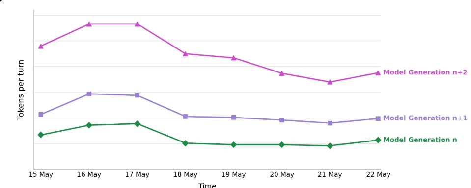
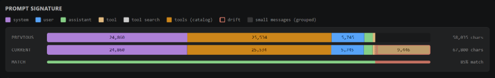

## 每轮请求的 Token 都花在哪了

GitHub Copilot 切换到按量计费之后，每一次 agent 会话里的 token 都直接影响费用、延迟和上下文窗口余量。VS Code 团队自己的数据显示，每一代新模型在同一任务上的 token 消耗普遍比上一代更高。这是一个持续的趋势 — 模型能力在涨，token 开销也在涨。

而 agentic harness（Agent 调度层）的效率优化，正好是抵消这一趋势最直接的手段。

Harness 层面的优化很少是靠一个大改动翻盘的，更多是一堆小改进积累起来。VS Code 团队的做法是：每次改动都用生产环境的 A/B 实验和离线评测跑一遍任务套件，确认任务成功率持平或提升，同时 token 用量下降。

下面按 OpenAI 和 Anthropic 两条线分别展开，先说一个共通的底层问题。

### 提示前缀与缓存

在 agent 编码会话里，每轮请求有很大一部分内容是重复的：系统指令、工具定义、仓库上下文、对话历史。这些重复出现在请求开头的部分叫作**提示前缀（prompt prefix）**。

当多个请求共享完全相同的提示前缀时，推理服务端可以复用已计算的模型状态，而不是每轮都从头算一遍。这个"缓存"不是人类可读的提示词副本，而是模型处理前缀时产生的内部 key/value 张量。缓存命中可以大幅降低费用（缓存输入 token 的价格可能是未缓存的十分之一）和延迟。

### 工具定义开销

另一大开销来自工具定义。agent 可能挂载大量工具：MCP 服务端暴露的、内置的、扩展提供的。每个工具都会带着完整的 JSON 参数 schema 发到模型上下文里。即使这部分数据被缓存了，每轮占用上下文窗口的绝对值也不会变，工具集越大占得越多。

### 工具搜索：按需加载

**工具搜索（tool search）**的思路是把"全量加载"变成"按需加载"。模型在前置阶段只看到轻量元数据（工具名和描述），完整的参数 schema 留在上下文外。当模型需要某个工具时，再通过搜索把它的定义拉到上下文末尾。

这样做的收益有两点：没用到的工具不占 token，而且延迟加载的工具被追加到上下文窗口末尾而不是前缀里，不会破坏缓存的提示前缀，缓存收益得以持续生效。

## OpenAI 模型上的三项改进

针对 OpenAI 系列模型，VS Code 团队做了三件事：延长缓存保留时间、减少工具定义开销、把 HTTP 换成 WebSocket。

### 延长提示缓存

OpenAI 模型的提示缓存是自动的：服务端推断可复用的前缀并复用模型状态。这对于支持缓存定价的模型来说，未缓存的输入 token 价格是缓存输入的 **10 倍**。

缓存什么时候失效是可以配置的。默认情况下缓存存在快速 GPU 内存里，大约 5-10 分钟无活动后就会被丢弃。通过设置 `prompt_cache_retention` 为 `"24h"`，缓存被移到稍慢但容量更大的 GPU 本地存储里，最多保留 24 小时。

效果很直观：默认缓存下，停下来喝杯咖啡的工夫缓存就没了，下一轮请求要以全价重新处理整个前缀。而 24 小时保留让长时间暂停后继续会话仍然能用缓存价格跑。

以下是开启 24 小时缓存保留后，各模型在不同请求间隔下缓存命中率的相对提升（注意是相对变化，不是百分点增加；+919% 意味着命中率是之前的 10.19 倍）：

| 请求间隔   | GPT-5.2 | GPT-5.3-Codex | GPT-5.4 |
| ---------- | ------- | ------------- | ------- |
| 10-20 分钟 | +13%    | +32%          | +10%    |
| 20-30 分钟 | +135%   | +142%         | +137%   |
| 30-40 分钟 | +301%   | +203%         | +679%   |
| 40-60 分钟 | +338%   | +279%         | +919%   |

间隔越长，提升越明显。这意味着长时间暂停后恢复会话时，更多输入 token 按低价缓存费率计费。

### 工具搜索

GPT-5.4 及以上模型支持 [OpenAI 原生的工具搜索](https://developers.openai.com/api/docs/guides/tools-tool-search)，通过 `defer_loading` 标记实现工具定义的延迟加载。模型前置阶段只看到延迟函数的名称和描述，或按命名空间分组后只看到命名空间的名称和描述。

四天的 VS Code 实验数据：

| 指标              | 模型    | 变化   |
| ----------------- | ------- | ------ |
| P50 每轮总 token  | GPT-5.4 | -9.81% |
| P50 每轮总 token  | GPT-5.5 | -8.61% |
| P50 首 token 时间 | GPT-5.4 | -6.88% |
| P50 首 token 时间 | GPT-5.5 | -7.34% |
| P50 完成时间      | GPT-5.4 | -5.31% |
| P50 完成时间      | GPT-5.5 | -5.42% |

按整个会话聚合，Copilot 用户 token 用量中位数下降了 8.97%（GPT-5.4）和 10.92%（GPT-5.5）。

### WebSocket 传输

Agent 编码会话的一个轮次可能包含多次顺序请求 — 模型每调用一次工具、往解决方案推进一步，都会发起一次请求。即使底层 HTTP 连接被复用了，每个步骤仍然是一次独立的 API 调用。

[OpenAI Responses API 的 WebSocket 模式](https://developers.openai.com/api/docs/guides/websocket-mode) 保持一条持久连接，为这些顺序请求提供了更低延迟的续接路径。在活跃连接上，OpenAI 还能复用最近一次响应状态（通过连接本地内存缓存），降低长链工具调用中的续接开销。

在 VS Code Stable 的初始推送上，WebSocket 相比 HTTP 的延迟收益：

| 指标               | 分位数 | GPT-5.3-Codex | GPT-5.4 |
| ------------------ | ------ | ------------- | ------- |
| 首 token 时间      | p50    | -19.46%       | -16.37% |
| 首 token 时间      | p95    | -12.92%       | -15.78% |
| 完成时间（按轮次） | p50    | -13.55%       | -11.74% |
| 完成时间（按轮次） | p95    | -7.86%        | -6.26%  |

用户参与度也有统计显著的提升：GPT-5.3-Codex 和 GPT-5.4 的活跃用户分别增加了 1.27% 和 2.17%，两日活跃度分别提高了 1.90% 和 3.14%。

WebSocket 已经成为 GPT-5.2 及更新模型在 VS Code、Copilot CLI、GitHub App 等全平台上的默认传输方式。

## Anthropic 模型上的两项改进

针对 Anthropic 模型，改进集中在同一类问题上：提示缓存的命中率和工具定义开销。

### 更聪明的缓存断点策略

Anthropic 的提示缓存机制和 OpenAI 不同。它不是由服务端自动推断可复用前缀，而是由调用方通过 `cache_control` 断点显式标记。每个请求的断点预算有限且固定，放在哪和放不放一样重要。

VS Code 团队重新设计了 Messages API 的缓存策略，把最多四个断点锚定在提示词中最稳定的边界上：

- **工具定义末尾**和**系统提示词末尾**：这些内容在轮次之间变化最少。
- **两个滚动锚点**，分别指向最近两条可缓存的对话消息。第二条较旧的锚点是一个安全网 — 如果最新锚点因慢速工具调用导致缓存失效，或者内容有轻微偏差，旧锚点仍然可以命中，覆盖到它为止的所有内容。通常只损失一次交互的缓存，而不需要从整个会话冷启动。

这些改动让缓存命中率稳定在 94% 左右。对于前缀长、轮次密集的 agent 工作负载来说，这意味着每轮请求只有很小一部分输入需要重新计算。

### 从服务端到客户端的工具搜索

Anthropic 的工具搜索同样是延迟加载思路：工具通过 `defer_loading: true` 标记，同时保留一组精选的核心工具常驻上下文（读写文件、运行终端命令、搜索工作区），让最常见的操作不增加额外步骤。

首先上线的是 Anthropic 服务端工具搜索。模型在 Anthropic 侧搜索延迟工具目录，API 将匹配结果展开为 `tool_reference` 块内联返回。七天的 VS Code 实验数据：

| 指标            | 范围          | 变化    |
| --------------- | ------------- | ------- |
| 首块响应时间    | p50（按轮次） | -2.45%  |
| 提示 token 总量 | p50（按轮次） | -11.30% |
| 提示 token 总量 | p50（按用户） | -18.32% |
| 总 token        | p50（按轮次） | -11.09% |
| 总 token        | p50（按用户） | -18.03% |

Copilot 用户中位数的提示 token 和总 token 在整个会话中各下降了约 18%。

方案验证有效后，团队把搜索逻辑移到了客户端。模型仍然调用 `tool_search` 工具，但搜索在本地执行，匹配结果以 `tool_reference` 块返回。

客户端搜索的匹配方式不是靠工具名和描述的词法比对，而是用了 [Copilot 内部 Embedding 模型](https://github.blog/news-insights/product-news/copilot-new-embedding-model-vs-code/) — 同一个支撑 embedding 引导工具路由的模型 — 把搜索查询和所有可用工具的向量表征做语义比对。它是按意图匹配而不是按关键字匹配，所以像"查找这个符号的所有引用"这样的请求，即使查询和工具名完全没有共同词汇，也能命中正确的工具。

客户端搜索带来的额外收益：

- **响应速度**：搜索在本地针对已缓存的 embedding 运行，不再依赖服务端搜索的往返延迟。
- **动态 MCP 工具发现**：因为候选集由客户端维护，MCP 服务端在会话中途增删的工具能即时反映，不需要等待固定的服务端目录。
- **搜索质量提升**：embedding 引导的搜索更擅长为一个查询找到正确的工具，用户错误率随之下降。

两周 VS Code Stable 推送上，客户端工具搜索在延迟加载已节省的 token 基础上进一步降低了延迟：

| 指标                 | 模型              | 变化   |
| -------------------- | ----------------- | ------ |
| 首 token 时间（p50） | Claude Opus 4.6   | -1.91% |
| 完成时间（p50）      | Claude Opus 4.6   | -1.97% |
| 完成时间（p95）      | Claude Opus 4.6   | -2.57% |
| 完成时间（p50）      | Claude Sonnet 4.6 | -1.30% |
| 完成时间（p95）      | Claude Sonnet 4.6 | -3.35% |
| 用户错误率           | Claude Sonnet 4.6 | -4.01% |

两种工具搜索方案中，延迟加载的工具都在缓存提示前缀之外，前缀不会被改写，之前的缓存收益持续生效。而且一个工具被发现后，在后续对话中一直可用，模型不需要再次为它付出搜索成本。

## 下一步

VS Code 团队当前的工作方向有两个。

**专门的子 Agent**：把特定类型的工作从主 agent 剥离出去，用最便宜、最小的能满足需求的模型来跑，而不是让主模型在自己的上下文里为这些工作买单。正在构建和探索的子 agent 包括搜索工作区、运行命令、汇总结果等窄任务。

**Token 用量透明度**：在产品内标记那些会偷偷拉升费用的操作，比如长时间暂停后恢复会话（缓存已过期）、会话中途修改 reasoning effort 级别等，让用户在冷启动缓存之前能做出知情选择。

如果你关注 AI 助手、开发工具和软件工程实践，可以关注 Aide Hub。这里会继续分享能落地的工具教程、技术观察和项目经验。

## 参考

- [Improving token efficiency for GitHub Copilot in VS Code](https://code.visualstudio.com/blogs/2026/06/17/improving-token-efficiency-in-github-copilot)
- [Coding Harness: How the agentic harness in VS Code connects GitHub Copilot to your tools](https://code.visualstudio.com/blogs/2026/05/15/agent-harnesses-github-copilot-vscode)
- [How we're making GitHub Copilot smarter with fewer tools](https://github.blog/ai-and-ml/github-copilot/how-were-making-github-copilot-smarter-with-fewer-tools/)
- [OpenAI Tool Search documentation](https://developers.openai.com/api/docs/guides/tools-tool-search)
- [OpenAI Responses API WebSocket mode](https://developers.openai.com/api/docs/guides/websocket-mode)
- [Copilot's new embedding model for VS Code](https://github.blog/news-insights/product-news/copilot-new-embedding-model-vs-code/)
