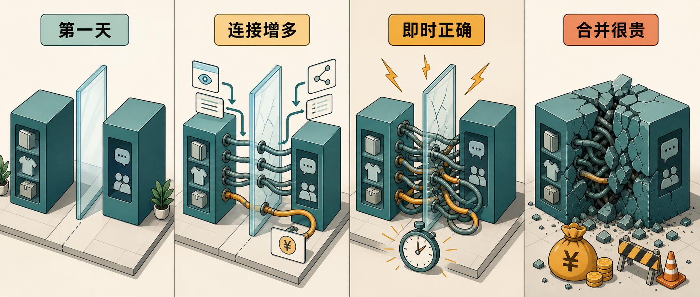

模块化单体最容易让人误判的一点，是边界刚画下时看起来都很合理。职责清楚、目录清楚、事件也清楚，团队很容易把这个判断当成已经完成的设计。

Milan Jovanović 这篇文章讲的是一次更扎实的教训：边界在第一天很干净，过了一年后却被业务规则慢慢拉回到一起。问题没有出在“模块化单体”这个选择上，也没有出在异步事件本身。更具体的原因是：业务后来要求两个模块在同一刻给出正确结果，而原来的边界默认它们可以最终一致。

## 当时的拆分

原文的背景是一套有 40 年历史的制造业 ERP 重写项目。后端是 ERP，面向经销商的订购工具叠在上面。这个工具让经销商和客户在展厅里一起搭建订单。

团队把系统拆成两个模块：

- `Catalog` 管产品、配置、选项和价格。
- `Collaboration` 管订单协作过程，包括草稿、评论、审批和修订。

这个拆分在当时很好解释。产品目录和协作流程属于不同职责，也对应团队里不同工作区域。模块之间通过事件沟通，避免直接耦合。这是模块化单体里很常见、也很容易被认可的做法。

原作者强调，这次拆分并非条件反射。团队认真判断过，每个后续选择在当时也都站得住。

## 问题如何变重

变化从普通需求开始。

协作页面需要展示产品选项，于是它读取 `Catalog` 的数据。后来页面又需要实时价格。再后来，业务提出一个更硬的规则：订单必须马上反映目录变更。

单看每一步，都像一次正常功能开发。没有人会在第一次跨模块读取时拉响警报。可这些需求连续出现后，`Collaboration` 和 `Catalog` 之间多了事件、读取、同步价格检查。文件夹里的边界还在，运行时的关系已经换了样子。

这类变化危险的地方在于，它们通常不会以“架构变更”的名义出现。它们会以小票、热修复、页面字段、价格校验的形式进入系统。等你回头看，两个模块已经离不开彼此。

## 假设过期了

更深的矛盾来自通信方式。

原系统里，模块之间通过异步事件沟通。`Catalog` 发布事件，`Collaboration` 收到后再处理。这个设计在高风险迁移里有实际好处：各模块能独立推进，旧系统也能被一块一块替换。

可这个设计隐含了一个前提：两个模块可以接受最终一致。

当业务要求“经销商保存配置时，价格必须当场正确”，这个前提就失效了。异步事件可以让两个模块最终同步，却不能保证保存那一刻的价格一定正确。

于是系统开始补同步调用、共享事务和各种绕路处理。每个修补都能解决当下问题，也都在表达同一个事实：按新的业务一致性要求看，`Catalog` 和 `Collaboration` 更像同一个模块里的两个部分。

## 被忽略的信号

原作者复盘时列了几个信号，它们单独看都不刺眼，连在一起就很明显。

`Collaboration` 经常读取 `Catalog` 数据。跨模块读取在系统里很常见，所以很容易被当成普通流量。但如果某个模块的核心功能总要读另一个模块，边界就该重新检查。

几乎每个新的协作功能都会碰到目录模块。这说明需求增长方向一直穿过同一条边界。

事件处理器越加越多，只为让两个模块保持同步。事件驱动看起来很干净，可如果事件只是在补两个强相关模型之间的时间差，它也会变成耦合的一种表现。

第一次“必须马上正确”的热修复尤其关键。它看起来像一次例外，实际是在提醒团队：最终一致这个前提已经开始裂开。

## 给过去的建议

这篇文章最有用的判断，是把模块边界当成猜测。边界画下时，团队掌握的信息最少，所以后面要持续检查它。

在不确定时，先用更粗的模块。一个大模块日后拆成两个，通常成本较低；两个已经被调用、事件、事务和数据同步绑在一起的模块，后来再合回一个，风险和成本都会高很多。

一致性需求应该参与边界判断。如果两个概念必须在同一刻保持正确，它们大概率应该待在同一侧。把异步事件放在中间，等于押注它们永远只需要最终一致。这个押注可以做，但要清楚自己正在做这个选择。

还要观察那些便宜的小决定。边界刚画下时很轻，建目录、加事件、拆包都不难。真正的成本会在一年后通过同步调用、热修复和合并压力慢慢出现。

## 这对实践的影响

这篇复盘没有否定模块化单体。原作者也说，如果重来一次，他仍然会选择模块化单体。问题在于，早期边界最容易被后来学到的业务事实推翻，也最容易因为已经写进结构而被忽略。

落到日常开发，可以用几件事检查边界是否还成立：

- 某个模块的新需求是否总要读取同一个外部模块。
- 事件是否主要用于补同步，而非表达清楚的业务事实。
- 是否出现了“保存时必须当场正确”的规则。
- 同步调用是否在同一条边界上反复增加。
- 合并两个模块的想法是否一再出现，但总因为成本被推迟。

如果这些信号持续出现，边界就该重新评估。模块化单体的价值在于让系统能在一个进程内保持结构清楚，也让团队有机会较早调整设计。别等到目录、事务、事件和数据复制都长满之后，才承认当初那条线已经过期。

如果你关注 AI 助手、开发工具和软件工程实践，可以关注 Aide Hub。这里会继续分享能实际使用的工具教程、技术观察和项目经验。

## 参考

- [The Modular Monolith Boundary I Couldn't Take Back](https://www.milanjovanovic.tech/blog/the-modular-monolith-boundary-i-couldnt-take-back)
