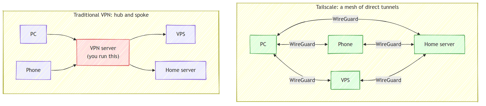
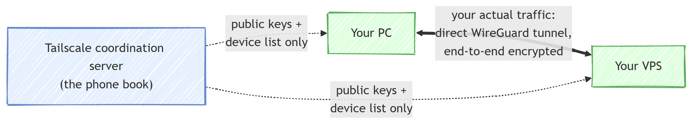
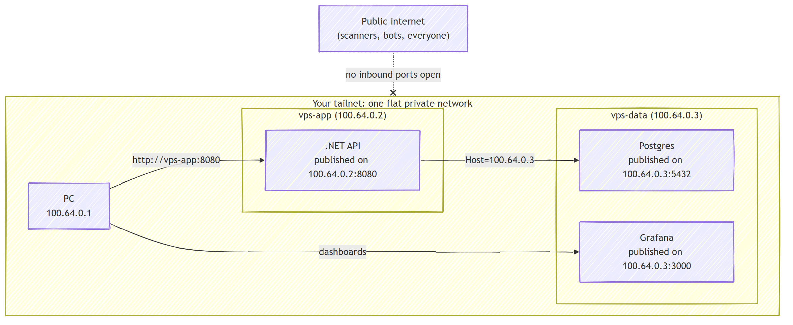

此刻正有 bot 在互联网上扫描你的数据库。不是专门针对你的，而是每一台有公网 IP 的服务器、每一个暴露的端口，都在这场无差别的 24 小时扫描范围里。

而你服务器上跑的大部分东西，本来就不是为公网设计的。数据库、管理面板、监控大盘、只有内部服务才会调用的 API——这些都不该暴露给外界。但大多数教程的做法是随手开一个公网端口，顺便附赠一套新工作：搞证书、配登录页、设置 IP 白名单、应对全天候的 bot 探测。

更好的默认策略是：把这些服务留在私有网络里，只让它们互相看到、只让你访问到，对外暴露的端口为零。这篇文章就用 [Tailscale](https://tailscale.com) 来实现这一点。

## Tailscale 到底做了什么

**VPN**（虚拟专用网络）的本质，是在公共互联网上建立加密隧道，让流量在不可信的网络里保持私密。

Tailscale 做的事是把 VPN 更进一步：它把你自己的机器（PC、服务器、手机）连成一个只有你的设备能看到的私有网络，叫 **tailnet**。底层跑的是 [WireGuard](https://www.wireguard.com)——一个现代、经过大量审计的加密协议，密钥、地址管理全部自动完成。

和传统 VPN 最大的不同在于拓扑结构。传统 VPN 是**中心辐射型**：每台设备都拨号到一台中心服务器，所有流量都经过它。Tailscale 构建的是 **Mesh** 网络：每台设备和每台其他设备之间都有一条直接加密隧道。



没有中间服务器卡在流量路径上。你的应用连数据库的流量走两台机器之间最短的路由，也不需要维护什么中转节点。

那设备之间没有中心服务器怎么找到彼此？Tailscale 把职责拆成了两层：**协调服务器**（coordination server）维护一个设备目录和它们的公钥（相当于电话簿），而**真正的数据**直接在设备之间走 WireGuard 加密隧道，端到端加密。



关键属性是：设备永远只向外拨号——向协调服务器、向其他设备。没有任何东西需要向内连接。这就是下一步能关掉所有防火墙端口的基础。

## 两台 VPS 之间零开放端口的连接

安装 Tailscale 每台机器两条命令（PC 上再加一个客户端）：

```bash
curl -fsSL https://tailscale.com/install.sh | sh
sudo tailscale up
```

打开它打印的登录链接，批准设备，它就会加入你的 tailnet，获得一个**固定的私有 IP**（`100.x.y.z` 范围）和一个在任何网络下都不变的名字。

下面是我们要搭建的拓扑：

- `vps-app`（`100.64.0.2`）跑一个 .NET API，放在 [Docker](https://www.docker.com) 里
- `vps-data`（`100.64.0.3`）跑 [Postgres](https://www.postgresql.org) 和 [Grafana](https://grafana.com)，也在 Docker 里
- API 跨机器查询 Postgres，你用 PC 访问一切，公网看不到任何一个服务



### 关掉防火墙

因为 Tailscale 只向外拨号，云防火墙不需要任何入站规则就能到达这些机器。先确认通过 tailnet 能用 SSH 连上，然后删掉公网的 22 端口规则——对互联网来说 SSH 就此消失。

### 把服务绑定到 tailnet IP

这是“零开放端口”能成立的关键一步。用常见方式发布 Docker 端口（`-p 5432:5432`）会把它绑到 `0.0.0.0`，也就是所有网络接口。私有服务应该**只绑在 tailnet IP 上**。

在 `vps-data` 上：

```yaml
services:
  postgres:
    image: postgres:18
    restart: unless-stopped
    environment:
      POSTGRES_PASSWORD: ${POSTGRES_PASSWORD}
    ports:
      - "100.64.0.3:5432:5432" # tailnet IP，不是 0.0.0.0
    volumes:
      - pgdata:/var/lib/postgresql/data

  grafana:
    image: grafana/grafana:12.1.0
    restart: unless-stopped
    ports:
      - "100.64.0.3:3000:3000"
    volumes:
      - grafana:/var/lib/grafana

volumes:
  pgdata:
  grafana:
```

现在 Postgres 在任何一层都没有公网端点，但 tailnet 上的每台设备都能直接访问它。

### 把应用连到另一台机器

用一条普通的连接字符串，指向数据机器稳定的 tailnet IP：

```yaml
services:
  api:
    image: ghcr.io/milanjovanovic/api:latest
    restart: unless-stopped
    ports:
      - "100.64.0.2:8080:8080"
    environment:
      ConnectionStrings__AppDb: "Host=100.64.0.3;Port=5432;Database=app;Username=app;Password=${POSTGRES_PASSWORD}"
```

然后从你的 PC 上，在任何网络环境里：

```bash
curl http://vps-app:8080/health
psql -h vps-data -p 5432 -U app app
```

### 这一步帮你省掉了什么

回头看这套配置让你跳过了哪些东西：

- WireGuard 已经加密了每一字节，所以 TLS 证书完全不用操心
- Grafana 上线不需要反向代理，也不需要登录页面
- 访问每个服务用的是 tailnet 名称，而不是 DNS 记录
- 服务在跑，但公网看不到它们

## 你得到什么

一旦你的机器共享同一个私有网络，所有内部服务——数据库、消息队列、监控面板、管理后台、服务间 API——就不再是需要防御的公网端点，而只是一个你直接连接的私有地址。

这也是 Milan Jovanović 在他正在构建的编程平台 [Katabench](https://katabench.com) 里实际跑的模式。对外只有一个跑在 80 和 443 端口的反向代理，因为用户要通过它加载应用。其他一切——部署面板、Postgres、消息队列、Grafana、所有遥测——全部跑在 tailnet 里，没有任何公网主机名。

记住一条原则就够了：**公网主机名是服务挣来的**，只有外部用户确实需要访问时，才给它一个。其他所有东西默认私有。

15 分钟配置，零开放端口，你的基础设施从公网上消失，便利性一点没少。

如果你关注 AI 助手、开发工具和软件工程实践，可以关注 Aide Hub。这里会继续分享能落地的工具教程、技术观察和项目经验。

## 参考

- [Build Your Own VPN With Tailscale — Milan Jovanović](https://www.milanjovanovic.tech/blog/build-your-own-vpn-with-tailscale)
- [Tailscale 官网](https://tailscale.com)
- [WireGuard](https://www.wireguard.com)
- [Katabench](https://katabench.com)
