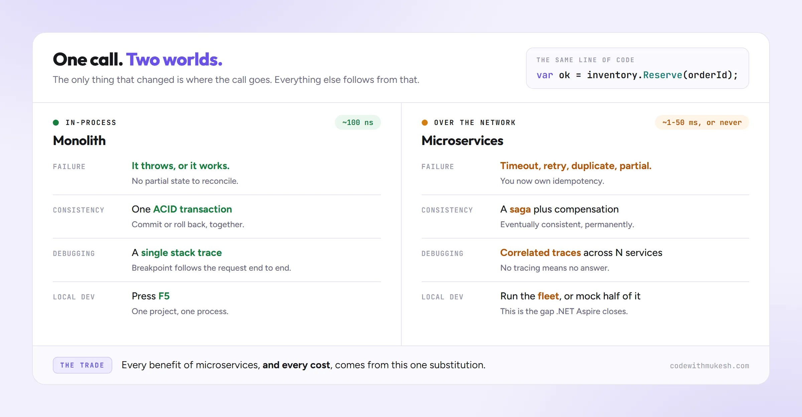

微服务什么时候值得上？什么时候碰都不要碰？这是每个做过架构决策的 .NET 开发者都会遇到的问题。太多团队因为一场会议演讲就「单体是坏的」，把一个好好的应用拆成八个服务，然后花一整年跟网络超时和坏掉的本地环境搏斗，而不是交付功能；也有单体应用在四十人团队里因为部署互相踩脚而崩盘。两种都是架构失败，区别只在于你手里的是哪个问题。

这篇文章是给做判断的人看的决策指南，不贴大段代码。读完你会知道：微服务真正解决什么、哪些信号说明该上、哪些信号在尖叫「别上」、签下的隐藏账单是什么，以及为什么 Amazon Prime Video 和 Segment 这样的团队会悄悄把架构退回去。

## 微服务的定义：关键是「独立部署」

微服务是一个小型、可独立部署的服务，拥有自己的业务能力和数据，通过网络与其他服务通信。

其中最重要的限定词是「**可独立部署**」。如果一个服务不能在不重部署其他服务的情况下单独上线，你拥有的不是微服务，而是**分布式单体**——两种世界的最差组合。

对比一下单体：一个部署单元、一个进程、通常一个数据库，所有代码一起发布。「单体」这个词常被当贬义词用，但结构良好的单体完全是大应用体面的运行方式。微服务的对立面不是「糟糕的架构」，而是「更少的部署单元」。

微服务架构就是由这样一群服务组成的系统：各自独立进程、各自部署节奏、各自持有别人不能直接读的私有数据库。服务之间的边界是网络调用（HTTP、gRPC）或队列消息，而不是进程内的方法调用。

这个单一的设计选择——把方法调用变成网络调用——就是微服务所有收益和所有成本的来源。

## 微服务真正解决的是「人的问题」，不是「代码问题」

这是全文最重要的一句话：**微服务首先是人员问题的解药，而不是代码问题的解药**。

写过《微服务设计》的 Sam Newman 对此直言不讳：采用微服务最强的理由是让多个团队能够独立工作和部署。这正是康威定律（Conway's Law）的体现——系统的结构会镜像组织的沟通结构；既然你有多个团队，就沿着团队边界切分系统，减少互相阻塞。

微服务实际买来三样东西：

1. **独立部署**：A 团队下午 2 点上线支付服务，不需要等 B 团队的结算版本，也不需要回归整个应用。
2. **独立扩展**：活动期间图片处理服务跑 40 个实例，用户资料服务保持 2 个。扩展热点部分，而不是整个应用。
3. **技术与故障隔离**：一个服务可以用不同的运行时或数据库，推荐服务崩溃不必拖垮结算服务。

注意清单上没有的东西：「更干净的代码」「更好的关注点分离」「更容易理解」。干净边界来自好的设计，而不是网络调用。你完全可以跨服务写出意大利面——而且这次是没法用单个堆栈跟踪调试的意大利面。

如果你的真实问题是代码纠缠，微服务不会修复它，只会把它分散到网络上并增加延迟。先修边界，在进程内修，那里犯错代价最低。

## 什么时候该用微服务：五个信号

老实勾选以下几条，一条通常不够，几条同时成立才值得考虑：

**1. 多个团队在部署上互相阻塞。** 这是最强的信号。五个团队共用一个发布列车、每次部署都是谈判时，沿团队边界切分很快就能回本。

**2. 系统某一部分的扩展需求截然不同。** 视频转码流水线、搜索索引器、通知扇出（fan-out）这类需要其他部分 50 倍资源的模块，是天然的抽取候选。

**3. 不同部分有不同的可用性或合规要求。** 支付需要比博客 CMS 更高的可用性和更严格的审计边界，隔离它可能值回票价。

**4. 有边界稳定、真正独立的业务能力。** 计费、身份、库存是经典例子：契约清晰，很少需要和其他部分共享一个事务。

**5. 你已经有运维肌肉。** CI/CD、容器化、集中日志、分布式追踪和 on-call 轮值，必须在分布式之前就存在，而不是之后。

如果这五条里你能诚实勾出三四条，微服务可能真是正确选择。迁移会痛，但痛换来了真实的东西。

## 什么时候别用微服务：五个反信号

这是大多数架构文章跳过的一节，值得多花点篇幅。以下任一情况成立就该回避：

**小团队（10 人以下）。** 一两个团队时，微服务要解决的协调问题几乎不存在。你会为几乎为零的收益付全部运维成本。模块化单体几乎总是更好的选择。

**产品还在摸索期。** 早期产品的领域边界每周都在变。微服务把边界冻结成网络契约和独立数据库——恰恰在你最需要边界保持流动的时候。在单体里移动边界是一次重构；跨服务移动边界是一次迁移。

**服务会共享数据库或事务。** 如果两个「服务」频繁读对方的表、需要一起提交，它们就是一个穿了戏服的服务。数据层已经耦合，分离的所有好处都丢了。

**DevOps 成熟度不够。** 没有容器流水线、没有集中日志、没有追踪、手动部署？微服务会把每个缺口乘以服务数量。十个服务就是十个凌晨三点要监控、部署、加固和调试的东西。

**性能瓶颈在数据库而不在应用层。** 把应用拆成服务不会让慢查询变快，只会给同一个慢数据库加上网络跳数，然后管这叫进步。

对新项目和小团队的诚实默认答案是：**不要从微服务开始**。从一个结构良好的单体起步，保持接缝干净，只有当某个具体、可命名的压力逼你出手时，才抽取服务。

## 隐藏成本：把方法调用变成网络调用

每个被变成网络调用的方法调用，都继承了分布式计算的八项谬误：网络不可靠、延迟不为零、带宽不是无限。落到实践里是这样：

| 成本项       | 单体中                           | 微服务中                                             |
| ------------ | -------------------------------- | ---------------------------------------------------- |
| 跨功能调用   | 进程内方法，纳秒级，几乎总是成功 | 网络调用：可能慢、可能超时、可能半途失败             |
| 数据一致性   | 一个数据库，一次 ACID 事务       | 没有分布式事务，需要 saga 和最终一致性               |
| 调试一个请求 | 一个堆栈跟踪                     | 跨 N 个服务和队列的关联追踪                          |
| 本地开发     | 运行一个项目，按 F5              | 跑一整套服务，或者 mock 掉一半（.NET Aspire 能缓解） |
| 模式变更     | 一次迁移                         | 版本化契约、向后兼容的滚动发布                       |
| 部署         | 一条流水线                       | 每服务一条流水线，外加编排                           |

最大的一笔是**数据一致性**。每个服务拥有自己的数据库那一刻起，多步业务操作就无法放进单个事务。「建订单、扣卡、锁库存」不再是一次提交，而变成一场每个步骤都可能失败、都必须补偿的事件编排。这就是 saga 模式——它是每一个跨服务工作流上的永久税。

第二笔是**可观测性**。单体里一次失败请求是一个堆栈跟踪；微服务里这个请求可能穿过六个服务和两个队列，你需要分布式追踪（OpenTelemetry、correlation ID）才能回答「在哪断的」。如果无法端到端追踪请求，就无法安全运营微服务。

## 中间路径：从模块化单体开始

对绝大多数 .NET 团队，正确的起点几乎总是同一个：**模块化单体**。

模块化单体是单个可部署应用，内部按明确边界拆成模块。每个模块拥有自己的领域切片、暴露清晰的公共接口，不允许伸手进其他模块的内部。它仍然作为一个单元部署，（通常）用一个数据库。纪律是逻辑层面的，不是物理层面的：边界靠代码强制，不靠网络。

这个区别就是全部重点。你得到人们**以为**微服务会带来的干净、解耦边界，同时保留单体一切舒服的地方——一次部署、一个堆栈跟踪、真实的事务、能从端到端跟完一个请求的调试器。

为什么它几乎每次都是对的默认项：

- **只拿好处（边界），不付账单（网络）。** 模块间调用仍是进程内方法调用：快、不超时、同一事务提交。分布式系统管道一分钱不花。
- **保留选项。** 架构的本质是延迟决策，直到有足够信息做对。带干净接缝的模块化单体让微服务之门保持敞开且便宜；过早的微服务把这扇门焊死。
- **匹配大多数团队真实的扩展方式。** 没几个产品第一天就需要行星级规模或几十个团队。模块化单体让中小团队舒服地跑好几年，吸收功能增长而不用分布式重写。
- **优雅失败。** 如果边界划错了——早期几乎一定会——修它是单个代码库里的重构，不是跨服务和数据库的迁移。错误保持廉价。

Martin Fowler 在 2015 年就把这称为「MonolithFirst」策略，十年行业经验基本证明了他是对的。只有当具体压力——团队争抢、失控的扩展曲线、硬性隔离要求——超出单个部署单元的承载时，才走向微服务。在那天到来之前，模块化单体不是妥协，它就是正确答案。

## 真实案例：退回去的团队

反对默认微服务的最强论据，是几个知名工程团队采用后又公开反悔。

**Amazon Prime Video。** 2023 年 3 月，Prime Video 工程团队发表了一篇著名的文章：他们重建了音视频质量监控服务。原设计是基于 serverless 组件的分布式系统（AWS Step Functions 和 Lambda 相互传数据），因为编排开销和组件间数据移动成本，很快就撞上扩展上限且费用暴涨。他们把整个东西合并成单进程单体，基础设施成本大约**下降 90%**，扩展性还更好。一个帮助普及云原生模式的团队，因为数字说话，为这个工作负载选择了单体。

**Segment。** 客户数据平台 Segment 写过一篇业内最坦诚的复盘文章《Goodbye Microservices》。他们膨胀到 140 多个微服务后，运维开销——每个服务的部署、依赖管理、这么多移动部件的认知负荷——压垮了小团队的节奏。合并回单体后生产力大幅回升。他们的教训不是「微服务是坏的」，而是「微服务对我们团队的规模和问题的形状来说，是错的工具」。

**那谁该跑微服务？** 以微服务闻名的 Netflix、Uber、Amazon 零售平台，共享一个画像：数千工程师、数百团队、行星级流量，以及专门支撑分布式系统的平台组织。常被引用为微服务案例的 Shopify，核心其实是一个大型、纪律严明的模块化单体（Ruby on Rails 应用），只是选择性抽取服务。规律一致：这些团队用微服务解决他们真实存在的组织扩展问题，而且有配套的运维投入。

如果你的处境不像他们，照搬他们的架构就等于照搬成本，却没有他们的理由。

## 如果真要上：五个关键架构决策

假设你勾满了条件，迁移是正当的。决定微服务是帮忙还是添乱的，是下面这些决策：

**1. 边界围绕业务能力画，而不是技术层。** 「支付」服务拥有支付的一切，很好；「数据库服务」或「验证服务」不是微服务——那是被放到网络上的层，会让所有使用它的东西耦合。领域驱动设计（DDD）的限界上下文（bounded context）是这里最好的工具。

**2. 每个服务拥有自己的数据库。** Database-per-service 没有商量余地。两个服务共享数据库的那一刻，它们在模式层耦合，再也无法独立部署和演化。这也是把你逼进最终一致性的那个决定，所以要有意识地做。

**3. 跨服务工作流优先异步消息。** 同步调用链（A 调 B、B 调 C）把失败和延迟相乘——如果每个服务可用性 99.9%，五个服务串起来只剩约 99.5%。消息代理（RabbitMQ、Azure Service Bus、Amazon SQS/SNS）上的事件在时间上解耦服务、圈住故障。查询用同步，状态变更用异步事件。

**4. 边缘放 API 网关。** 客户端不该知道你的内部服务拓扑。网关（.NET 世界用 YARP，老栈用 Ocelot）统一处理路由、认证和限流，让你在网关背后重塑服务而不破坏客户端。

**5. 在第二个服务之前先投资可观测性。** 集中式结构化日志、指标、基于 OpenTelemetry 的分布式追踪是前提条件，不是锦上添花。.NET Aspire 让本地编排和遥测比过去轻松得多。

## 决策矩阵

把前面的判断压成一张表，是我实际在用的版本：

| 你的处境                     | 建议                         |
| ---------------------------- | ---------------------------- |
| 新产品，领域不清晰           | 单体，保持干净，快速迭代     |
| 增长中的应用，1-2 个团队     | 模块化单体，强内部边界       |
| 某个功能扩展需求差异巨大     | 模块化单体 + 只抽取那个功能  |
| 多个团队部署互相阻塞         | 沿团队边界的微服务           |
| 想要「干净代码」「现代架构」 | 模块化单体，这不是微服务问题 |
| 行星级规模，数百工程师       | 微服务，配平台团队支撑       |

## 关键结论

问题从来不是「单体 vs 微服务」，而是「**解决我眼前这个实际问题，最少需要几个部署单元**」。对读这篇文章的绝大多数人来说，答案是 1——一个干净、模块化的 1。在压力出现之前你多加的每一个服务，都是一张你持续在付的账单。

微服务是一个针对特定问题的强力工具：让许多团队在规模下独立部署和扩展。它不是默认项、不是资历标志、也不是乱代码的解药。成本真实且永久——分布式数据、最终一致性、更难的调试、需要专门设计的本地开发体验。

如果你在 .NET 团队里做架构决策，把模块化单体当作默认答案：干净的内部边界、一个部署单元、以及某天真实压力出现时能便宜地抽取真服务的自由。Amazon Prime Video 和 Segment 都是体验过另一种选择后才做出这个决定的。借他们的结论，不用付他们的学费。

Aide Hub 会继续分享 AI 助手、开发工具和软件工程实践，欢迎关注，也欢迎在评论区聊聊你的架构决策。

## 参考

- [When to Use Microservices (And When Not To) — codewithmukesh](https://codewithmukesh.com/blog/when-to-use-microservices/)
- [Scaling up the Prime Video audio/video monitoring service and reducing costs by 90% — Amazon Prime Video Tech（原站已下线，经 Internet Archive 存档）](https://web.archive.org/web/2023/https://www.primevideotech.com/video-streaming/scaling-up-the-prime-video-audio-video-monitoring-service-and-reducing-costs-by-90)
- [Goodbye Microservices — Segment Engineering](https://www.twilio.com/en-us/blog/developers/best-practices/goodbye-microservices)
- [MonolithFirst — Martin Fowler](https://martinfowler.com/bliki/MonolithFirst.html)
- [Microservices architecture on .NET — Microsoft Learn](https://learn.microsoft.com/en-us/dotnet/architecture/microservices/)
