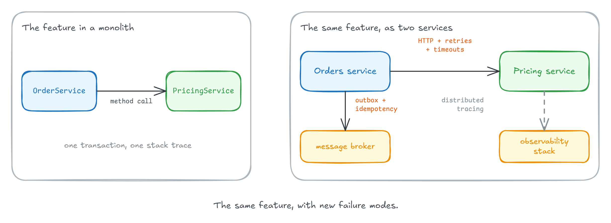
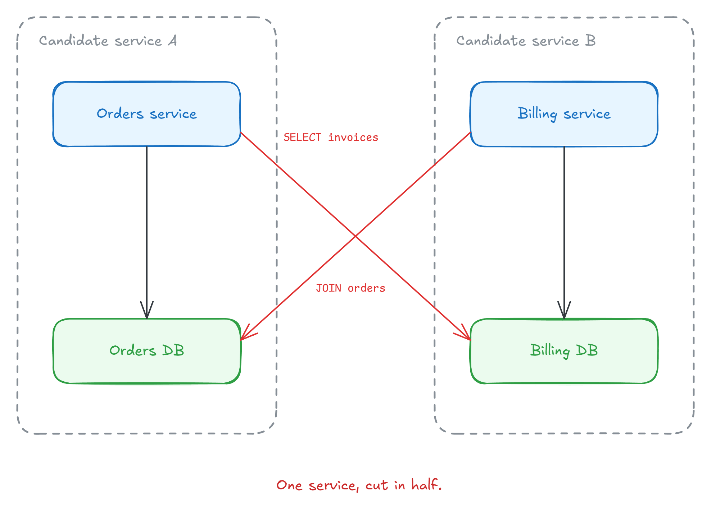
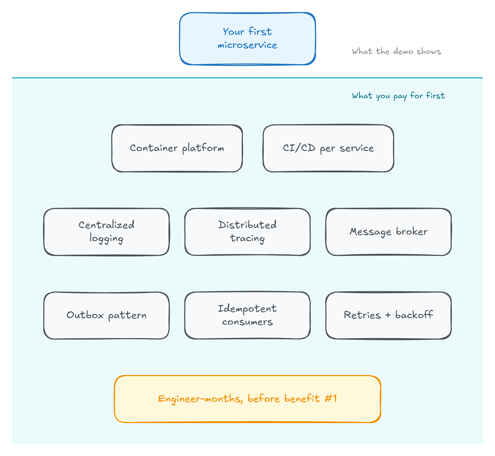
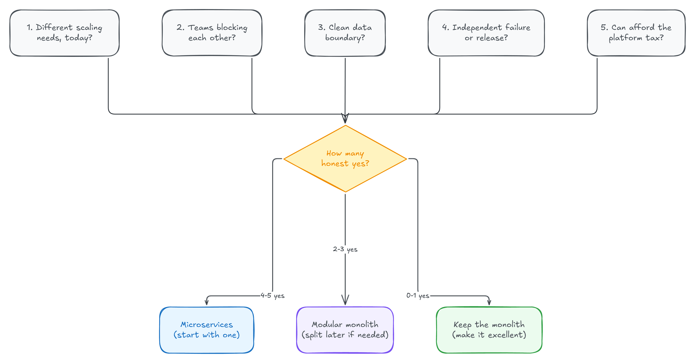

Milan Jovanović 在文章里说了一句很直白的话：他帮团队上过微服务，也帮团队从微服务里爬出来，而后者人数更多。几乎每个失败案例都有一个共同点——**拆分这个决定先于拆分的理由出现**。「应用以后可能要扩展」「单体每个 sprint 都更乱」「演讲里独立部署看起来很轻松」，这些都不是引入分布式系统的理由。

这篇文章给的是做决策用的自查清单：5 个问题，答完按数量评分，三个分数档对应三条不同的路。适合正在纠结「要不要拆」的团队负责人和架构师，读完可以直接拿去开评审会。

## 先看清这笔交易：本地复杂度换分布式复杂度

微服务的本质交易是残酷且具体的：**用本地复杂度交换分布式复杂度**。方法调用变成网络跳转，事务变成 saga，一条堆栈变成横跨三个服务和一条队列的分布式追踪。

这笔交易有时值得，作者自己也做过、还会再做——前提是「在正确的情境下」。下面 5 个问题就是用来判断情境的。

## 问题一：系统各部分真的有不一样的扩展需求吗？

注意，不是「以后可能有」，而是「今天能测到」：某一部分的流量是其余部分的 100 倍，或者需要 GPU，或者内存占用逼得你按它的峰值给整个部署定规格。

这是真实理由。把热点路径抽出来独立扩展（以及独立失败），是服务边界最好的论据之一。

但要先诚实地核对一遍：大多数 .NET 单体在负载均衡后面就能[扩展得很好](https://milanjovanovic.tech/blog/scaling-monoliths-a-practical-guide-for-growing-systems)。如果你的整个应用三个实例就跑得很舒服，你根本没有值得一个服务边界的扩展问题。

## 问题二：团队真的在互相阻塞吗？

微服务既是技术工具，也是组织工具。这个信号最强的形态是：多个团队、一个代码库、发布流程里 A 队做了一半的功能会拖住 B 队的热修复。发布列车、发布冻结、排队要排一天的合并队列——如果你过的是这种日子，独立可部署性确实有真实价值。

反过来说，如果你是六人团队，这个理由不成立。一个团队自己踩自己的脚，踩不出需要运维一个分布式系统的代价。作者甚至把话说死了：**低于大约两个完整团队，微服务在组织层面的理由为零**。

## 问题三：画得出数据边界吗？

这是最常杀死拆分的问题，也是人们最爱跳过的问题。

每个服务必须**完全拥有自己的数据**：没有其他服务直接读它的表，哪怕只是为了一次方便的 join。如果两个候选服务回答基本查询时频繁需要对方的数据，它们不是两个服务——它们是一个服务，你正准备把它切成两半。

作者在这个问题上交过学费，写过一篇[收不回来的模块化单体边界](https://milanjovanovic.tech/blog/the-modular-monolith-boundary-i-couldnt-take-back)：在组织架构图上看起来很干净的边界，数据层面可能纠缠得无可救药。而且这种纠缠不会因为你给两半之间加一个网络就消失，只会更糟——因为从此每一次「join」都是一次 API 调用，[保持数据边界完整](https://milanjovanovic.tech/blog/how-to-keep-your-data-boundaries-intact-in-a-modular-monolith)变成了一个分布式问题。

## 问题四：有什么东西要求独立失败或独立发布吗？

系统里有些部分承担着其余部分没有的要求：

- 支付流程必须在报表模块宕机时仍然存活；
- 带合规边界的组件（PCI、HIPAA），你希望被审计的面越小越好；
- 某个集成每周发布，而核心每季度发布。

这些都是正当的隔离需求，服务边界是表达它们的干净方式。注意它们有多具体——一个笼统的「想要隔离」不在这份名单上。

## 问题五：付得起平台税吗？

在第一个微服务交付任何价值之前，你就要有：容器平台、每个服务各自的 CI/CD、集中式日志、[分布式追踪](https://milanjovanovic.tech/blog/introduction-to-distributed-tracing-with-opentelemetry-in-dotnet)、消息代理，以及让服务间通信安全可靠的模式——[outbox](https://milanjovanovic.tech/blog/implementing-the-outbox-pattern)、[幂等消费者](https://milanjovanovic.tech/blog/the-idempotent-consumer-pattern-in-dotnet-and-why-you-need-it)、带退避的重试。

这是用工程师-月计价的入场费，而且要在收益第一条出现之前付清。拿不出这部分产能的团队，不会得到微服务的廉价版——只会得到一个**分布式单体**：零收益，全成本。

## 评分：三个数字，三条路

把五个问题过完，数一数诚实的 yes：

- **四到五个 yes：拆。** 但先从**一个**服务开始，不是十二个。挑边界最清晰的那一块，在生产环境跑满一个季度，再拆下一块。
- **两到三个：你要的是模块，不是服务。** [模块化单体](https://milanjovanovic.tech/blog/what-is-a-modular-monolith)给你边界、团队所有权和以后拆分的选择权，却不用付平台税。现在强制出来的边界，正是让[将来迁移到微服务变成机械操作](https://milanjovanovic.tech/blog/breaking-it-down-how-to-migrate-your-modular-monolith-to-microservices)而不是英雄壮举的原因。
- **零到一个：保持单体。** 把省下来的精力投入把单体做得优秀。

后悔微服务的团队，几乎从不是技术选错，而是 18 个月前在某个会议室里，拆分在理由出现之前就被决定了。开属于你的那个会之前，先把这 5 个问题跑完。

这套框架的价值在于把「感觉该拆了」变成可核对的具体信号：能不能测到扩展差、团队是不是真的互相阻塞、数据边界画不画得出来、有没有具体的隔离要求、平台税有没有预算。如果你的场景里多数答案是模糊的，那本身就是一个答案——先把边界画清楚，比先拆出去更划算。

如果你关注 AI 助手、开发工具和软件工程实践，可以关注 Aide Hub。这里会继续分享能落地的工具教程、技术观察和项目经验。

## 参考

- [Should You Split That Into Microservices? Ask These 5 Questions First（原文）](https://milanjovanovic.tech/blog/should-you-split-that-into-microservices-ask-these-5-questions-first)
- [Scaling Monoliths: A Practical Guide for Growing Systems](https://milanjovanovic.tech/blog/scaling-monoliths-a-practical-guide-for-growing-systems)
- [The Modular Monolith Boundary I Couldn't Take Back](https://milanjovanovic.tech/blog/the-modular-monolith-boundary-i-couldnt-take-back)
- [How to Keep Your Data Boundaries Intact in a Modular Monolith](https://milanjovanovic.tech/blog/how-to-keep-your-data-boundaries-intact-in-a-modular-monolith)
- [Introduction to Distributed Tracing with OpenTelemetry in .NET](https://milanjovanovic.tech/blog/introduction-to-distributed-tracing-with-opentelemetry-in-dotnet)
- [Implementing the Outbox Pattern](https://milanjovanovic.tech/blog/implementing-the-outbox-pattern)
- [The Idempotent Consumer Pattern in .NET (and Why You Need It)](https://milanjovanovic.tech/blog/the-idempotent-consumer-pattern-in-dotnet-and-why-you-need-it)
- [What Is a Modular Monolith?](https://milanjovanovic.tech/blog/what-is-a-modular-monolith)
- [Breaking It Down: How to Migrate Your Modular Monolith to Microservices](https://milanjovanovic.tech/blog/breaking-it-down-how-to-migrate-your-modular-monolith-to-microservices)
