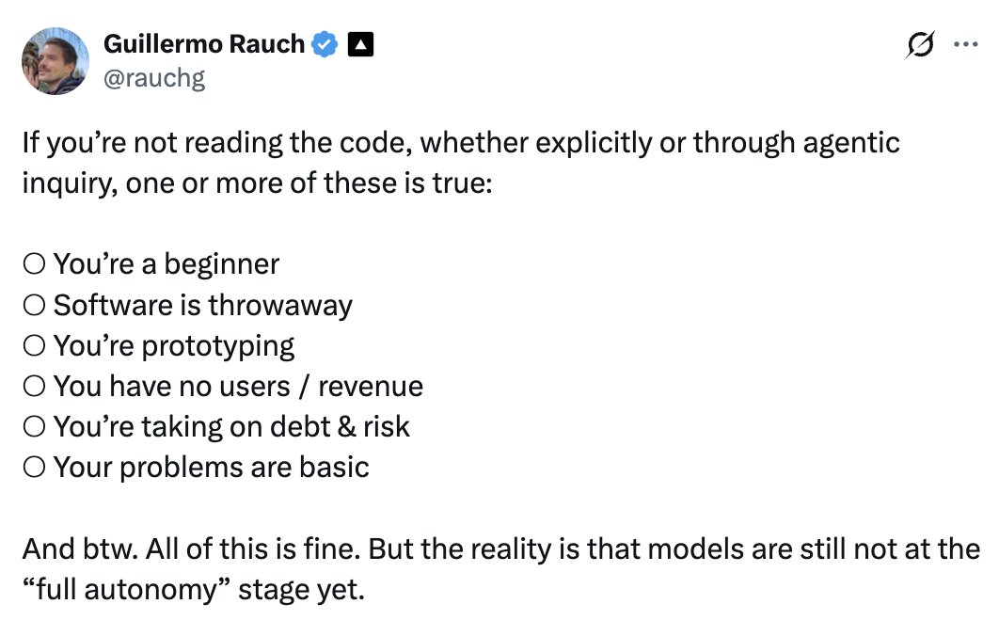
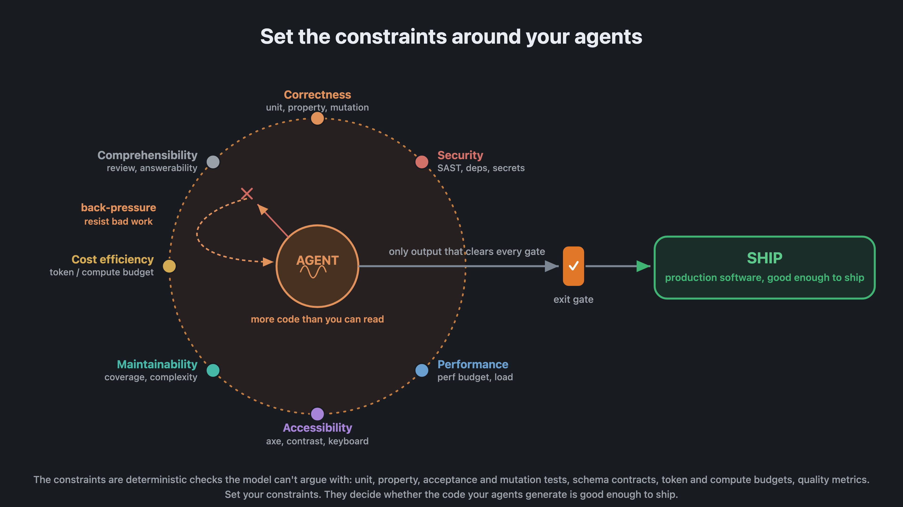
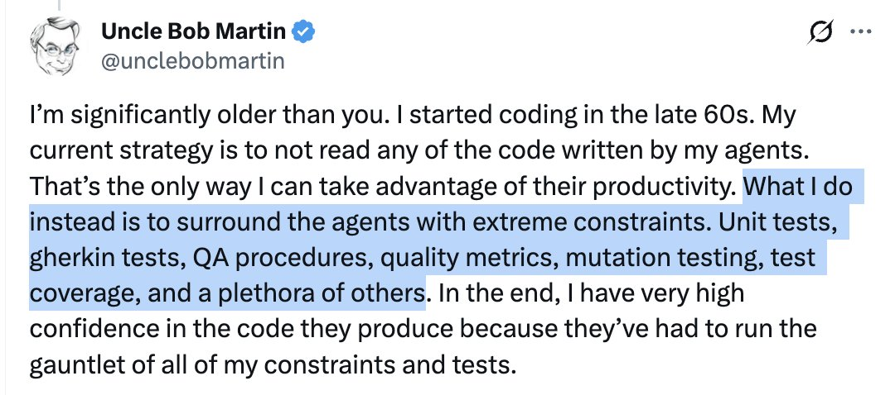
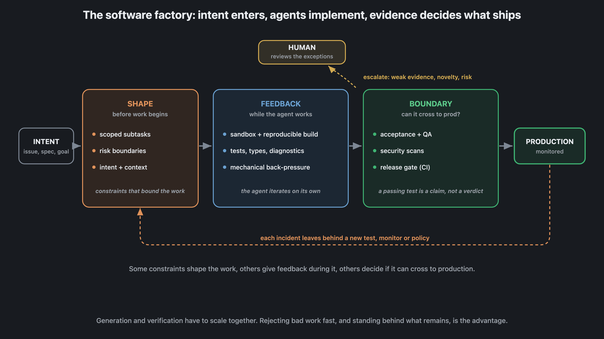
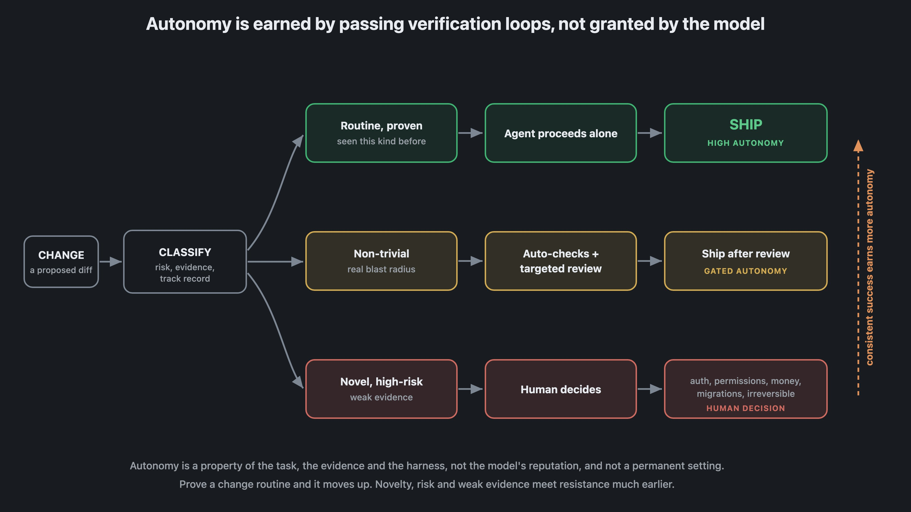
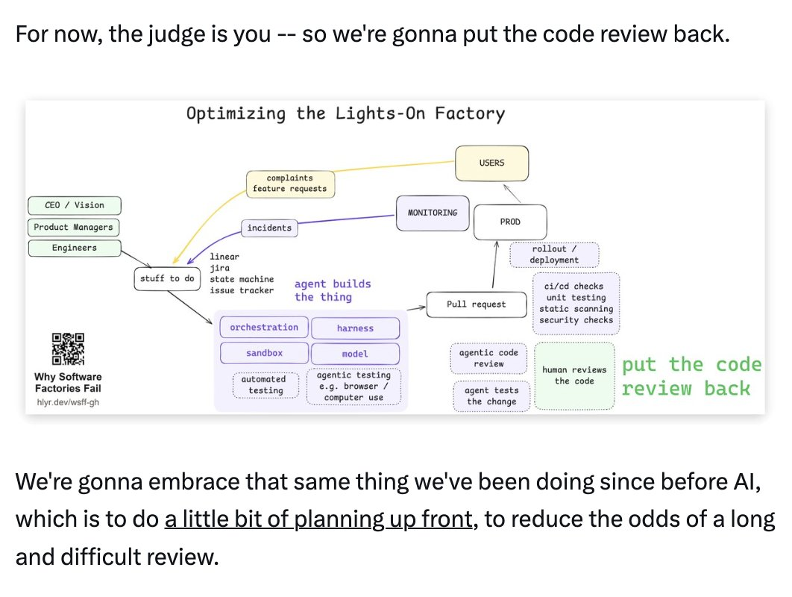

在很长一段人类历史里，代码质量靠的是 code review：一个人读你写的东西，确认它干净、周到、快、易懂、测试也像样。但当代码由 AI agent 生成，这个前提就崩了——**代码量大到没有人读得完**。

Addy Osmani（Google 工程与 DevRel 负责人）在 2026 年 8 月发表的长文《Agentic Code Quality》里给出了一个判断：质量检查正在从「人读代码」转移到 harness、环境和操作系统里，**软件质量现在取决于你围绕 agent 设置的约束**。他自己仍然读代码，但已经非常刻意地选择：哪些地方他接受用约束作为检查手段。

这篇文章适合正在用编码 agent（Claude Code、Copilot 等）的团队和个人开发者。读完你会得到一套可落地的框架：质量门有哪些形态、背压为什么必须贯穿整个管道、自主性怎么按证据分级，以及人类注意力应该投向哪里。

## 为什么「人读代码」在 agent 时代失效

原文的起点很直白：

> For agents, that approach doesn't scale well; there's just too much code for anyone to read.

当 agent 每天产生数十万甚至数百万个变更，让真人逐个 diff 阅读并给出意见在数学上就不成立。所以越来越多的质量检查必须发生在 agent 周围的基础设施里——不是靠「看」，而是靠「挡」。

## Guillermo 清单：判断你能不能跳过阅读

Addy 引用了 Vercel CEO Guillermo Rauch 的推文作为「能不能不读代码」的判据。Guillermo 说，如果你没有在读代码（无论直接读还是通过 agent 追问），那么以下至少有一条成立：

- 你是新手
- 代码是一次性/可抛弃的
- 你还在原型阶段
- 你没有用户、没有收入
- 你在主动积累债务与风险
- 你面临的问题太基础

Addy 的点评很尖锐：这个清单里每一个「是」，本质上都是在承认**风险很低**——没有用户、代码可抛弃、只是原型。一旦风险升上去，就必须有东西在「读」代码：如果不是你在每个 diff 上读，那就必须是约束在读。

> Once the stakes go up, something has to read the code. If it isn't you on every diff then it has to be the constraints.

## 质量门：约束的具体形态

这些约束被 Addy 称为 **quality gates（质量门）**，形式多样：

- 常规单元测试、**属性测试**（property tests）和验收测试
- **变异测试**（mutation testing）：生成代码的变异版本，跑同一套测试，确认没有偷偷混进测试抓不到的 bug
- 代码质量指标：圈复杂度、行长等，维持可读性
- 类型安全、性能预算、后期安全扫描
- 团队自定义约束，包括 ESLint 这类 linting 工具可以强制执行的架构规则——很多这类工具带内置 hook，可以在出错时把 agent 或人类拉进来

质量门的工作机制是：**约束通过抛出测试和确定性检查，定义系统允许做什么**。一个变更提案从 agent 的解释器（interpreter）走到 agent controller、再走向生产，沿途要过足够多的检查，才能确信它可以安全发布、影响范围没有超出 agent 的授权。

> An agent can propose anything. Your constraints decide whether a proposal is safe enough, correct, scoped, and useful.

## Guillermo 与 Uncle Bob：障碍跑道之争

Addy 用了一个精彩的对照：两个人可以完全不同意「要不要读代码」，却同意同一个机制。Guillermo 读。Uncle Bob Martin 不读——他的策略是用极端约束包围 agent：

> What I do instead is to surround the agents with extreme constraints. Unit tests, gherkin tests, QA procedures, quality metrics, mutation testing, test coverage, and a plethora of others. In the end, I have very high confidence in the code they produce because they've had to run the gauntlet of all of my constraints and tests.

两人描述的其实是同一条**障碍跑道（gauntlet）**，区别只是有没有一个真人坐在跑道里面。Addy 调侃了一句「I don't endorse Bob's other views」——只认可这个机制，不认可 Uncle Bob 的其他观点。

## 约束的三个时机：开始前、工作中、生产边界

约束不是只在最后验收时才出现。Addy 把软件工厂画成一条管道：**意图进入 → agent 实现 → 证据决定什么能上线**。

- **SHAPE（开始前）**：把任务拆成有边界的子任务，划定风险边界，附上约束工作的上下文
- **FEEDBACK（工作中）**：沙箱 + 可复现构建，测试、类型、诊断信息形成机械性背压，让 agent 自己迭代
- **BOUNDARY（生产边界）**：验收、QA、安全扫描、CI 发布门——「一个通过的测试只是一个主张，不是判决」（a passing test is a claim, not a verdict）
- **PRODUCTION（上线后）**：持续监控，**每次事故都会留下一条新测试、新监控或新策略**

这引出了两个 Addy 认为值得认真对待的缺口。

**自主性（autonomy）**。agent 可能执行意图执行得很好，但在信息缺失或任务本身含糊时失败——这既包括任务本身，也包括任务被 harness 和环境参数化的方式。人类交付不了好代码的那些原因，agent 全都共享：经不起脚本化压力的脆弱环境、不确定的构建、缺失的权限、虚弱的测试。

**信任（trust）**。不能因为模型聪明就轻信地把意图交出去而不检查正确性。信任从默认开始，但必须靠证据挣来（hard-earned）。

> The environment we're after is one where an agent can do real work, get feedback it can trust, and fail without doing much damage.

## 自主性不是模型给的，是验证挣来的

关于「什么时候让 agent 放手干」，Addy 给了一个比「按模型名声授权」更实用的框架——按变更的证据分级：

- **常规、被证明过的变更**：agent 独立完成，高自主
- **非平凡、有真实爆炸半径**：自动检查 + 定向审查
- **新颖、高风险、证据薄弱**：人类决定

**自主性是任务、证据和 harness 的属性，不是模型的声誉，也不是永久设置。** 一个变更被反复证明是常规的，就能升级自主度；新颖性、风险和薄弱证据则会在更早的阶段遇到阻力。

## 人类的注意力只投向例外

AI 带来高产量和高速度，代价是人类不可能再审查每个变更。Addy 的观点是：**必须刻意决定人类注意力投到哪里**。把人工检查放进一台以机器速度运转的系统里，却指望生产力不受影响，是不现实的。

> Human attention is scarce and valuable so we should proactively direct it to those most nuanced problems that require our judgment. Downstream humans should only be pulled in when the automated guardrails for constraints break.

人类注意力是稀缺资源，应该被主动引导到最微妙、最需要判断力的问题上；下游的人类只在自动护栏失效时才介入。未来的 code review 会看起来非常不同。

这也正是 Dex Horthy（HumanLayer CEO）在《Why Software Factories Fail》里画的那张循环图的论点：绿框就是他的主张——**人类审查应该回到循环里，而不是被循环取代**。

## 背压：贯穿整个循环的阻力

约束和背压让 agent 在坏工作变成问题之前就抓住它。**背压（back-pressure）** 的实现工具很多：

- 编译器拒绝无效代码
- 测试失败
- 安全策略阻止坏实践
- CI 拒绝部署

关键在位置：理想情况下背压存在于**整个循环**，而不是管道末尾的一次总审查。不要在 CI 最后一步才告诉 agent「你不许部署」——要通过每一条可能的路径尽早使用这些信号。

## 扩展：验证容量、生成速率与质量条

当变更量超过验证工具能消化的速度，就会退化成排队、退化成人类速度的验证系统。要扩展，Addy 列出三个杠杆：

1. **扩展验证系统**，创造更多容量去约束和顶回变更
2. **降低 agent 的变更生成速率**，让验证追上来
3. **降低质量条**，让背压不那么用力

同时别忘了反方向：**在有些方向上解除约束反而能产出更多**——例如用 swarm 式的 agent 开发者或自动化软件工厂，在不等人工审查的情况下持续产出变更。思路是：**在最在意的地方收紧约束，在其他地方给自由，从而在不牺牲质量的前提下最大化吞吐量**。

当然，这些都是取舍：安全很重要，但也要在「交付安全」和「按时交付」之间权衡。从创新导向到质量导向是一条光谱，团队必须选好自己的位置。

## 质量是一组信号，不是单一指标

Addy 强调，正确性只是质量的一个维度。质量还包括可维护性、性能、安全、效率、可理解性——每个维度都能像正确性那样分解成多种信号。重要的不只是约束的数量，而是**这些约束是否够有挑战性**，能不能够到你和团队的质量门槛。

> Software quality isn't a single metric. Think of it as a collection of signals of varying importance to you and your team.

约束在管道各个位置生效，正是它们让质量「有了牙齿」（give quality its teeth）。而系统中的终极约束，是我们给自己设的：愿意为我们构建和运行这套系统的决策负责，并像对待其他约束一样，对它做深思熟虑的权衡。

## 制定你自己的约束驱动计划

Addy 的收尾是一个行动号召：

> Quality is in the constraints that we place around our agents. So as you're thinking about quality for your own apps, take this problem statement and come up with your own constraint-driven plan.

给团队落地时，建议按这个顺序过一遍：

1. **盘点风险**：哪些变更爆炸半径最大（权限、金钱、迁移、不可逆操作）？
2. **给质量分维度**：正确性之外，安全、性能、可维护性各自的门槛是什么？
3. **把门放对位置**：哪些约束在任务开始前就框定边界，哪些在工作中给反馈，哪些守生产边界？
4. **按证据分级自主性**：常规变更放行，新颖高风险变更升级给人。
5. **定义「例外」长什么样**：什么信号会触发人工介入？介入后沉淀成什么（新测试、新策略、新监控）？
6. **背压要早**：把检查尽量推进到循环内，而不是只依赖最后的 CI。

最后提醒一点：原文末尾有一段 Sonar 的赞助推广（「agents are writing your code, Sonar gives you the quality gates to make it shippable」），SonarQube 一类的质量门工具正是这个框架的商业化形态——工具只是载体，约束设计才是核心。目前「有用输出」和「slop 垃圾输出」之间的差别，很大程度上仍取决于操作这套循环的团队水平。

如果你也在用 AI agent 写代码、搭建智能体工作流，欢迎关注 Aide Hub。我们会继续分享 AI 助手、开发工具和软件工程实践的一手内容。

## 参考

- [Agentic Code Quality（原文，Addy Osmani）](https://x.com/addyosmani/status/2087427868343373919)
- [Guillermo Rauch 推文：不读代码的六种情况](https://x.com/rauchg/status/2086513316265181213)
- [Uncle Bob Martin 推文：用极端约束包围 agent](https://x.com/unclebobmartin/status/2080257779395154409)
- [Why Software Factories Fail（Dex Horthy）](https://x.com/dexhorthy/article/2081058573556306030)
- [Sonar（原文赞助，质量门工具）](https://www.sonarsource.com/products/sonarqube/cloud/)
