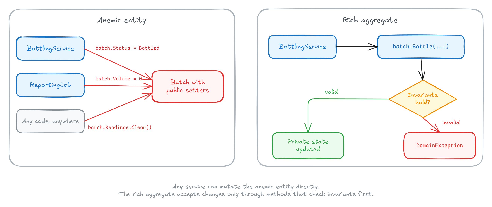

每当有人写「把贫血模型重构为富模型」，评论区总会出现同一个反对意见：「理论很好，但 EF Core 需要 public setter 和 public 无参构造函数，ORM 强迫我们使用贫血模型。」

Milan Jovanović（The .NET Weekly 作者）在 2026 年 8 月的这篇文章里直接回应：这句话**十年前是真的，现在不是**。EF Core 可以毫无问题地持久化一个完全封装的聚合——私有构造函数、私有 setter、只读集合、连属性都没有的私有字段，都能映射。收益是领域模型在**一个地方**强制不变式（invariants），ORM 在后台安静地干活。

这篇文章适合：已经在用 EF Core、想上 DDD 聚合却担心 ORM 是障碍的 .NET 开发者。读完你能照着把聚合端到端映射一遍，并知道每个配置项为什么存在、真正的限制在哪两个地方。

**前置条件**：.NET 9+（示例用到 `Guid.CreateVersion7()` 和 `TimeProvider`）、EF Core 8+（复杂类型是 8.0 引入）。代码按原文整理，版本相关说法已对照官方文档核对。

## 我们要持久化的聚合

领域选的是**家酿啤酒**，因为订单聚合已经被写烂了。一个 `Batch`（批次）发酵，你要定期测比重（gravity），比重连续两次稳定后才能装瓶——装瓶太早，酵母还在吃糖，你会得到**瓶爆**（bottle bombs）。

这是 `Batch` 想要的写法：没有 public setter，通过工厂创建，所有状态变更走方法：

```csharp
public sealed class Batch
{
    private readonly List<FermentationReading> _readings = [];
    private readonly List<IDomainEvent> _domainEvents = [];
    private DateTime? _bottledAtUtc;

    private Batch() { } // For EF Core

    private Batch(BatchId id, RecipeId recipeId, Volume volume)
    {
        Id = id;
        RecipeId = recipeId;
        Volume = volume;
        Status = BatchStatus.Fermenting;
    }

    public BatchId Id { get; private set; }
    public RecipeId RecipeId { get; private set; }
    public BatchStatus Status { get; private set; }
    public Volume Volume { get; private set; }

    public IReadOnlyCollection<FermentationReading> Readings => _readings.AsReadOnly();
    public IReadOnlyCollection<IDomainEvent> DomainEvents => _domainEvents.AsReadOnly();

    public static Batch Start(RecipeId recipeId, Volume volume) =>
        new(new BatchId(Guid.CreateVersion7()), recipeId, volume);

    public void AddReading(Gravity gravity, DateTime takenAtUtc)
    {
        if (Status != BatchStatus.Fermenting)
        {
            throw new DomainException("Readings only make sense while the batch is fermenting.");
        }

        _readings.Add(new FermentationReading(gravity, takenAtUtc));
    }

    public void Bottle(TimeProvider timeProvider)
    {
        if (Status != BatchStatus.Fermenting)
        {
            throw new DomainException("Only a fermenting batch can be bottled.");
        }

        Gravity[] lastTwo = _readings
            .OrderBy(r => r.TakenAtUtc)
            .TakeLast(2)
            .Select(r => r.Gravity)
            .ToArray();

        if (lastTwo.Length < 2 || lastTwo[0] != lastTwo[1])
        {
            throw new DomainException(
                "Gravity must hold steady across two readings before bottling.");
        }

        Status = BatchStatus.Bottled;
        _bottledAtUtc = timeProvider.GetUtcNow().UtcDateTime;
        _domainEvents.Add(new BatchBottled(Id));
    }

    public void ClearDomainEvents() => _domainEvents.Clear();
}
```

支撑类型是 record，值相等免费获得：

```csharp
public readonly record struct BatchId(Guid Value);
public readonly record struct RecipeId(Guid Value);
public readonly record struct Gravity(decimal Value);

public sealed record Volume(decimal Amount, string Unit);
```

三个设计决策直接来自聚合设计原则：

- **`RecipeId` 只按 ID 引用其他聚合**——配方是独立聚合，测比重不需要它的配方表
- **`FermentationReading` 是子实体**——随批次生、随批次死
- **`_bottledAtUtc` 是私有字段，连属性都没有**

这三点每一个都「据说会弄坏 EF Core」，下面逐段映射。



## 私有构造函数和私有 setter：直接用

EF Core 物化实体时**根本不走你的 public API**：它调用私有无参构造函数，然后**通过 backing field** 写入属性——私有 setter 也不例外。这就是 `private Batch() { }` 存在的原因，也是领域模型对 ORM 做的唯一让步。

加载和修改一个批次，看起来和任何 EF 代码一样：

```csharp
Batch batch = await context.Batches
    .SingleAsync(b => b.Id == batchId);

batch.AddReading(new Gravity(1.012m), timeProvider.GetUtcNow().UtcDateTime);

await context.SaveChangesAsync();
```

变更追踪读取的是同一个 backing field，所以私有 setter 对 `SaveChanges` 毫无隐瞒。

EF 甚至能绑定**参数化构造函数**——按名字和类型把参数匹配到映射属性，私有也行。两个注意点：

1. **导航属性不能构造函数绑定**（官方文档明确），所以带集合的聚合仍然需要无参构造函数兜底；
2. EF 加载时**跳过工厂的验证**是正确行为：物化时重跑规则，意味着某条规则一旦变更，所有历史行都会变得无法加载。

## 强类型 ID 和对其他聚合的引用

`BatchId`、`RecipeId` 是强类型 ID，在 `IEntityTypeConfiguration<Batch>` 里用值转换映射：

```csharp
public sealed class BatchConfiguration : IEntityTypeConfiguration<Batch>
{
    public void Configure(EntityTypeBuilder<Batch> builder)
    {
        builder.ToTable("batches");

        builder.HasKey(b => b.Id);

        builder.Property(b => b.Id)
            .HasConversion(
                id => id.Value,
                value => new BatchId(value))
            .ValueGeneratedNever();

        builder.Property(b => b.RecipeId)
            .HasConversion(
                id => id.Value,
                value => new RecipeId(value));

        // Collections, value objects, and domain events: next sections.
    }
}
```

`ValueGeneratedNever()` 很关键：**converter 后面的值生成是文档化的限制区域**，所以 ID 在代码里生成（工厂里的 `Guid.CreateVersion7()`），并明确告诉 EF 别插手。

注意 `RecipeId` **不是** `Recipe` 导航属性：外键列照样存在，但领域模型不会顺着它穿越到另一个聚合——要读配方，那是仓储/查询侧的职责。

## 封装的集合

按约定 EF 能自己找到 `Readings` 导航对应的 `_readings` backing field，但显式配置能让映射在字段重命名后依然存活：

```csharp
builder.HasMany<FermentationReading>("_readings")
    .WithOne()
    .HasForeignKey("batch_id");

builder.Navigation("_readings")
    .UsePropertyAccessMode(PropertyAccessMode.Field)
    .AutoInclude();
```

三行各自的作用：

- **`PropertyAccessMode.Field`**：EF 只读写字段，永远不碰 public 视图
- **`AutoInclude`**：聚合的默认选择——`Bottle()` 的不变式要读 readings，**半加载的 `Batch` 是不安全的**，所以查询时总是连同子实体一起加载
- **`WithOne()` 无参数**：子实体没有指回 `Batch` 的导航，`batch_id` 外键只作为 shadow property 存在

## 完全没有属性的状态

`_bottledAtUtc` 连属性都没有，EF 照样映射：

```csharp
builder.Property<DateTime?>("_bottledAtUtc")
    .HasColumnName("bottled_at_utc");
```

代价出现在查询侧：要按这个字段过滤，LINQ 里得写 `EF.Property`：

```csharp
var bottledThisWeek = await context.Batches
    .Where(b => EF.Property<DateTime?>(b, "_bottledAtUtc") >= weekAgo)
    .ToListAsync();
```

Milan 给了一条实用规则：**会被查询过滤的状态用 private setter，只有聚合自己需要的状态才用 field-only 映射。**

## 值对象：复杂类型、拥有类型和转换

`Volume` 是多属性值对象，映射为**复杂类型**（complex type）——成员内联存在拥有者的表里，没有 join、没有独立标识：

```csharp
builder.ComplexProperty(b => b.Volume, volume =>
{
    volume.Property(v => v.Amount)
        .HasColumnName("volume_amount");
    volume.Property(v => v.Unit)
        .HasColumnName("volume_unit");
});
```

复杂类型是 EF Core 8 的 v1 特性（当时不支持可选复杂类型和集合），后续版本逐步放开。按官方文档，目前集合类复杂类型在关系型数据库上必须通过 JSON 列（`ToJson`）映射。**在 EF 8/9 上**，值对象集合（比如批次维护一份 `HopAddition` 投料计划）要回退到**拥有类型**（owned types）——到处可用，但带着一个隐藏的 shadow key，因为 EF 把值当成了「伪装成值的实体」：

```csharp
builder.OwnsMany(b => b.HopAdditions, hop =>
{
    hop.ToTable("hop_additions");
    hop.WithOwner().HasForeignKey("batch_id");
});
```

枚举用普通转换存成文本，数据库保持可读：

```csharp
builder.Property(b => b.Status)
    .HasConversion<string>()
    .HasMaxLength(20);
```

所有转换属性的共同坑：**LINQ 操作的是 provider 类型**。所以按 `Status` 排序得到的是字母序（Bottled、Dumped、Fermenting），而不是生命周期顺序——需要业务顺序就自己写比较映射。

## 领域事件不进 schema

`IDomainEvent` 不是实体，让 EF 别碰这个集合：

```csharp
builder.Ignore(b => b.DomainEvents);
```

事件总得有人送出去，`SaveChangesInterceptor` 是天然的位置：

```csharp
public sealed class DomainEventsInterceptor(IDomainEventsDispatcher dispatcher)
    : SaveChangesInterceptor
{
    public override async ValueTask<int> SavedChangesAsync(
        SaveChangesCompletedEventData eventData,
        int result,
        CancellationToken cancellationToken = default)
    {
        var domainEvents = eventData.Context!.ChangeTracker
            .Entries<Batch>()
            .SelectMany(entry =>
            {
                var events = entry.Entity.DomainEvents.ToList();
                entry.Entity.ClearDomainEvents();
                return events;
            })
            .ToList();

        await dispatcher.DispatchAsync(domainEvents, cancellationToken);

        return await base.SavedChangesAsync(eventData, result, cancellationToken);
    }
}
```

`IDomainEventsDispatcher` 是作者另一篇文章里构建的强类型分发器（不依赖 MediatR）；那篇还覆盖了**保存之前**分发的情况——当 handler 必须共享同一个事务时用 `SavingChanges` 而不是 `SavedChanges`。

## 领域层从不引用 EF Core

到目前为止所有映射都住在 `BatchConfiguration` 里，`Batch` 里没有任何映射 attribute、没有 ORM 基类——这就是**持久化无知**（persistence ignorance），fluent 配置 API 让它成为可能。`DbContext` 位于基础设施层，从自己的程序集拾取所有配置：

```csharp
public sealed class BreweryDbContext(DbContextOptions<BreweryDbContext> options)
    : DbContext(options)
{
    public DbSet<Batch> Batches => Set<Batch>();

    protected override void OnModelCreating(ModelBuilder modelBuilder)
    {
        modelBuilder.ApplyConfigurationsFromAssembly(
            typeof(BreweryDbContext).Assembly);
    }
}
```

## 总结与常见问题

「EF Core 强迫贫血模型」的反对意见早已过时。私有构造函数、backing field、值转换、复杂类型，覆盖了一个完全封装聚合的全部需求，而且这一切都放在领域层看不见的配置类里。真正的限制只有两个：

1. **导航属性不能构造函数绑定**——带集合的聚合需要保留无参构造函数；
2. **转换过或 field-only 的成员**，在查询里通过 provider 类型翻译（`EF.Property`、字母序排序）。

如原文所说：**ORM 从来不是让你的领域模型保持贫血的东西。它只是一次性的映射练习，每个聚合做一次，封装从此保持。**

常见问题速查：

- **为什么 EF 加载时不执行工厂验证？** 物化时重跑规则会让历史行在规则变更后无法加载，跳过是对的。
- **private setter 还是 field-only？** 查询会过滤的状态用 private setter，只有聚合内部用的状态用字段。
- **EF 8/9 上值对象集合怎么办？** 用 `OwnsMany`，接受隐藏 shadow key；升级后复杂类型集合需要 `ToJson`。
- **按枚举排序不对？** 转换属性按 provider 类型排序，需要业务顺序就显式映射。

## 参考

- [Persisting a Rich Domain Model With EF Core（原文，Milan Jovanović）](https://milanjovanovic.tech/blog/persisting-a-rich-domain-model-with-ef-core)
- [Entity types with constructors | Microsoft Learn（导航不能构造绑定）](https://learn.microsoft.com/en-us/ef/core/modeling/constructors)
- [Complex types | Microsoft Learn（复杂类型与拥有类型的区别）](https://learn.microsoft.com/en-us/ef/core/modeling/complex-types)
- [Building a Custom Domain Events Dispatcher in .NET（原文引用，无 MediatR 依赖）](https://milanjovanovic.tech/blog/building-a-custom-domain-events-dispatcher-in-dotnet)
