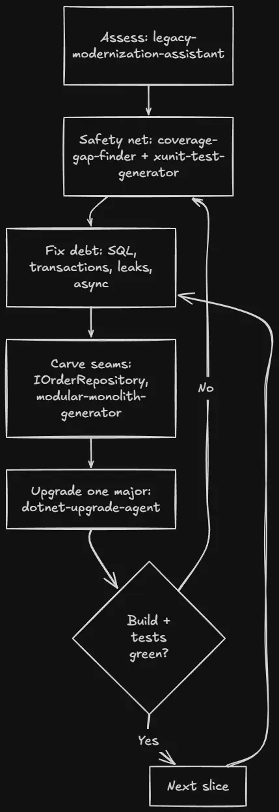

大多数 .NET 团队都有一个这样的服务：跑了好几年，还在 .NET Framework 上，依赖用 `new` 拼出来而不是 DI，到处是 sync-over-async，几乎没有测试。它工作正常——这正是没人敢碰它的原因：任何改动都可能弄坏某个已经没人完全理解的角落。

这时候拿起 AI，最直觉的用法也是最糟的用法：**「把它重写成现代 .NET。」**把旧类粘进去，要一个干净版本，重复。结果是堆看起来合理但没有安全网的新代码，你在生产环境才发现弄坏了什么。

Stefan Đokić（Microsoft MVP，TheCodeMan）在 2026 年 8 月的这篇文章里给出另一种用法：**把 Claude 用在遗留代码上，价值不在生成重写，而在执行一套有纪律的增量现代化——系统全程保持工作。**他用一个 .NET Framework 4.8 样本 `LegacyErp`（WinForms + Dapper/ADO.NET 数据层）走完整条流程，每一步用什么 agent、什么规则，都写得清清楚楚。

这篇文章适合：手里有老 .NET 系统不敢动、又想让 AI 帮上忙的开发者。读完你能得到一套可以直接照搬的四步工作流，外加每步的 agent 配置和安全规则。

## 为什么「从零重写」必败

大爆炸式重写失败的原因，和写的人是人还是 AI 无关：

- **功能开发被冻结**——重写期间没人加新功能
- **旧 bug 被复制，新 bug 被引入**
- **无法证明新代码行为等同旧代码**——旧行为从来没有被写下来，只存在于运行中的系统里

替代方案是 **strangler-fig（绞杀藤）模式**：先包裹住旧系统，然后一块一块替换，全程保持交付。起步更慢，收尾安全得多。下面每一步都建立在这个原则上。

## Step 1：先诚实评估，不碰代码

第一件工作不是改代码，是**理解**代码。用一个 `legacy-modernization-assistant` agent 指向仓库，它的全部工作就是读代码库、产出一份按风险和价值排序的路线图——**不允许编辑**。工具集被刻意限制为只读：

```text
---
name: legacy-modernization-assistant
description: Assesses a legacy .NET codebase and produces a pragmatic,
  incremental modernization roadmap, prioritized by risk and value.
tools: Read, Glob, Grep, Bash
---

## Operating principles
- Incremental over rewrite. Strangler-fig: wrap and replace piece by piece.
- Risk x value sequencing. Start where modernization is safe and pays off.
- Tests first where you'll change most.
- Be honest, not demoralizing. Name the debt plainly, give a doable path.
```

跑在 `LegacyErp` 上，它产出的路线图（节选）长这样：

```text
# Modernization Roadmap — LegacyErp

## Honest assessment
Two-project .NET Framework 4.8 solution: a LegacyErp.Data class library
(Dapper/ADO.NET) and a LegacyErp.UI WinForms app. Old-style non-SDK .csproj,
packages.config. Small, but it carries most of the classic legacy risks at
once - and several are correctness or security bugs, not just "old style".

Load-bearing risks are in OrderRepository: a single SqlConnection opened in
the constructor and held open forever, SQL built by string concatenation
(injectable), no using on command/reader, and two stock writes that must be
atomic with no transaction. Serialize() uses BinaryFormatter - a security
hole and removed on modern .NET, so a hard migration blocker.

Platform blockers: System.Web referenced from a data library, System.ServiceModel
(WCF) in the UI, BinaryFormatter, and a Newtonsoft.Json version split (12.0.3
vs 13.0.1). WinForms itself runs on modern .NET, so the target is reachable.
No tests. Nothing can be safely refactored until that changes.

## Roadmap (incremental, sequenced)
Phase 1 — safe foundations: fix the SQL injection + missing transaction in
place on net48 behind characterization tests; packages.config -> PackageReference;
old .csproj -> SDK-style; introduce IOrderRepository + injected connection string.
Phase 2 — carve seams: connection-per-operation; make the data layer async;
fix UI threading + the static-event leak; replace BinaryFormatter.
Phase 3 — migrate: net48 -> .NET 8 -> .NET 9 one major at a time (verify between);
replace the WCF client; retarget WinForms to modern .NET.

## Quick wins
Parameterize SQL + add the TransferStock transaction; unsubscribe from the
static event; try/catch the async void handler; collapse Newtonsoft to one version.
```

给评估 pass 只读工具很关键：agent 不可能「好心」在你还什么都没决定之前就开始重写某个类——这正是你要避免的失败模式。**你读路线图、批准顺序，然后才允许任何改动发生。**

## Step 2：先建安全网

无法验证的代码不能重构。在碰高风险部分之前，先给**当前行为**写测试——**特征测试**（characterization tests）：记录代码现在做什么，无论对错，这样重构如果改变了行为你立刻能发现。

两个 skill 负责重活：

- **`test-coverage-gap-finder`**：读代码库，报告哪些路径没有测试，按「无测试改动风险」排序——在 `LegacyErp` 里排最前的是 `SearchOrders` 和 `TransferStock`
- **`xunit-test-generator`**：给即将改动的具体方法写 xUnit 测试

重点不是 100% 覆盖率，而是**给下一步要碰的代码铺一张网**。

## Step 3：在测试注视下修债

现在按路线图动工，从安全性和正确性 bug 开始，这些不该等迁移。

**SQL 注入 + 连接永不释放 + 同步 I/O。** 样本里真实的 `SearchOrders`：

```csharp
// Before: injectable, sync, shared connection never disposed
private SqlConnection _conn; // opened once in the constructor, held open

public DataTable SearchOrders(string customerName)
{
    string sql = "SELECT * FROM Orders WHERE CustomerName = '" + customerName + "'";
    SqlCommand cmd = new SqlCommand(sql, _conn);      // no using
    SqlDataReader reader = cmd.ExecuteReader();        // no using, sync
    // ...
}
```

修复是参数化查询、每次调用开连接、全部释放、改异步——现在安全了，因为 Step 2 已经给行为上了测试：

```csharp
// After: parameterized, connection-per-call, disposed, async
public async Task<List<Order>> SearchOrdersAsync(string customerName)
{
    const string sql = "SELECT * FROM Orders WHERE CustomerName = @name";
    using var conn = new SqlConnection(_connectionString);
    using var cmd = new SqlCommand(sql, conn);
    cmd.Parameters.AddWithValue("@name", customerName);

    await conn.OpenAsync();
    using var reader = await cmd.ExecuteReaderAsync();

    var orders = new List<Order>();
    while (await reader.ReadAsync())
        orders.Add(Map(reader));
    return orders;
}
```

**没人退订的静态事件。** WinForms 的 `MainForm` 在构造函数里订阅进程级静态事件 `AppEvents.DataChanged` 然后永远不放手，于是表单（以及它持有的一切）永远活着——教科书式的 .NET 内存泄漏：

```csharp
// Before: subscribed in the constructor, never unsubscribed
public MainForm()
{
    InitializeComponent();
    AppEvents.DataChanged += OnDataChanged;
}

// After: unsubscribe when the form is disposed
protected override void Dispose(bool disposing)
{
    if (disposing)
        AppEvents.DataChanged -= OnDataChanged;
    base.Dispose(disposing);
}
```

同一轮还覆盖路线图其余机械项：`TransferStock` 的两笔写入包进事务、`async void` 点击处理器加 `try/catch`、在框架升级前把 `BinaryFormatter` 换成 `System.Text.Json`（它内置实现已在 .NET 9 移除）。**每一个都是小改动、可审查、背后有测试。**

## Step 4：拆缝，再升级

债清了，开始重塑结构。引入 `IOrderRepository`，让 UI 不再 `new` 数据层，改为注入、可测试。在更大的泥球里，`modular-monolith-generator` 能把纠缠的区域抽成一个边界清晰的模块——一条以后可以整体替换、不碰其余部分的 strangler 边界。

平台升级单独用一个 agent，因为它是另一种工作、另一种安全纪律：

```text
---
name: dotnet-upgrade-agent
description: Plans and executes a .NET version upgrade across a solution -
  target framework bumps, breaking-change remediation, package updates.
tools: Read, Glob, Grep, Bash, Edit
---

## Operating principles
- Incremental, not big-bang. Upgrade one major at a time (6->8, then 8->9).
- Plan before editing. Show the plan and get approval before changing files.
- Verify continuously. Build and run tests after each stage.
- Cite sources for breaking changes rather than guessing.
```

对 `LegacyErp` 来说就是 net48 → .NET 8，验证全绿，再 .NET 8 → .NET 9——**不是一步跳到最新**。每次跳跃之间构建并测试；遇到需要人决策的事（WCF 客户端在现代 .NET 没有可直接替换的等价物），停下来问，而不是猜。

## 整个流程是一个循环

这整套东西不是通往重写的直线，而是**以安全网为中心的循环**：



每个切片都走同一个循环。agent 干机械、繁琐、容易出错的部分；你做判断，并保持构建全绿。

## 安全规则清单

作者明确说「这些规则我从不跳过」：

1. **评估只用只读工具**——规划 pass 不能编辑文件，先产出路线图等你批准
2. **没有测试就不重构**——无法刻画当前行为就先写特征测试
3. **安全和正确性 bug 最先修**——SQL 注入和缺失的事务不该等迁移
4. **一次只升一个主版本**——每次跳跃之间验证构建全绿，绝不留着红构建过夜
5. **改动小而可审查**——大 AI diff 能藏大错误，每个切片小到你能真正读完

## 常见问题

**能不能让 Claude 一次把遗留 .NET 应用重写完？** 它能产出看起来像重写的东西，但你不该上线。没有特征测试、没有增量验证的重写，就是把旧 bug 搬进新代码再添新 bug。安全用法是测试托底的增量现代化，每一步应用都在工作。

**什么是特征测试，为什么要先写？** 捕获代码当前行为的测试——即使行为很怪——给你一条基线。重构后，失败的特征测试告诉你行为变了。没有它，你就是在盲改遗留代码。

**要直接升到最新的 .NET 吗？** 遗留系统跳跃式升级不要。一次一个主版本（比如 net48 → .NET 8，再 8 → 9），每步构建加测试。每次跳跃都有自己的破坏性变更，一次处理一个，失败才小、才好找。

**AI 到底最有用在哪？** 机械重复的活：找未测试路径、生成测试、参数化 SQL、把 async 走通调用链、替换 BinaryFormatter 这类过时 API。架构判断留给你，助手负责清掉枯燥的体量。

## 收尾

用 Claude 重构遗留 .NET 之所以有效，是因为你**把它当工作流，而不是重写按钮**：先做只读评估拿到排序路线图；给要改的代码上测试；在测试注视下先修 SQL 注入、缺失事务和内存泄漏这些安全与正确性 bug；然后拆缝，一次一个验证过的主版本升级平台。

这些步骤没有一个是新的——它们是有经验工程师处理遗留系统一直用的纪律。变的是：评估、测试脚手架、机械重写这些枯燥部分现在可以交给**遵循纪律而不是抄近路**的 agent。样本 `LegacyErp` 和本文的 agents 都来自作者的 AI for .NET Developers 社区（每周新增一个 agent），社区本身是推广渠道，工作流本身可独立照搬。

## 参考

- [Refactoring a Legacy .NET Codebase with Claude（原文，Stefan Đokić）](https://thecodeman.net/posts/refactoring-legacy-dotnet-with-claude)
- [In-box BinaryFormatter implementation removed | Microsoft Learn（.NET 9 移除）](https://learn.microsoft.com/en-us/dotnet/core/compatibility/serialization/9.0/binaryformatter-removal)
- [Migrate from ASP.NET Framework to ASP.NET Core | Microsoft Learn（增量迁移即 Strangler Fig 模式）](https://learn.microsoft.com/en-us/aspnet/core/migration/fx-to-core/)
- [Hunting a Memory Leak in Production .NET（作者相关文章）](https://thecodeman.net/posts/hunting-a-memory-leak-in-production-dotnet)
